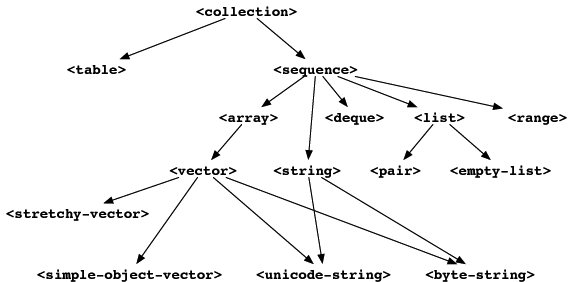
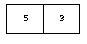
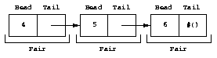
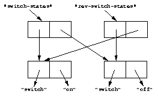
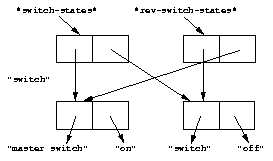

Collections and Control Flow
============================

A *collection* is a kind of container that can hold zero or more
objects. In this chapter, we illustrate several useful built-in
collections including strings, lists, vectors, arrays, and tables.

In Dylan, a collection is an instance of the built-in class
``<collection>``. Dylan provides a rich set of collection classes, and a
rich set of generic functions to iterate over and to manipulate
instances of those classes. In addition to using the built-in collection
classes, you can define new collection classes. We present an example of
defining a new collection class in :doc:`heap`.

Control-flow functions enable you to alter the default (sequential)
order of statement execution, including performing iteration. Dylan
provides several ways of branching to different code depending on the
value of one or more tests, as well as iterating over ranges of numbers
and elements of collections.

In this chapter, we present collections and control flow together,
because often Dylan control-flow constructs are used to operate on
collections.

Built-in collection classes
---------------------------

:ref:`built-in-collection-classes` shows the most common Dylan collection
classes.

.. _built-in-collection-classes:

   Built-in collection classes.

A collection holds a group of objects, called *elements*. Each element
is associated with a key. Each class of collection can have different
restrictions on keys or elements.

Sequences are an important subclass of collections. Sequences restrict
their keys to be nonnegative integers starting at 0, and increasing by
one for each additional value in the collection. Arrays, vectors,
strings, and lists are sequences. Instances of ``<string>`` are sequences
that can hold only characters. You can access instances of ``<array>``
using several subscripts. Instances of ``<vector>`` are one-dimensional
arrays. Instances of ``<simple-object-vector>`` can hold any kind of Dylan
object. Instances of most subclasses of ``<vector>`` cannot change size;
the exception is instances of ``<stretchy-vector>``.

Basic use of collections
------------------------

In Sections `Creation of strings and access to elements`_ through
`Creation of lists and access to elements`_, we show how to create
collections, and how to access the elements of a collection.

.. index::
   single: vectors; creation and access to elements

Creation of strings and access to elements
~~~~~~~~~~~~~~~~~~~~~~~~~~~~~~~~~~~~~~~~~~

First, we define a variable, initializing it with a string:

.. code-block:: dylan-console

    ? define variable *greeting* = "Hello, world.";

    ? *greeting*;
    => "Hello, world."

We can access elements of the string:

.. code-block:: dylan-console

    ? *greeting*[0];
    => ’H’

    ? *greeting*[1];
    => ’e’

The syntax ``*greeting*[n]`` refers to the *n* th element of the
string in ``*greeting*``. You can use this syntax to access any
element of any collection. In Dylan, double quotes are used to enclose
literal strings, and single quotes are used to enclose characters.

We can use the assignment operator to change an element of a string:

.. code-block:: dylan-console

    ? *greeting* := copy-sequence(*greeting*);
    =>"Hello, world."

    ? *greeting*[0] := 'j';
    => ’j’

    ? *greeting*;
    => "jello, world."

We copied the greeting before modifying it, because modifying a literal
constant is an error. A *literal constant* is an object whose contents
are known completely at compile time. Dylan has a special syntax for
each class of literal constant, so that they can be identified easily.
The literal constant ``"Hello, world."``, which is used to initialize the
``*greeting*`` variable, is part of the program executable, and is
allocated when you compile the program.

The ``copy-sequence`` generic function returns a new collection with the
same elements as its argument. The ``copy-sequence`` function creates the
copy at run time, so modification of its results is permitted, because
such changes do not alter the program itself. Note that, although the
listener presents all objects in literal-constant syntax, not everything
displayed by the listener is a literal constant.

The square-bracket syntax is an abbreviation for calling the generic
function ``element``. The following examples are equivalent:

.. code-block:: dylan-console

    ? *greeting*[0];
    => ’j’

    ? element(*greeting*, 0);
    => ’j’

You can use either the square-bracket syntax or the ``element`` generic
function on any collection. You must be careful if you use ``element`` as
a local variable, however, because doing so will interfere with its use
as a generic function, including the use of the square-bracket
abbreviation.

Creation of vectors and access to elements
~~~~~~~~~~~~~~~~~~~~~~~~~~~~~~~~~~~~~~~~~~

There are several ways to create collections. One way is to create a
collection by using ``make``. For example, here we create a vector that
contains two elements:

.. code-block:: dylan-console

    ? define variable *my-vector* = make(<vector>, size: 2);

We can change the first and second elements:

.. code-block:: dylan-console

    ? *my-vector*[0] := 5;
    => 5

    ? *my-vector*[1] := 3;
    => 3

    ? *my-vector*;
    => #[5, 3]

If you want to create a sequence of a certain size, with every element
having the same value, you can specify a ``fill`` keyword argument to
``make``. The default value for the ``fill`` keyword parameter is ``#f``.
Thus, if you had read an element of ``*my-vector*`` before you wrote
numbers into it, you would have received ``#f``.

We can create and initialize a vector to different values all at once by
using a built-in constructor. A *constructor* is a function that creates
an instance; using it is a shorthand for calling ``make``. Here, we use
the ``vector`` constructor function to create a vector and to initialize
it with data.

.. code-block:: dylan-console

    ? define variable *my-vector* = vector(5, 3);

    ? *my-vector*;
    => #[5, 3]

As we saw in `Creation of strings and access to elements`_, certain
collections have a literal syntax that enables you to specify a
particular data structure as part of the program:

.. code-block:: dylan-console

    ? define variable *my-vector* = #[5, 3];

    ? *my-vector*;
    => #[5, 3]

:ref:`diagram-of-vector` shows how you can picture the vector that
we just created.

.. _diagram-of-vector:

   Diagram of the vector ``#[5, 3]``.

You might think that ``*my-vector*`` is a direct instance of ``<vector>``,
but it is not: The ``<vector>`` class is abstract, but instantiable.
When you use the ``vector`` function, or use ``make`` with ``<vector>``, the
result is a general instance of ``<simple-object-vector>``. You specify
the size of a ``<simple-object-vector>`` when you create one, and you
cannot change that size later. If you need a vector that can change
size, use the ``<stretchy-vector>`` class. See :ref:`heap-new-collection-class`,
for an example that uses stretchy vectors.

Creation of lists and access to elements
~~~~~~~~~~~~~~~~~~~~~~~~~~~~~~~~~~~~~~~~

Lists are similar in purpose to vectors: Each one can store an ordered
sequence of objects. Lists differ from vectors in that it is easy to add
and remove elements from lists, especially at the front. In general, if
the number of elements in a sequence will remain constant, lists are
less efficient than vectors are.

Each element of a list is stored in a ``pair``. A pair has two parts — a
head and a tail. Typically, the head of a pair refers to an element, and
the tail refers to the pair that holds the next element of the list.
Normally, the final tail of the list is the empty list, represented by
``#()``. Elements of lists can be any kind of object, including, of
course, lists.

The ``list`` constructor function creates a list whose elements are the
arguments provided:

.. code-block:: dylan-console

    ? list(4, 5, 6);
    => #(4, 5, 6)

:ref:`diagram-of-list` is a diagram of the list that we just created.

.. _diagram-of-list:

   Diagram of the list ``#(4, 5, 6)``.

We can create a similar list by using the ``pair`` function, which creates
one pair of the list at a time:

.. code-block:: dylan-console

    ? pair(4, pair(5, pair(6, #())));
    => #(4, 5, 6)

As you can see, using ``list`` instead of ``pair``, in this case, is much
clearer. Note that Dylan provides functions called ``head`` and ``tail``,
which operate on lists:

.. code-block:: dylan-console

    ? head(#(4, 5, 6));
    => 4

    ? tail(#(4, 5, 6));
    => #(5, 6)

    ? tail(tail(#(4, 5, 6)));
    => #(6)

A reference to the first pair of a list is exactly the same as a
reference to the entire list.

We use ``head`` and ``tail`` when we define a method for copying lists in
`Lists and efficiency`_. We use ``pair`` in a method that copies lists
recursively in `A recursive list copier`_.

.. _collect-iteration-over-sequence:

Iteration over a sequence
-------------------------

In the examples in Sections `Building our own copy-sequence`_ through
`Changes to a generic function’s signature`_, we
show how to process each element of a sequence using different techniques.

Building our own ``copy-sequence``
~~~~~~~~~~~~~~~~~~~~~~~~~~~~~~~~~~

.. index:: while

How would we write our own ``copy-sequence`` function, if Dylan did not
already provide one? There are many possible approaches. One way would
be to use a ``while`` loop. A ``while`` loop has a *test expression*
(surrounded by parentheses) and a *body*. As long as the value of the
test expression is true, the body will be executed repeatedly.

.. code-block:: dylan

    define method my-copy-sequence
        (old-sequence :: <sequence>) => (new-sequence :: <sequence>)
      let seq-size = old-sequence.size;
      let new-sequence = make(type-for-copy(old-sequence), size: seq-size);
      let index = 0;
      while (index < seq-size)
        new-sequence[index] := old-sequence[index];
        index := index + 1;
      end while;
      new-sequence;
    end method my-copy-sequence;

The method ``my-copy-sequence`` makes a new sequence of the same size as
its argument, then iterates over all the elements of the argument,
storing each element of the sequence into the appropriate element of the
new sequence. The ``size`` generic function returns the number of elements
in a collection. In this example, the ``while`` loop terminates when
``index`` reaches the size of the sequence.

The ``type-for-copy`` generic function returns an appropriate class for
``make``, given an object that you wish to copy. For most collections,
``type-for-copy`` just returns the class of the collection provided.

Iteration with ``for``
~~~~~~~~~~~~~~~~~~~~~~

We can use the ``for`` to express concisely a loop that increments a
variable until a limit is reached.

.. code-block:: dylan

    define method my-copy-sequence
        (old-sequence :: <sequence>) => (new-sequence :: <sequence>)
      let new-sequence
        = make(type-for-copy(old-sequence), size: old-sequence.size);
      for (index from 0 below old-sequence.size)
        new-sequence[index] := old-sequence[index];
      end for;
      new-sequence;
    end method my-copy-sequence;

In the preceding example, the body is executed ``old-sequence.size``
times, with ``index`` bound to zero first, then rebound to one more than
the previous value of ``index`` each time through the loop. The variable
``index`` is defined only within the body of the ``for`` iteration
construct. The body of the ``for`` iteration construct begins after the
iteration clause(s), and finishes with the matching ``end``. For the
``while`` iteration construct shown in `Building our own copy-sequence`_,
the body starts after the predicate and finishes with the matching ``end``.

The ``for`` loop can have many different kinds of iteration clauses. In
this section, we have shown a simple iteration over a series of numbers.
In `Lists and efficiency`_, we use clauses that bind variables to initial
values for the first time through a loop, and use expressions to rebind
the variables for the second and subsequent times through the loop. We
also demonstrate a clause that permits iteration to continue until an
expression is true, both in `Lists and efficiency`_ and
:ref:`heap-adding-and-removing-elements`.

The ``for`` loop has a simple type of iteration clause that we can use to
iterate over any Dylan collection. The airport example in
:ref:`nlanding-vehicle-containers`, demonstrates iteration over vectors
using this kind of iteration clause.

.. _collect-lists-and-efficiency:

Lists and efficiency
~~~~~~~~~~~~~~~~~~~~

The ``my-copy-sequence`` method in `Iteration with for`_ works
efficiently for vectors. It does so because Dylan can store and
retrieve arbitrary elements of vectors, and can determine the
size of vectors in constant time.

Lists are quite a different data structure from vectors. Accessing
elements and determining the size of a list takes linear time. Thus, you
can access the thousandth element of a vector or string in the same
amount of time as you can access the first element of a vector or
string; when you uses lists, however, it takes about 1000 times longer
to access the thousandth element than to access the first element. The
difference in access times occurs because Dylan must walk over almost
1000 pairs to get to the thousandth pair, and thus get to the thousandth
element of the list. Although the method defined in `Iteration with for`_
can copy lists, it will be excessively slow, especially for long lists.

We would like to provide a special method for copying lists that uses a
more efficient algorithm. In particular, we want to walk over the
provided list element by element, without having to retrace over
elements of the list that we have already copied.

.. code-block:: dylan

   // Assumes that old-list is a proper list (that is, it ends with #())
   // and is not circular
   define method my-copy-sequence (old-list :: <list>) => (new-list :: <list>)
     let new-list = make(<list>, size: old-list.size);
     for (old = old-list then old.tail,
          new = new-list then new.tail,
          until: empty?(old))
       new.head := old.head;
     end for;
     new-list;
   end method my-copy-sequence;

First, ``my-copy-sequence`` makes a new list that is the same length as
the old one. Next, the ``for`` iterator is used to bind the variables
``old`` and ``new`` to ``old-list`` and ``new-list``, respectively. Then, the
``for`` iterator executes the ``until:`` expression to determine whether it
is time to terminate the loop. If the ``until:`` expression returns true,
then the ``for`` loop terminates, and the newly created list is returned
from ``my-copy-sequence``. Otherwise, the body of the ``for`` loop is
executed — the body stores the head of the first pair in ``old`` into the
head of the first pair in ``new``. The result of that action is that the
first element of ``new`` is identical to the first element of ``old``. For
this iteration, that action causes the first element of ``new-list`` to be
identical to the first element of ``old-list``. In subsequent iterations,
the body will access elements 1 closer to the end of the list. It will
do so because, after the body is executed, the ``for`` iterator loops back
to the iterator clauses, where the *then* clauses bind ``old`` to all but
the first pair of ``old``, and bind ``new`` to all but the first pair of
``new``. The termination check occurs again, with the same consequences,
depending on the value of the ``until:`` expression. Iteration then
continues just like the second time through the loop until the end of
``old`` is reached.

In this method, we never have to search for the current spot of the old
list that we are copying, or to search for the end of the new list that
we are building. The variables ``old`` and ``new`` track exactly which pairs
in the iteration to access, and that tracking saves a considerable
amount of time for large lists. When the iteration is finished,
``my-copy-sequence`` returns the new list.

Polymorphism
~~~~~~~~~~~~

An important advantage of programming in Dylan is that we can provide a
general method for copying a sequence (as shown in `Iteration with for`_),
and also can provide special copying methods for particular subclasses of
sequences (as shown in `Lists and efficiency`_). Method dispatch takes care
of picking the best method for the argument. Callers of ``my-copy-sequence``
do not need to worry about any performance optimizations that we have
installed for lists. They simply use ``my-copy-sequence`` for lists,
just as they would for any other sequence. This polymorphism can be
useful for keeping interfaces between components of a program simple and
extensible.

.. _collect-mapping-functions:

Mapping functions
~~~~~~~~~~~~~~~~~

Iterating over all the elements of a collection is a common idiom, and
Dylan provides several different mapping functions that accomplish these
kinds of iterations in different ways. In the following example, we
redefine the ``my-copy-sequence`` method originally defined in
`Lists and efficiency`_. Here, we use the ``do`` iteration construct,
instead of a ``for`` loop.

.. code-block:: dylan

    // Assumes that old-list is a proper list (that is, it ends with #())
    // and is not circular
    define method my-copy-sequence (old-list :: <list>) => (new-list :: <list>)
      let new-list = make(<list>, size: old-list.size);
      // Remember the pair of the copy that we are initializing
      let current-pair = new-list;
      // Iterate over all the elements of the existing list, making new pairs,
      // and splicing them into the end of the copy that we are building
      do(method (old-element)
           current-pair.head := old-element;
           current-pair := current-pair.tail;
         end method,
         old-list);
      new-list;
    end method my-copy-sequence;

The ``do`` mapping function takes a function and one or more collections,
and calls the function on each element of each collection. The function
should take one argument if you provide ``do`` with one collection, two
arguments if you provide two collections, and so on. The result of
calling the function is ignored, and ``do`` itself returns no meaningful
value. The ``do`` function is useful only if the method that you provide
accomplishes a valuable side effect. In the preceding example, the
supplied method stores an element of the old list into the head of the
current pair of the new list, and moves to the next pair of the new
list. Note that this method is actually a closure, which closes over the
``current-pair`` local variable. See :ref:`func-closures`, for more
information about closures.

.. _collect-recursive-list-copier:

A recursive list copier
~~~~~~~~~~~~~~~~~~~~~~~

In many situations, the most concise way to manipulate lists (and other
treelike structures) is to use recursion. In *recursion*, a function
calls itself, directly or indirectly. In the following example, we
redefine the ``my-copy-sequence`` method for lists to use recursion
instead of iteration.

.. code-block:: dylan

    define method my-copy-sequence (old-list :: <list>) => (new-list :: <list>)
      if (empty?(old-list))
        #();
      else
        pair(old-list.head, my-copy-sequence(old-list.tail));
      end if;
    end method my-copy-sequence;

Note that recursion can be just as efficient as iteration. For example,
consider the function ``my-reverse``, which creates a new list with
elements in the reverse order from the list you supply.

.. code-block:: dylan

    define method my-reverse (old-list :: <list>) => (reversed-list :: <list>)
      local method rev (old :: <list>, results :: <list>)
        if (empty?(old)) results else rev(old.tail, pair(old.head, results)) end;
      end method;
      rev(old-list, #());
    end method my-reverse;

The ``local method`` declaration inside the ``my-reverse`` method defines
a function that is bound to the name ``rev`` only within a scope of the
body of ``my-reverse``. This declaration is different from ``define method``,
which creates module bindings that can be accessed outside the lexical scope
of where they are defined.

The local method ``rev`` calls itself as the last expression in its body.
Thus, the ``rev`` method can be optimized by the Dylan compiler into code
that is exactly as efficient as if it was written with iteration.

Alternative ways of defining the ``my-reverse`` function are discussed in
`Reversal of sequences`_.

.. _collect-using-map-curry:

Using ``map`` and ``curry``
~~~~~~~~~~~~~~~~~~~~~~~~~~~

.. index:: map

Perhaps the easiest way to implement our simple sequence copier is to
use the ``map`` function. The ``map`` function takes the same arguments as
does ``do``. However, instead of ignoring the return value of the
function that you provide, ``map`` gathers into a new collection all the
results of calling the provided function. The new collection will be an
instance of the ``type-for-copy`` of the first collection argument to ``map``.

.. code-block:: dylan

    define method my-copy-sequence
        (old-sequence :: <sequence>) => (new-sequence :: <sequence>)
      map(identity, old-sequence);
    end method my-copy-sequence;

The ``identity`` function simply returns its argument without making any
changes. A more interesting example is to define a method that
multiplies a number by each element of a vector, yielding a new vector
with the products. Here is a sample call to ``scalar-multiply``, which we
define next:

.. code-block:: dylan-console

    ? scalar-multiply(3, #[4, 5, 6]);
    => #[12, 15, 18]

Here is our definition of ``scalar-multiply``, using ``map``:

.. code-block:: dylan

    define method scalar-multiply
        (scalar :: <number>, old-vector :: <vector>) => (result :: <vector>)
      map(method (vector-element) scalar * vector-element end,
          old-vector);
    end method scalar-multiply;

We use the ``method`` statement to create a kind of function (a closure)
that multiplies ``scalar`` by an element of the vector provided by ``map``.
The ``map`` iterator then calls that function on each element of
``old-vector``, collecting the results in a new sequence. A variant of
``map``, called ``map-into``, replaces elements in an existing collection,
rather than creating a new collection for the results. See
:ref:`heap-basic-collection-methods`, for an example of the use of
``map-into``.

.. index:: curry

We can define this method more succinctly using ``curry``, which is a
function that generates a function:

.. code-block:: dylan

    define method scalar-multiply
        (scalar :: <number>, old-vector :: <vector>) => (result :: <vector>)
      map(curry(\*, scalar), old-vector);
    end method scalar-multiply;

The ``curry`` function in this example creates exactly the same method as
the one that we created in the previous definition of ``scalar-multiply``.
That is, ``curry(\*, scalar)`` builds a function that multiplies its
argument by ``scalar``. This generated function is then used by ``map`` to
compute the value of each element of the new sequence.

Mapping functions such as ``do`` and ``map`` work well when you want to
operate over the entire collection. The ``map`` function works well only
if there is a one-to-one correspondence between input-collection sizes
and output-collection size. However, the other techniques that we have
presented, such as using ``for`` and ``while``, can work better when you
want to operate on only part of a sequence. In `A sequence copier
that can copy a portion of a sequence`_, we take another look at how
a ``for`` loop can help us to solve the problem of iterating over only
part of a collection.

A sequence copier that can copy a portion of a sequence
~~~~~~~~~~~~~~~~~~~~~~~~~~~~~~~~~~~~~~~~~~~~~~~~~~~~~~~

The ``copy-sequence`` generic function provided by Dylan actually takes
keyword arguments that allow only a portion of the sequence to be
copied. Here is an example:

.. code-block:: dylan-console

    ? copy-sequence("airport", start: 3);
    => "port"

    ? copy-sequence("snow", start: 1, end: 3);
    => "no"

In the following, we use a ``for`` loop with two iteration clauses to
implement the more flexible version of the general purpose
``my-copy-sequence``:

.. code-block:: dylan

    define method my-copy-sequence
        (old-sequence :: <sequence>,
         #key start = 0, end: limit = old-sequence.size)
     => (new-sequence :: <sequence>)
      let new-sequence = make(type-for-copy(old-sequence), size: limit - start);
      for (source-index from start below limit,
           destination-index from 0)
        new-sequence[destination-index] := old-sequence[source-index];
      end for;
      new-sequence;
    end method my-copy-sequence;

In the preceding example, we force the keyword parameter ``end:`` to bind
the variable ``limit``, rather than binding ``end``. It is illegal to use
``end`` as a variable name, because ``end`` is one of a few reserved words
in Dylan. In the body of the ``for`` loop, ``source-index`` will range from
``start`` to 1 less than ``limit``, and ``destination-index`` will range from
0 to 1 less then ``limit`` minus ``start``, which is the length of the new
sequence being created.

Changes to a generic function’s signature
~~~~~~~~~~~~~~~~~~~~~~~~~~~~~~~~~~~~~~~~~

Note that the ``my-copy-sequence`` method defined in `A sequence
copier that can copy a portion of a sequence`_ has a
parameter list that is not congruent with the parameter list of the
generic function. That is, that method accepts the ``start:`` and ``end:``
keyword arguments, when previously only required arguments were allowed
for that generic function. We did not explicitly define the
``my-copy-sequence`` generic function; Dylan created the generic function
implicitly, when we defined the first method for it, in `Building
our own copy-sequence`_. The generic function accepts two required
parameters, and no keyword parameters.

When you need to change the signature of a generic function, you must
change all the methods for that generic function to have a compatible
signature. In our example, we would have to fix the ``my-copy-sequence``
method for lists to accept the ``start:`` and ``end:`` keyword arguments,
and would have to change the methods to operate on only a portion of the
list provided. For more information about the congruence rules for
methods of a generic function, see :ref:`func-parameter-list-congruence`.

Manipulation of collections
---------------------------

Dylan provides an extensive library of functions that manipulate
collections. In this section, we explore how to build complex collection
functions from simpler ones, using the control-flow functions already
shown in this chapter.

Reversal of sequences
~~~~~~~~~~~~~~~~~~~~~

Dylan provides two generic functions for reversing sequences: ``reverse``,
and ``reverse!``. They both achieve the same objective, but ``reverse!``
is allowed to modify its argument, whereas ``reverse`` never modifies its
argument.

.. code-block:: dylan-console

    ? reverse("lever");
    => "revel"

    ? define variable *switch* = vector("switch", "on");

    ? reverse(*switch*);
    => #["on", "switch"]

    ? *switch*;
    => #["switch", "on"]

    ? reverse!(*switch*);
    => #["on", "switch"]

After the call to ``reverse!``, the value of ``*switch*`` is not defined.
Only the return value from ``reverse!`` will be meaningful. If we want
``*switch*`` to contain the reversed sequence, we must instead write

.. code-block:: dylan-console

    ? *switch* := reverse!(*switch*);
    => #["on", "switch"]

    ? *switch*;
    => #["on", "switch"]

Note that ``reverse!`` cannot change the object to which ``*switch*``
refers; however, ``reverse!`` is allowed to alter the contents of that
object. Also note that ``reverse!`` may not return the same object as that
you provide as its argument. Consider the case of using ``reverse!`` on a
list to see how this behavior can be useful.

.. topic:: Convention:

   Dylan has a convention of putting an exclamation point at the
   ends of the names of functions that can destructively modify
   their arguments. For example, ``reverse!`` takes a sequence, and
   returns a sequence that has the same elements but in reverse order.
   The ``reverse!`` generic function may change the sequence that is its
   argument. In contrast, the ``reverse`` generic function performs a
   similar operation, but does not destructively modify its argument.
   Setters are an exception to this convention: They modify their
   argument, but do not typically end with ``!``.

How can we write our own version of ``reverse`` using the iteration
techniques presented so far?

.. code-block:: dylan

    define method my-reverse (seq :: <sequence>) => (reversed-seq :: <sequence>)
      let reversed-seq = make(type-for-copy(seq), size: seq.size);
      for (destination-index from seq.size - 1 to 0 by -1,
           source-index from 0)
        reversed-seq[destination-index] := seq[source-index];
      end for;
      reversed-seq;
    end method my-reverse;

Once again, this algorithm is fine for vectors and strings, but has poor
performance for lists. Here is a special ``my-reverse`` method for lists:

.. code-block:: dylan

    define method my-reverse (old-list :: <list>) => (reversed-list :: <list>)
      let reversed-list = #();
      for (old-element in old-list)
        reversed-list := pair(old-element, reversed-list);
      end for;
      reversed-list;
    end method my-reverse;

It is easy to build up a list from its end to its start, and that is
exactly what we do in the preceding method. We start with the empty
list, and add pairs to the reversed list whose heads are the elements of
the argument. We follow the old list from its start to its end, while we
build the new list from its end to its start, thus reversing the list.

It is important to remember that, even though we created a new sequence
to contain the elements of the old sequence, we still share those old
elements with the new sequence. If two elements of a collection refer to
the same object, then modifying the element of one of the collections
affects the value of the element of the other collection. We illustrate
this behavior in `Destructive operations and shared structure`_.

Destructive operations and shared structure
~~~~~~~~~~~~~~~~~~~~~~~~~~~~~~~~~~~~~~~~~~~

Consider the following example, and Figures :ref:`state-before-element-changed`
and :ref:`state-after-element-changed`.

.. code-block:: dylan-console

    // First we construct a vector of two vectors
    ? define variable *switch-states*
        = vector(vector("switch", "on"), vector("switch", "off"));

    ? *switch-states*;
    => #[#["switch", "on"], #["switch", "off"]]

    // Now, we reverse the vector, holding on to the result
    ? define variable *rev-switch-states* =
        my-reverse(*switch-states*);

At this point, the states of the variables and vectors correspond to
:ref:`state-before-element-changed`.

We examine the two sequences:

.. code-block:: dylan-console

    ? *rev-switch-states*;
    => #[#["switch", "off"], #["switch", "on"]]

      // Although *switch-states* and *rev-switch-states* are different vectors,
      // they share elements
    ? *switch-states* == *rev-switch-states*;
    => #f

.. _state-before-element-changed:

   State before the element is changed.

Now, we change an element:

.. code-block:: dylan-console

    ? *switch-states*[0] == *rev-switch-states*[1];
    => #t

      // So, when we change an element in one, the same change occurs in the other
    ? (*switch-states*[0])[0] := "master switch";
    => "master switch"

At this point, the states of the variables and vectors correspond to
:ref:`state-after-element-changed`.

.. _state-after-element-changed:

   State after the element is changed.

We can look at the values of the variables:

.. code-block:: dylan-console

    ? *switch-states*;
    => #[#["master switch", "on"], #["switch", "off"]]

    ? *rev-switch-states*;
    => #[#["switch", "off"], #["master switch", "on"]]

Each object pictured in Figures :ref:`state-before-element-changed` and
:ref:`state-after-element-changed` is a vector. The strings in the figures
are vectors, although we did not draw them as such, to keep the diagrams
relatively simple. Variables are not objects in Dylan, but they are
shown referring to objects. In :ref:`state-after-element-changed`,
the string ``"switch"`` is not referenced by any other object and is
therefore garbage; eventually, it will be reclaimed by a garbage collector.

Changing an element of one collection can affect another collection if
the two collections share elements. Two collections share an element if
there is a value in one collection that is ``==`` (that is, identical) to
a value in the other collection. Functions such as ``copy-sequence`` and
``reverse`` do only a *shallow copy* of their arguments: only the top
level of the copy is new. Every other part is shared with the old
sequence. Thus, it is important to take care when you modify objects
that might be shared with other parts of your application. Using
well-defined module boundaries that specify whether data structures can
be modified by clients of the module can help you to keep application
data consistent.

Conditional execution
---------------------

In Sections `if, else, and elseif`_ through `Search of arrays with find-key`_,
we consider ways to execute different code depending on the results of one
or more tests.

``if``, ``else``, and ``elseif``
~~~~~~~~~~~~~~~~~~~~~~~~~~~~~~~~

We showed the simplest use of ``if`` in :ref:`offset-methods-on-time-offset`.
Consider the case where there is more than one test involved. Suppose that we
want to write a method that describes a vote. Here are sample calls to
``interpret-votes``:

.. code-block:: dylan-console

    ? interpret-votes(yes: 4, no: 0);
    => "unanimously approved"

    ? interpret-votes(yes: 3, no: 1);
    => "approved"

    ? interpret-votes(yes: 2, no: 2);
    => "tie"

    ? interpret-votes(yes: 1, no: 3);
    => "not approved"

We can define the ``interpret-votes`` method using the ``if`` control
structure and the ``else`` clause:

.. code-block:: dylan

    define method interpret-votes
        (#key yes :: <nonnegative-integer> = 0, no :: <nonnegative-integer> = 0)
     => (interpretation :: <string>)
      if (yes > 0 & no = 0)
        "unanimously approved";
      else if (yes > no)
        "approved";
      else if (yes = no)
        "tie";
      else
        "not approved";
      end if;
      end if;
      end if;
    end method interpret-votes;

We defined the ``<nonnegative-integer>`` type in :ref:`classes-examples-types-not-classes`,
using ``limited``. Only positive integers and the integer 0 are instances
of ``<nonnegative-integer>``. We use this type in the ``interpret-votes``
method parameter list to ensure that no negative vote counts are
accepted.

.. topic:: *Quick summary of* ``&`` *infix operator* : *arg1* ``&`` *arg2*

   The infix operator ``&`` does the *and* logical operation. If either or
   both of the arguments to the ``&`` operator are false, then ``&`` returns
   false.

   Note that the ``&`` operator is actually a control-flow operator. If the
   first argument to the ``&`` operator is false, then the value of the
   second argument is never computed, and false is returned. If the value
   of the first argument is true, then the value of the second argument is
   computed and returned.

   The ``|`` operator (logical *or*) behaves in a similar manner, except
   that its second argument is computed and returned only if the first
   argument is false.

The syntax for the ``if`` control structure allows ``elseif`` clauses, which
makes this style of conditionalization slightly more compact:

.. code-block:: dylan

    define method interpret-votes
        (#key yes :: <nonnegative-integer> = 0, no :: <nonnegative-integer> = 0)
     => (interpretation :: <string>)
      if (yes > 0 & no = 0)
        "unanimously approved";
      elseif (yes > no)
        "approved";
      elseif (yes = no)
        "tie";
      else
        "not approved";
      end if;
    end method interpret-votes;

Branching with ``case``
~~~~~~~~~~~~~~~~~~~~~~~

Dylan also provides the ``case`` control structure to give you an
alternative way to express the branching style shown in
`if, else, and elseif`_:

.. code-block:: dylan

    define method interpret-votes
       (#key yes :: <nonnegative-integer> = 0, no :: <nonnegative-integer> = 0)
     => (interpretation :: <string>)
      case (yes > 0 & no = 0) => "unanimously approved";
           (yes > no) => "approved";
           (yes = no) => "tie";
           otherwise => "not approved";
      end case;
    end method interpret-votes;

The decision of whether to use ``if`` with ``elseif`` and ``else`` as
opposed to using ``case``, is largely a matter of personal style.

Branching with ``select``
~~~~~~~~~~~~~~~~~~~~~~~~~

In certain situations, you are working with a particular two-argument
predicate (such as ``==`` or ``<``). The value of the first argument to the
predicate will always be the same, and you would like to perform
different actions based on the second value. You can use both ``if`` and
``case`` to handle this situation, but the ``select`` control structure is
more concise. The following example interprets traffic-light colors:

.. code-block:: dylan

    define method color-action
        (color :: <symbol>) => (action :: <symbol>)
      select (color)
        #"red" => #"stop";
        #"yellow" => #"slow";
        #"green" => #"go";
      end select;
    end method color-action;

The ``select`` control structure uses ``==`` for the default predicate. For
example, in the preceding ``select`` statement, the symbol ``#"stop"`` will
be returned if ``color == #"red"``. If you require a different predicate,
use the ``by`` clause, as shown in the following example, which interprets
age from a number representing years:

.. code-block:: dylan

    define method interpret-age
        (age :: <nonnegative-integer>) => (description :: <string>)
      select (age by \<)
        13 => "youngster";
        20 => "teenager";
        60 => "adult";
        otherwise => "senior";
      end select;
    end method interpret-age;

The preceding method returns the string ``"youngster"`` when provided an
age less then 13; returns ``"teenager"`` when the age is between 13 and
20; and returns ``"adult"`` when the age is between 20 and 60. In all
other cases, it returns ``"senior"``.

Tables: Dynamic associations
~~~~~~~~~~~~~~~~~~~~~~~~~~~~

In `Branching with select`_, we saw how the ``color-action`` method
associated traffic-light colors with actions by using ``select``. These
associations are *static*. They are determined at compile time, and you
cannot change them without recompiling the ``color-action`` method.
Sometimes, it is useful to associate one object with another
*dynamically*, while the program is running. Collections are good
data structures for this purpose. How could we rewrite ``color-action``
so that it uses a collection to associate colors with actions?

.. code-block:: dylan

    define variable *color-action-table* = make(<table>, size: 3);

    *color-action-table*[#"red"] := #"stop";
    *color-action-table*[#"yellow"] := #"slow";
    *color-action-table*[#"green"] := #"go";

    define method color-action (color :: <symbol>) => (action :: <symbol>)
        *color-action-table*[color];
    end method color-action;

The tables provided by Dylan use ``==`` to compare keys.

During the execution of the program, we could add new associations to
``*color-action-table*``, or could change or remove existing
associations. Tables grow as necessary to accommodate new associations
that are added.

Search of arrays with ``for`` and ``block``
~~~~~~~~~~~~~~~~~~~~~~~~~~~~~~~~~~~~~~~~~~~

Suppose that you wanted to search a two-dimensional array, and to return
the first number greater than a given value.

.. code-block:: dylan

    define method find-larger-than
        (2d-array :: <array>, value :: <integer>)
     => (result :: type-union(singleton(#f), <integer>))
      let first-dimension = dimension(2d-array, 0);
      let second-dimension = dimension(2d-array, 1);
      block (return)
        for (i from 0 below first-dimension)
          for (j from 0 below second-dimension)
            if (2d-array[i, j] > value)
              return(2d-array[i, j]);
            end if;
          end for;
        end for;
        #f;
      end block;
    end method find-larger-than;

In the preceding example, the ``block`` statement binds the variable
``return`` to a *nonlocal exit procedure*. If this exit procedure is
called while the ``block`` is in effect, it will return immediately from
the ``block`` statement, using any provided arguments as return values.
Thus, if an element of ``2d-array`` is greater than ``value``, then this
element will be returned immediately from the ``block``, and thus from
the method. Array elements can be accessed with the square-bracket
syntax, or with the function ``aref``. (For more information about
referencing elements of an array, see :ref:`func-element-references`.) If
the entire array is searched, and no element is found that is greater than
``value``, then the ``for`` loops exit normally and the ``block`` statement
returns the last value in the ``block`` body, which in this case is false.
We use the ``type-union`` type-generating function to create a type that
permits either false or an integer to be returned from this method.

Search of arrays with ``find-key``
~~~~~~~~~~~~~~~~~~~~~~~~~~~~~~~~~~

In Dylan, we can access multidimensional arrays as though they are
linearized one-dimensional vectors by using the ``element`` generic
function. Dylan provides a ``find-key`` generic function that uses
``element`` to find the index (or key) that corresponds to a desired value
in a collection. Here, we rewrite ``find-larger-than`` to use ``find-key`` :

.. code-block:: dylan

    define method find-larger-than
        (array :: <array>, value :: <integer>)
     => (result :: type-union(singleton(#f), <integer>))
      let index
        = find-key(array, method (array-element) array-element > value end);
      index & array[index];
    end method find-larger-than;

The ``find-key`` generic function searches an array, calling the function
that we provided on each element. If our function ever returns true,
``find-key`` returns the linearized index of the array element containing
the value. For a two-dimensional array, the linearized index is the
index that would be the appropriate key of a one-dimensional array that
we could construct by placing the rows of the two-dimensional array one
after the other. Rows in a two-dimensional array are numbered with the
first subscript, and the column within those rows is numbered by the
second subscript.

If our function never returns true for any element, ``find-key`` returns
false. In this example ``&`` is truly used as a control structure. If
``index`` is false, then ``&`` will return false without executing the array
access. If ``index`` is true, then the array access occurs, and that is
the value of the ``&`` expression, and thus the value returned from the
method.

Summary
-------

In this chapter, we covered the following:

- We showed a selection of built-in collection classes, including
  strings, lists, vectors, tables, and arrays.
- We showed various iteration facilities and control structures,
  including ``for``, ``do``, ``map``, ``while``, ``if``, ``case``, ``select``,
  ``block``, ``&``, and ``|``.
- We showed a simple example of recursion.
- We showed some basic collection functions: ``element``, ``size``, and
  ``find-key``.
- We showed some basic sequence functions: ``copy-sequence``, and
  ``reverse``.
- We showed additional collection functions: ``head``, ``tail``, ``pair``,
  ``list``, and ``vector``.
- We explored basic sequence algorithms, and found that, although the
  various sequence classes are related, algorithms that are efficient
  for one class of sequence may not be appropriate for a different
  class of sequence.
- We discussed destructive versus nondestructive functions.
- We demonstrated the ``curry`` function, which generates functions.
- We showed several examples of the use of closures as arguments to
  iterators.

