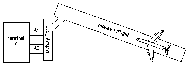
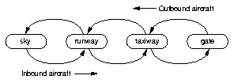
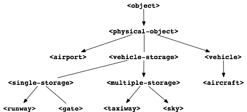

Design of the Airport Application
=================================

In this chapter, we explore the design of an airport application that
uses the ``time``, ``angle``, and ``say`` libraries.

.. _design-goals-airport-application:

Goals of the airport application
--------------------------------

Throughout this book, we have been developing components for an airport
application. This application deals with airports, aircraft, gates, and
related objects. :ref:`objects-in-simple-airport` shows a diagram of a
simple airport.

.. _objects-in-simple-airport:

   Objects in a simple airport.

.. _transitions-sky-gate:

   Transitions between sky and gate for outbound and inbound aircraft.

In :ref:`objects-in-simple-airport`, we see a
single *terminal*, A. It has two *gates*, A1 and A2, a *taxiway*,
Echo, a *runway*, 11R-29L, and an *aircraft* approaching the runway.

When landing, an aircraft goes from the sky to a runway to a taxiway to
a gate. :ref:`transitions-sky-gate` is a state diagram showing these
transitions for both inbound and outbound aircraft.

Our first goal for this application is as follows: given a set of
incoming aircraft at various positions in the sky, we want to predict
which gate each aircraft will use when it arrives, and to estimate the
arrival time of the aircraft at the gate. This information is displayed
on the Arrivals monitors in an airport.

Our second goal for the application is to provide additional information
for the ground crew. We must state the entire path that an incoming
aircraft will take, including the runway, the taxiway, and the gate. We
must also state the time that an aircraft is expected to be at each
point. For example, for an inbound aircraft, we want to display
information like the following::

    12:30: Aircraft Cardinal at Runway 11R-29L
    12:43: Aircraft Cardinal at Taxiway Echo
    12:47: Aircraft Cardinal at Gate A2

The application considers departing aircraft as well as arriving
aircraft.

Objects that model an airport
-----------------------------

We need to define classes that represent the objects in Figures
:ref:`objects-in-simple-airport` and :ref:`transitions-sky-gate`
Note that the application displays information about the path of
an aircraft from gate to sky and sky to gate; the aircraft stops at
the gate and does not enter the terminal itself. Therefore, we do
not need to define a terminal class. Our design includes these
airport classes:

    ``<airport>``, ``<gate>``, ``<taxiway>``, ``<runway>``, ``<sky>``,
    ``<vehicle>``, ``<aircraft>``

A vehicle is any object that is self-propelled. Aircraft are vehicles
that are capable of flying. In our design, the sky around the airport,
the gates, the taxiways, and the runways each keep track of each
aircraft as the latter moves from the sky to the gate and back to the
sky again. One common attribute of the sky, gates, taxiways, and runways
is that each of them can hold an aircraft, or more than one aircraft.
Because these objects can hold vehicles, we can think of them as
containers. Our design uses this class to represent all types of
containers:

     ``<vehicle-storage>``

In our design, containers are connected to other containers. In the
airport diagram in :ref:`objects-in-simple-airport`, gate A1 is
connected to taxiway Echo, which is connected to runway 11R-29L.
We can use a slot in the ``<vehicle-storage>`` class to model these
connections.

Since some containers can hold only one aircraft, whereas other
containers have more complex behavior, our design includes two
subclasses of ``<vehicle-storage>``:

    ``<single-storage>``, ``<multiple-storage>``

Instances of ``<single-storage>`` may hold a single aircraft regardless of
the direction of travel. Instances of ``<multiple-storage>`` may hold more
than one aircraft, and each direction is treated separately. For
example, ``<gate>`` is a subclass of ``<single-storage>``, and ``<sky>`` is a
subclass of ``<multiple-storage>``.

All subclasses of ``<vehicle-storage>`` must comply with the
vehicle-storage protocol. In particular, designers of
``<vehicle-storage>`` subclasses must ensure that the subclasses either
inherit or define methods for all the key vehicle-storage generic
functions.

Certain classes — such as the time and position classes — represent
intangible concepts. Other classes — such as airports, gates, runways,
and aircraft — represent physical objects. It may be useful to make that
distinction in our classes, so we define a class from which all physical
objects inherit:

    ``<physical-object>``

.. _inheritance-relationships-physical:

   Inheritance relationships among classes that represent physical objects.

Figure :ref:`inheritance-relationships-physical` shows the inheritance
relationships among the classes that represent physical objects.

Behaviors of the objects
------------------------

The top-level function of our application is called ``process-aircraft``.
Given an airport that has been properly initialized, ``process-aircraft``
will simulate and document the movement of all inbound aircraft through
all the containers of the airport, from landing through takeoff.

To predict how long it will take for an aircraft to arrive at the
airport, we need to compute the distance between the position of the
aircraft and the position of the airport. Then, we must divide the
distance by the speed to determine how long it will take the aircraft to
get from one position to the other. The ``flying-time`` method will
implement that computation in our design.

Once an aircraft approaches the airport, it enters a series of
containers. The generic functions that constitute the vehicle-storage
protocol help us to generate and simulate the transitions of the
aircraft from container to container.

We summarize some of the operations in our design here; we summarize the
vehicle-storage protocol in `The vehicle-container protocol`_.

process-aircraft *airport time*
'''''''''''''''''''''''''''''''

*Generic Function*
~~~~~~~~~~~~~~~~~~

#. This generic function simulates and documents the movement of
   aircraft through the airport, including the time of each transition —
   for example,

   ::

     12:30: Aircraft Cardinal at Runway 11R-29L
     12:43: Aircraft Cardinal at Taxiway Echo
     12:47: Aircraft Cardinal at Gate A2

#. The *airport* is an instance of ``<airport>``. The ``time`` is an
   instance of ``<time-of-day>``.

distance-3d *aircraft airport*
''''''''''''''''''''''''''''''

*Generic Function*
~~~~~~~~~~~~~~~~~~

#. This generic function returns the distance between its two arguments.
   The *aircraft* is an instance of ``<aircraft>``, and the *airport* is
   an instance of ``<airport>``.

flying-time *aircraft airport*
''''''''''''''''''''''''''''''

*Generic Function*
~~~~~~~~~~~~~~~~~~

#. This generic function returns the time that it would take for the
   *aircraft* to fly to the *airport*.

The vehicle-container protocol
------------------------------

Once the aircraft approaches the airport, it enters a set of connected
containers on its way inbound to a particular gate. The aircraft
eventually turns around and heads outbound toward the sky. The
vehicle-container protocol manages the transition of aircraft from one
container to another. The generic functions that make up this protocol
are summarized next. For all the generic functions that follow, the
value of the *vehicle* parameter must be an instance of ``<vehicle>``,
the value of the *container* parameter must be an instance of
``<vehicle-storage>``, and the value of the *direction* parameter must be
either the symbol ``#"inbound"`` or ``#"outbound"``.

available? *vehicle container direction*
''''''''''''''''''''''''''''''''''''''''

*Generic Function*
~~~~~~~~~~~~~~~~~~

#. This generic function returns true if there is space in *container*
   for *vehicle* to enter for traveling in *direction*.

move-in-vehicle *vehicle container direction*
'''''''''''''''''''''''''''''''''''''''''''''

*Generic Function*
~~~~~~~~~~~~~~~~~~

#. This generic function moves the *vehicle* into the *container* in the
   *direction* given.

move-out-vehicle *vehicle container direction*
''''''''''''''''''''''''''''''''''''''''''''''

*Generic Function*
~~~~~~~~~~~~~~~~~~

#. This generic function moves the *vehicle* out of the *container* in
   the *direction* given.

next-out *container direction*
''''''''''''''''''''''''''''''

*Generic Function*
~~~~~~~~~~~~~~~~~~

#. This generic function determines what vehicle, if any, could move to
   the next container. If there is such a vehicle, then *next-out*
   returns the vehicle, the next container in the direction of travel,
   and the time it would take to make that transition.

next-landing-step *container vehicle*
'''''''''''''''''''''''''''''''''''''

*Generic Function*
~~~~~~~~~~~~~~~~~~

#. This generic function returns two values. The first value is the
   class of the next container into which *vehicle* may move from
   *container*. The second value is how long it will take *vehicle* to
   move into the next container. This generic function is used by the
   *next-out* generic function to accomplish part of the latter’s work.

Sorted sequences
----------------

Part of what ``process-aircraft`` will do in our example is to generate a
collection of possible transition steps for aircraft in or around the
airport. For example, if an aircraft is on the runway, then one possible
transition step would be to move the aircraft to the taxiway. If there
are many aircraft in the airport, there are many possible transitions
that might take place at various time. The ``process-aircraft`` method
needs to consider these transitions in order. That is, if an aircraft is
ready to land on a runway in 5 minutes, but another one is ready to take
off in 2 minutes, ``process-aircraft`` should attempt to complete the
take-off transition before completing the landing transition. To keep
these transitions in time order, we use a collection called a *sorted
sequence*.

Dylan does not provide a sorted sequence class in its built-in
collection library. However, Dylan does provide an extensible collection
framework that permits us to define sorted sequences ourselves. In fact,
Dylan already provides all the generic functions that we need to
interact with sorted sequences: ``size``, ``shallow-copy``, ``element``,
``add!``, ``pop``, ``remove!``, and ``forward-iteration-protocol``.
We just need to provide methods for each of these generic
functions that implement these operations for sorted sequences. By
defining a method for ``forward-iteration-protocol``, we allow sorted
sequences to work with the standard Dylan collection iterators discussed
in :doc:`collect`. Because sorted sequences are generally useful, we
define them in their own library, in the same manner as we did the time
and angle components.

Testing
-------

We include in the application a test library, which creates instances of
the classes described in this chapter, initializes these instances to a
reasonable state, and calls ``process-aircraft``. Providing test cases
(in a separate library) is a good way to check the design, interface,
and implementation of an application library.

Summary
-------

In this chapter, we covered the following:

- We discussed the goals of the airport application: to predict the
  arrival time and gate of an incoming aircraft, and to describe the
  entire path that an incoming aircraft will take, including the time
  it is expected to be at each point.
- We discussed the design of the airport application classes, and the
  operations to be performed on instances of the classes, including the
  vehicle- container protocol.
- We discussed how the time, angle, sorted sequence, and testing
  libraries interact with the main airport application library.

In :doc:`heap`, we implement sorted sequences. In :doc:`nlanding`, we
implement the airport application.
