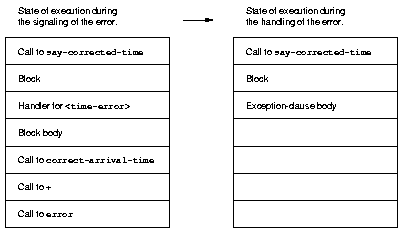
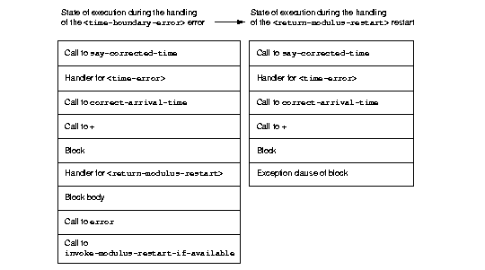

Exceptions
==========

An ``exception`` is an unexpected event that occurs during program
execution (as opposed to problems detected during program compilation).
One common type of exception is a violation of the contract of a
function, such as attempting to divide a number by zero. Another example
is an attempt to access an uninitialized slot, or certain cases of an
attempt to violate the type constraint on a slot or variable (those that
cannot be detected at compile time). Dylan detects all these exceptions
itself. Sometimes, an application detects a violation of a contract that
it defines. For example, in :ref:`slots-virtual-slots`, we defined methods
that detected attempts to specify a longitude direction of anything
other than east or west. (In :ref:`perform-enumerations` we changed the
application such that this particular application-detected exception was
transformed into one that is detected by Dylan.)

When an unusual event occurs in an application, there are many
options available for responding to that event. The application can try
to handle the situation in its own particular way, or it can use the
*exception protocol* defined by Dylan. In this chapter, we explore
several approaches to providing an exception protocol between parts of
an application.

An informal exception protocol
------------------------------

Our goal is to modify the method that adds a ``<time-offset>`` instance to
a ``<time-of-day>`` instance. We redefine that method to detect overflow
beyond the 24-hour period covered by a time of day, and to take special
action in that case. In this section, we show a simple way to indicate
and handle exceptions, without using the Dylan exception protocol. We
then discuss the problems with this informal approach. In
`A simple Dylan exception protocol`_, we achieve the same goal
using Dylan conditions, and discuss the advantages of that approach.

The ``+`` method using informal exceptions
~~~~~~~~~~~~~~~~~~~~~~~~~~~~~~~~~~~~~~~~~~

First, we redefine the method for adding ``<time-offset>`` and
``<time-of-day>`` (this method was last defined in
:ref:`time-mod-time-implementation-file`). The method now
returns an error string in the event that the computed sum is beyond the
permitted 24-hour range:

.. code-block:: dylan

    define method \+ (offset :: <time-offset>,
                      time-of-day :: <time-of-day>)
     => (sum :: type-union(<time-of-day>, <string>))
      let sum
        = make(<time-of-day>,
               total-seconds: offset.total-seconds + time-of-day.total-seconds);
      if (sum >= $midnight & sum < $tomorrow)
        sum;
      else
        "time boundary violated";
      end if;
    end method \+;

We have altered the ``+`` method in two important ways. First, we have
modified the original values declaration, ``(sum :: <time-of-day>)``, to
allow the return of either a ``<time-of-day>`` instance or a string
describing a problem. Second, we have added code that checks the
computed time of day, and returns an error string if the sum is out of
bounds.

To illustrate further how the informal exceptions work, we define a
method that calls the ``+`` method defined in this section. We define a
method, ``correct-arrival-time``, that adds predicted weather and traffic
delays to an arrival time; and we define ``say-corrected-time``, which
calls ``correct-arrival-time`` and displays the results:

.. code-block:: dylan

    define method correct-arrival-time
        (arrival-time :: <time-of-day>, weather-delay :: <time-offset>,
         traffic-delay :: <time-offset>)
     => (sum :: type-union(<time-of-day>, <string>))
      let sum1 = weather-delay + arrival-time;
      // Check whether the result of + was a string representing an error
      if (instance?(sum1, <string>))
        sum1;
      else
        // Otherwise, if there is no error, compute the second part of the sum
        traffic-delay + sum1;
      end if;
    end method correct-arrival-time;

    define constant $no-time = make(<time-offset>, total-seconds: 0);

    define method say-corrected-time
        (arrival-time :: <time-of-day>,
         #key weather-delay :: <time-offset> = $no-time,
              traffic-delay :: <time-offset> = $no-time)
     => ()
      let result = correct-arrival-time(arrival-time, weather-delay,
                                        traffic-delay);
      // Check whether the result of + was a string representing an error
      if (instance?(result, <string>))
        format-out("Error during time correction: %s", result);
      else
        // Otherwise, if there is no error, display the result
        say(result);
      end if;
    end method say-corrected-time;

Problems with the informal exception protocol
~~~~~~~~~~~~~~~~~~~~~~~~~~~~~~~~~~~~~~~~~~~~~

There are several significant problems with the approach used in
`The + method using informal exceptions`_:

- As we saw in the ``correct-arrival-time`` method, most callers of the
  ``+`` function must check the type of the value returned. This type
  checking breaks up the normal flow of control, and gives as much
  weight to the unusual case (the exception) as it does to the usual
  case. If a caller fails to check the return value to see whether that
  value is a string, then a different error will occur later in the
  program (such as adding a string and time together), when it might be
  hard to trace back the problem to the original point of failure. Note
  that both direct callers of ``+`` (``correct-arrival-time``) and
  indirect callers of ``+`` (``say-corrected-time``) must understand and
  use this error protocol correctly.
- For other methods that might return any object (including strings,
  for example), an additional return value would have to be used to
  indicate that an exception occurred. It would be easy to forget to
  check the extra return value and such failure could easily go
  undetected, causing unpredictable program behavior. If the method is
  being added to a generic function in another library, it might be
  impossible to add a second return value indicating failure, because
  the generic function might limit the number of return values.
- A casual reader of the code could become easily confused about this
  ad hoc error protocol. Someone might inadvertently write code that
  did not obey this ad hoc protocol. Also, if all programmers use their
  own error protocols, it will be hard to remember which convention to
  obey at the call site; programmers will have to check the convention
  in the source code or programmer documentation.
- In this example, the ability to restrict the return value to only
  ``<time-of-day>`` is lost. This loss might prevent compile-time error
  checking that could catch errors that would be difficult or
  inconvenient to catch at run time. It might also prevent the compiler
  from optimizing code that uses the results of this function, thus
  decreasing performance of the application.
- We are limited in how we can respond to the error. The context in
  which the error was detected has been lost. There is no state we can
  examine to gather more details about the error, and to determine why
  the error occurred. We also cannot correct whatever caused the
  problem, then continue from the point where the error occurred.

A simple Dylan exception protocol
---------------------------------

In Sections `Signaling conditions`_ through `Continuation from errors`_,
we show how to modify the three methods in
`The + method using informal exceptions`_ to use the basic tools that Dylan
provides for indicating and responding to exceptional situations.

Signaling conditions
~~~~~~~~~~~~~~~~~~~~

Dylan provides a structured mechanism for indicating that an unusual
event or exceptional situation has occurred during the execution of a
program. Using this mechanism is called *signaling a condition*. A
``condition`` is an instance of the ``<condition>`` class, which represents
a problem or unusual situation encountered during program execution.

To signal a condition, we need to take these steps:

#. Define a condition class, which must be a subclass of ``<condition>``.
   The condition class should have slots that are appropriate for the
   application. In this example, we define a condition class named
   ``<time-error>`` to be a direct subclass of ``<error>``. Note that
   ``<error>`` is a subclass of ``<condition>``. We defined ``<time-error>``
   to inherit from ``<error>``, because in case our application does not
   handle the exception, we want Dylan always to take some action, such
   as entering a debugger. If ``<time-error>`` inherited from
   ``<condition>`` and the application failed to handle the exception,
   then the exception might simply be ignored.
#. Modify the functions that might detect the exception. These functions
   must make an instance of the condition class, and must use an
   appropriate Dylan function to initiate the signaling process. In this
   example, we redefine the ``+`` method to signal the condition with the
   ``error`` function.

In the following code, we define a condition named ``<time-error>`` to
represent any kind of time error, and we define a condition named
``<time-boundary-error>`` to represent violations of time-of-day bounds.

.. code-block:: dylan

    define abstract class <time-error> (<error>)
      constant slot invalid-time :: <time>,
        required-init-keyword: invalid-time:;
    end class <time-error>;

    define method say (condition :: <time-error>) => ()
      format-out("The time ");
      say(condition.invalid-time);
      format-out(" is invalid.");
    end method say;

    define class <time-boundary-error> (<time-error>)
      // Inclusive bound
      constant slot min-valid-time :: <time>,
        required-init-keyword: min-time:;
      // Exclusive bound
      constant slot valid-time-limit :: <time>,
        required-init-keyword: time-limit:;
    end class <time-boundary-error>;

    define method say (condition :: <time-boundary-error>) => ()
      next-method();
      format-out("\nIt must not be less than ");
      say(condition.min-valid-time);
      format-out(" and must be less than ");
      say(condition.valid-time-limit);
      format-out(".");
    end method say;

We redefine the ``+`` method to signal the ``<time-boundary-error>``
condition (instead of returning an error string) to indicate that this
problem has occurred:

.. code-block:: dylan

    define method \+ (offset :: <time-offset>, time-of-day :: <time-of-day>)
     => (sum :: <time-of-day>)
      let sum
        = make(<time-of-day>,
               total-seconds:
                 offset.total-seconds + time-of-day.total-seconds);
      if (sum >= $midnight & sum < $tomorrow)
        sum;
      else
        error(make(<time-boundary-error>, invalid-time: sum,
                   min-time: $midnight, time-limit: $tomorrow));
      end if;
    end method \+;

We create the condition with ``make``, just as we create instances of
other classes. We call the ``error`` function to signal the condition. The
``error`` function is guaranteed never to return to its caller.

Now we can specify an exact return value for the ``+`` method, because we
are no longer returning an error string to indicate a problem with the
addition.

In previous chapters (for example, in :ref:`multi-adding-other-times`), we
called the ``error`` function with a string. Given a string as its first
argument, the ``error`` function creates a general-purpose condition named
``<simple-error>`` and stores its arguments in the condition instance. In
the preceding example, however, we created an instance of a condition
that is customized for our program (``<time-boundary-error>``), and then
supplied that condition to the ``error`` function. This approach provides
information that is more readily accessible to the code that will handle
the condition. Conditions, like any other Dylan class, can use
inheritance, and can participate in generic function dispatch. For
example, we define ``say`` methods for our errors, so that our handlers
can provide a reasonable error message to the user. (Unfortunately,
Dylan debuggers do not yet have a standard way to know about our ``say``
generic function. We expect that Dylan will eventually support such a
mechanism.)

Supplying a specific condition to the ``error`` function brings the full
power of Dylan’s object-oriented programming capabilities to the task of
signaling and handling exceptional situations.

Once the ``error`` function receives a condition instance, or makes an
instance of ``<simple-error>`` itself, Dylan begins a process of
attempting to resolve the situation represented by the condition. We
present the details of condition resolution in the next section.

Simple condition handling
~~~~~~~~~~~~~~~~~~~~~~~~~

A *handler* can potentially resolve an exceptional situation, although a
handler can decline to resolve a particular exception. If an application
provides no handlers, then the generic function ``default-handler`` is
called on the condition. There is a method on ``<condition>`` that just
returns false, and there is a method on ``<serious-condition>`` (a
superclass of ``<error>``) that causes some kind of
implementation-specific response to be invoked. Most development
environments provide a debugger that deals with any serious conditions
not handled by the application. Typically, the debugger describes the
serious condition being signaled, and might provide any number of
options for recovery (or might provide no recovery options). In a sense,
the debugger is the handler of final resort.

In the following example, we establish a handler for the condition that
we want to resolve, before calling the code that might signal that
condition. We redefine the ``correct-arrival-time`` and
``say-corrected-time`` methods to take advantage of the Dylan exception
protocol.

.. code-block:: dylan

    define method correct-arrival-time
        (arrival-time :: <time-of-day>, weather-delay :: <time-offset>,
         traffic-delay :: <time-offset>)
     => (sum :: <time-of-day>)
      traffic-delay + (weather-delay + arrival-time);
    end method correct-arrival-time;

    define method say-corrected-time
        (arrival-time :: <time-of-day>,
         #key weather-delay :: <time-offset> = $no-time,
              traffic-delay :: <time-offset> = $no-time)
     => ()
      block ()
        say(correct-arrival-time(arrival-time, weather-delay, traffic-delay));
        // We establish the handler in the following two lines
      exception (condition :: <time-error>)
        say(condition);
      end block;
    end method say-corrected-time;

The ``exception`` clause of ``block`` establishes a handler for a condition,
and all that condition’s subclasses, for any code in the ``block`` body,
and for any code called by the ``block`` body. We say that the handler is
established within the *dynamic scope* of the ``block`` body. When an
exception is signaled, Dylan starts a search to find the nearest handler
available that matches the condition signaled, and that accepts the
exception. The *nearest handler* is the one that was most recently
established in the dynamic scope of the signaler. The handler matches
the condition if the class associated with the handler (the handler
class) is the same as the condition, or if the handler class is a
superclass of the condition. You can associate a test with the handler
so that the handler can selectively accept the condition. By default, a
matching handler always accepts. If a handler established by the
``exception`` clause of ``block`` matches and accepts, then a nonlocal exit
from the signaler occurs, with execution continuing in the body of the
exception clause, which is executed in the context of the very beginning
of the block. All the locals defined by the block are gone, but the exit
procedure (if there is one) is still available. If there is relevant
local state, it may be captured in slots of the condition prior to
signaling of the condition. The code within the exception clause body is
executed, and the value of the last statement in that body is then
returned as the value of the block.

In this example, the ``+`` method (called by ``correct-arrival-time``) may
signal a ``<time-boundary-error>`` condition using the ``error`` function
during the execution of ``say-corrected-time``. If this error is
signaled, then the handler established by the ``block`` for ``<time-error>``
will match the ``<time-boundary-error>`` condition. This ``exception``
clause will always accept the condition, so a nonlocal exit will occur,
and will terminate execution of the ``error`` function, the ``+`` method,
and the ``correct-arrival-time`` method. Within the context of the
beginning of the ``block``, the variable ``condition`` is bound to the
condition instance being signaled (the instance supplied to ``error``;
then, execution resumes with the code inside the body of the ``exception``
clause. The body calls the ``say`` generic function on the condition
instance, which causes an appropriate error message (instead of the
time) to be displayed to the user. Execution then continues normally
after the end of the block; in this case, that results in the normal
exit from the ``say-corrected-time`` method. :ref:`signaler-to-handler`
shows the state of execution when ``error`` is called, and after the
execution of the ``exception`` clause body for ``<time-error>`` begins.
:ref:`signaler-to-handler` is a simplified diagram of the internal calling
stack of a hypothetical Dylan implementation. It is similar to what a
debugger might produce when asked to print a backtrace at these two
points in the execution of the example. The ``error`` function called
within the ``+`` method signals the ``<time-boundary-error>`` error,
and the ``exception`` clause of ``block`` in the ``say-corrected-time``
method establishes the handler for that error.  Once the handling of
the exception is in progress, the handler selected is no longer
established. If there is relevant local state, it may be captured in
slots of the condition being signaled.

.. _signaler-to-handler:

   Context transition from signaler to handler.

The advantages of this structured approach to signaling and handling
conditions are significant:

- The method focuses on the normal flow of control, and the exceptional
  flow of control appears only where necessary. For example, the
  ``correct-arrival-time`` method does not need to be aware of the
  potential exceptions at all. The Dylan condition system makes it
  easier to reuse code that might not know about, or care to
  participate in, your application-specific exception recovery code.
- Because ``correct-arrival-time`` does not need to participate in the
  exception-recovery protocol, it can also have a specific return
  value; thus, like the ``+`` method, it might allow better compiler
  optimizations and better compile-time error checking.
- We allow room for expansion in the code. For example, at some point,
  ``correct-arrival-time`` might do more sophisticated computations with
  time, which might signal other kinds of time errors. As long as these
  new time errors inherit from ``<time-error>``, they can be resolved by
  the same handler established by ``say-corrected-time``. As the
  application evolves, we can build various families of error
  conditions, and can provide application-specific handlers that
  perform the correct recovery actions for those families.
- Because we are using the signaling and handling protocol defined by
  Dylan, casual readers of the code should be able to understand our
  intent.
- Because the handler has access to the condition object, the handler
  can perform intelligent recovery actions based on the information
  captured in the condition object when the exception occurred. For
  example, the handler may examine various slots of the condition
  object, and perform different actions based on information stored in
  those slots.

Dylan supports two models of handler execution. The ``exception`` clause
of ``block`` implements the exit model. When you establish handlers by the
``exception`` clause of ``block``, you do not have the ability to restart a
computation in the context of the signaler, or in a context closer to
the signaler than the handler. In `Definition of a recovery protocol`_,
we explore the calling model of handler execution, which allows you to
recover from an exception without a nonlocal exit back to the point
where the handler was established.

Definition of a recovery protocol
~~~~~~~~~~~~~~~~~~~~~~~~~~~~~~~~~

With the new definition of our ``+`` method on ``<time-offset>`` and
``<time-of-day>``, if we add 5 hours to 10:00 P.M., a condition instance
is signaled. The ``say-corrected-time`` method handles that condition, and
prints a suitable error message. By the time the handler in
``say-corrected-time`` takes control, the addition that we were performing
has been aborted. In fact, we are no longer even executing within the
``correct-arrival-time`` method. We have ceased executing there because
handlers established using the ``exception`` clause of ``block`` perform
nonlocal exits out of the current computation back to the block where
the handler was established. Suppose that we, instead of aborting the
addition, wanted to continue with the addition, perhaps modifying the
value returned by the ``+`` method such that it would still be within the
correct 24-hour range for ``<time-of-day>`` instances. In this section, we
modify ``say-corrected-time`` to use a different technique for
establishing a handler that does not abort the computation in progress,
and we modify the ``+`` method for ``<time-offset>`` and ``<time-of-day>`` to
offer and implement a way to modify the value returned to be a legal
time of day.

First, we must find a way to execute a handler in the context of the
signaler, instead of at the point where the handler was established.
Then, we must find a way to activate special code in the ``+`` method to
return a legal ``<time-of-day>`` instance as a way of recovering from the
time-boundary exception.

- The ``let handler`` local declaration provides a way to establish a
  handler that will execute in the context of the signaler, just as
  though the handler was invoked with a normal function call by the
  signaler.
- The restart protocol provides a structured way for a handler to
  recover from the exception, and to continue with the computation in
  progress.

In this case, continuing with the computation means that the ``+`` method
will return a legal ``<time-of-day>`` instance to ``correct-arrival-time``,
and ``correct-arrival-time`` will finish any additional processing and
return normally to its caller.

To recover from an exception, we use a signaling and handling technique
as similar to that we used to indicate the exception in the first place.
This time, we signal a particular condition that is a subclass of
``<restart>``, to indicate how the exception handler wishes to recover.
We use a *restart handler* to implement the particular recovery action.
You can think of a restart as a special condition that represents an
opportunity to recover from an exception. Establishing a restart handler
is a way to offer such an opportunity to other handlers, and to specify
the implementation of the restart. Any handler, when activated, might
signal a restart to request that a particular recovery action take
place. Restart signaling and handling connects recovery requests with
recovery actions.

For example, adding 5 hours to 10:00 P.M. is an error for
``<time-offset>`` and ``<time-of-day>`` instances. One way to recover from
this error would be to wrap around the result to 3:00 A.M. Here, we
define the restart class ``<return-modulus-restart>``, which represents
an offer to return from a time-of-day computation by wrapping the
result:

.. code-block:: dylan

    define class <return-modulus-restart> (<restart>)
    end class <return-modulus-restart>;

Using the ``exception`` clause of ``block``, we redefine the ``+`` method to
establish and implement the restart handler:

.. code-block:: dylan

    define constant $seconds-per-day = $hours-per-day * $seconds-per-hour;

    define method \+ (offset :: <time-offset>,
                      time-of-day :: <time-of-day>)
     => (sum :: <time-of-day>)
      let sum
        = make(<time-of-day>,
               total-seconds: offset.total-seconds + time-of-day.total-seconds);
      block ()
        if (sum >= $midnight & sum < $tomorrow)
          sum;
        else
          error(make(<time-boundary-error>, invalid-time: sum,
                min-time: $midnight, time-limit: $tomorrow));
        end if;
      // Establish restart handler
      exception (restart :: <return-modulus-restart>)
        make(<time-of-day>,
          total-seconds: modulo(sum.total-seconds, $seconds-per-day));
      end block;
    end method \+;

If a handler (established with ``let handler``) signals a
``<return-modulus-restart>`` during the handling of the
``<time-boundary-error>`` exception, then the sum will be wrapped around
so that it will stay within the bounds of the time-of-day specification,
and the result will be returned from the ``+`` method.

Next, we want to write a handler using ``let handler`` that will invoke
the restart. However, before we invoke the restart, we want to confirm
that the restart is currently established. Signaling a restart that is
not currently established is an error. The ``available-restart`` method
that follows returns an instance of a given restart, if that restart
is currently established; otherwise, ``available-restart`` returns false:

.. code-block:: dylan

    define method available-restart
        (restart-class :: <class>, exception-instance :: <condition>)
     => (result :: false-or(<restart>))
      block (return)
        local method check-restart (type, test, function, initargs)
          // Make an instance of the restart, so we can see whether it matches
          // our search criteria
          if (subtype?(type, restart-class))
            let instance = apply(make, type, condition:, exception-instance,
                                 initargs | #[]);
            if (test(instance)) return(instance); end;
          end if;
        end method;
        // The built-in Dylan function do-handlers will call check-restart
        // for every handler currently established, in order (first is nearest
        // to the signaler)
        do-handlers(check-restart);
        #f;
      end block;
    end method available-restart;

Dylan provides the *do-handlers* function, which iterates over all the
currently established handlers, calling its argument (a function) on all
the relevant information about the handler, including all the
information necessary to instantiate a restart instance for restart
handlers. The ``check-restart`` local method returns from
``available-restart`` with a restart instance only when a matching restart
that accepts is found. All restarts take a ``condition`` init-keyword
argument, which, if supplied, should be the original exception that
occurred. If the handler that created the restart provided the original
exception condition as an init-keyword argument, then restart handlers
can handle restart conditions for only particular exceptions. If none of
the established handlers match and accept the restart that we seek, then
``available-restart`` returns false. Note that you should establish
restart handlers for instantiable restart classes only, because the
restart classes will be instantiated by restart-savvy handlers. If the
restart classes cannot be instantiated, then the recovery process will
not operate correctly.

Next, we need to define a method to be called by the exception handler
to invoke the restart whether it is available. If the restart is not
available, the method will call the ``next-handler`` method, which will
allow another handler the opportunity to decide if it will handle the
exception. In other words, if the ``<return-modulus-restart>`` restart is
not established, the handler for ``<time-error>`` established by
``say-corrected-time`` will *decline* to handle the
``<time-boundary-error>`` condition being signaled.

.. code-block:: dylan

    define method invoke-modulus-restart-if-available
        (condition :: <time-error>, next-handler :: <function>)
      let restart = available-restart(<return-modulus-restart>, condition);
      if (restart) error(restart); else next-handler(); end;
    end method invoke-modulus-restart-if-available;

No return values are declared for ``invoke-modulus-restart-if-available``,
because we cannot be certain what ``next-handler`` might return. Our
handler method must be prepared to return any number of objects of any
types. Next, we establish a handler using the ``let handler`` local
declaration:

.. code-block:: dylan

    define method say-corrected-time
        (arrival-time :: <time-of-day>,
         #key weather-delay :: <time-offset> = $no-time,
              traffic-delay :: <time-offset> = $no-time)
     => ()
      let handler (<time-error>) = invoke-modulus-restart-if-available;
      say(correct-arrival-time(arrival-time, weather-delay, traffic-delay));
    end method say-corrected-time;

The ``let handler`` local declaration establishes a handler for the
``<time-error>`` condition and for all that condition’s subclasses. When
the ``error`` function inside the ``+`` method signals the
``<time-boundary-error>`` condition instance, Dylan conducts a search for
the nearest matching handler that accepts. In this case, the nearest
matching handler that accepts is the handler established by
``say-corrected-time``. Because this handler was established by a
``let handler`` local declaration, instead of by the ``exception`` clause of
``block``, no nonlocal exit takes place. Instead, the function specified
in the ``let handler`` local declaration is invoked in the context of the
signaler. The ``error`` function essentially performs a regular function
call on the function associated with the nearest matching handler. The
function is passed the condition instance being signaled, and the
``next-handler`` function that might be used to decline handling this
condition. In our example, the ``invoke-modulus-restart-if-available``
function will be called from ``error``. Once called,
``invoke-modulus-restart-if-available`` will first see whether the
``<return-modulus-restart>`` restart is established. If the restart is
established, we will invoke it by signaling an instance of the restart.
If the restart is not established, we decline to process the
``<time-boundary-error>`` condition in this handler. Assuming that no
other handlers exist, the debugger will be invoked.

If the restart is signaled, a nonlocal exit to the restart exception
clause in ``+`` method is initiated, which returns the sum suitably
wrapped such that it lies within the 24-hour boundary.

:ref:`handler-to-restart` shows the state of execution after the
handler function for ``<time-error>`` is invoked, and the state
after the restart handler function for ``<return-modulus-restart>``
is invoked. As you can see, although establishing a handler with
``let handler`` can be far removed from the signaler, the handler
function itself is executed in the context of the signaler.

.. _handler-to-restart:

   Context transition from handler to restart handler.

Continuation from errors
~~~~~~~~~~~~~~~~~~~~~~~~

The restart mechanism just described is exceedingly general, and may
provide several different ways to recover from exceptional situations.
Sometimes, however, there is just one main way to recover. Under certain
circumstances, Dylan provides a way for handlers simply to return to
their callers, allowing execution to continue after the signaler. Here,
we present a simpler (but less flexible) implementation for recovering
from the time-of-day overflow exception:

.. code-block:: dylan

    define method return-24-hour-modulus
        (condition :: <time-error>, next-handler :: <function>)
     => (corrected-time :: <time>)
      make(type-for-copy(condition.invalid-time),
           total-seconds: modulo(condition.invalid-time.total-seconds,
                                 $seconds-per-day));
    end method return-24-hour-modulus;

    define method return-allowed? (condition :: <time-error>)
      #t;
    end method return-allowed?;

    define method return-description (condition :: <time-error>)
      "Returns the invalid time modulo 24 hours.";
    end;

    define method say-corrected-time
        (arrival-time :: <time-of-day>,
         #key weather-delay :: <time-offset> = $no-time,
              traffic-delay :: <time-offset> = $no-time)
     => ()
      let handler (<time-error>) = return-24-hour-modulus;
      say(correct-arrival-time(arrival-time, weather-delay, traffic-delay));
    end method say-corrected-time;

    define method \+ (offset :: <time-offset>,
                      time-of-day :: <time-of-day>)
     => (sum :: <time-of-day>)
      let sum
        = make(<time-of-day>,
               total-seconds: offset.total-seconds + time-of-day.total-seconds);
      block ()
        if (sum >= $midnight & sum < $tomorrow)
          sum;
        else
          // If a handler returns, it must return a valid <time-offset>
          signal(make(<time-boundary-error>, invalid-time: sum,
                 min-time: $midnight, time-limit: $tomorrow));
        end if;
      end block;
    end method \+;

The ``return-allowed?`` and ``return-description`` generic functions are
provided by Dylan. When the generic function ``return-allowed?`` returns
true for a given condition, introspective handlers know that they can
return successfully back to the signaler. When returning is allowed,
such introspective handlers may call the ``return-description`` generic
function to find out what values to return, if there are any. This
description can be especially useful for interactive handlers, such as
debuggers.

The ``return-24-hour-modulus`` method has been generalized compared to the
exception-specific restart defined in `Definition of a recovery protocol`_.
This method may return either an instance of ``<time-of-day>`` or
``<time-offset>``, depending on the class of time that overflowed. Thus,
it could be reused for exception handling in other parts of the application.

In this implementation approach, there is an implicit contract between
the signaler in the ``+`` method and any handler that matches and
accepts ``<time-boundary-errors>``. The contract is that the handler will
always return a valid ``<time>`` value, or will never return at all. If
any handler violates this implicit contract, then the reliability of the
program will be placed at risk. It is important to document these
error-handling contracts.

Note that, in the ``+`` method, we must use the ``signal`` function to
signal the exception, because it is illegal for a handler to return from
exceptions signaled with the ``error`` function.

Additional exception mechanisms
-------------------------------

We do not cover the entire Dylan exception protocol in this book. Here,
we mention briefly certain other techniques that we do not discuss
further in this book:

- You can signal conditions with ``cerror``, and ``break``, in addition
  to with the ``error`` and ``signal`` functions. The ``cerror`` function
  establishes a simple restart, then signals an error in a manner
  similar to ``error``. The ``break`` function directly invokes the
  debugger without signaling.
- The ``exception`` clause of ``block`` and ``let handler`` takes several
  options that, among other things, can facilitate restart signaling
  and handling.
- There are additional protocols for attaching a user interface to
  returning or restarting (``return-query``, ``restart-query``, which
  could be used with handlers that act like interactive debuggers.

See *The Dylan Reference Manual* for more information.

Protected operations and the ``block`` construct
------------------------------------------------

In this section, we describe how to use ``block`` to protect sections of
Dylan code from unexpected nonlocal exits. Dylan provides powerful ways
to execute nonlocal exits from a given execution context. An application
might signal a condition that might cause a handler to execute a
nonlocal exit, or an application might call an exit procedure named by
the first argument to ``block``. Sometimes, it is necessary to add
behavior to the nonlocal exit, to keep the application’s execution
environment in good shape.

Protected objects
~~~~~~~~~~~~~~~~~

Suppose that you want to design a class of objects that could be
accessed only when a lock for that object is granted. You might use
instances of such a class to avoid conflicting concurrent access in a
multi-threaded implementation of Dylan, or you might use instances of
such a class to represent files or other operating-system objects that
might be accessed reliably by only one process at a time. Let’s assume
that the ``<lock>`` class and the ``get-lock`` and
``release-lock`` functions are supplied by an external library. The
``get-lock`` function atomically obtains the lock if that lock is
available; otherwise, it waits until the lock becomes free, and then
obtains the lock. The ``release-lock`` function frees the lock so that
some other process can acquire the lock. Given this locking library, how
would we define the following?

- A class that represents a protected object
- A ``call-using-lock`` function, which acquires a lock associated with a
  protected object, calls an arbitrary function, and then releases the
  lock

We could define the class as follows:

.. code-block:: dylan

    define abstract class <protected-object> (<object>)
      slot object-lock :: <lock> = make(<lock>);
    end class <protected-object>;

Each subclass of ``<protected-object>`` would inherit an ``object-lock``
slot. The lock instance stored in this slot must be acquired prior to
any operation on the protected object, and released when the operation
is complete. One naive way to implement ``call-using-lock`` would be as
follows:

.. code-block:: dylan

    define method call-using-lock
        (object :: <protected-object>, function :: <function>, #rest args)
     => (#rest results)
      get-lock(object.object-lock);
      apply(function, object, args);
      release-lock(object.object-lock);
    end method call-using-lock;

The approach in the preceding example has two serious problems. First,
``call-using-lock`` does not return the values returned by calling
``function``. Second, if ``function`` executes a nonlocal exit past
``call-using-lock``, the ``release-lock`` call will never be executed, and
after that point no process will be able to acquire the lock for the
protected object. Thus, subsequent attempts to use the protected object
will wait forever, because the lock was not properly released. We could
add a handler that would release the lock if any condition is signaled,
but that might be incorrect, because certain conditions might be handled
within the dynamic scope of ``function``, and might never perform a
nonlocal exit past ``call-using-lock``. Thus, the lock might be released
prematurely, possibly causing the integrity of the protected object to
be violated. Also, calling an exit procedure performs a nonlocal exit
without signaling a condition at all.

To solve exactly this sort of problem, Dylan provides the ``cleanup``
clause of ``block``. Code within the body of a ``cleanup`` clause is
guaranteed to be executed before the ``block`` is exited, even if it is a
nonlocal exit that causes the ``block`` to terminate. The value of this
``block`` will be the result of calling ``function``. The ``cleanup``
clause does not affect what the ``block`` returns.

.. code-block:: dylan

   define method call-using-lock
       (object :: <protected-object>, function :: <function>, #rest args)
    => (#rest results)
     block ()
       get-lock(object.object-lock);
       apply(function, object, args);
     cleanup
       release-lock(object.object-lock);
     end block;
   end method call-using-lock;

The ``cleanup`` clause of ``block`` provides a powerful tool for ensuring
the integrity of applications that use nonlocal exits.

Summary
-------

In this chapter, we covered the following:

- We described how to define condition classes, and to signal them.
- We explored establishing simple error handlers using the ``exception``
  clause of ``block``.
- We showed how to design and implement a introspective recovery
  protocol using ``let handler``, ``do-handler``, and restarts.
- We demonstrated how a handler can simply return to the signaler with
  cooperation from that signaler.
- We showed how we can protect sections of code from unexpected
  nonlocal exits by using the ``cleanup`` clause provided by ``block``.

You can use these techniques to control the handling of exceptional
situations when they arise. By designing your condition classes
carefully and handling those conditions correctly, you make your program
significantly more robust, without interrupting the normal flow of
control. By providing recovery protocols, you make it possible to
continue cleanly after a problem has been detected. By protecting
critical code against unexpected nonlocal exits, you enhance the
reliability of your applications.
