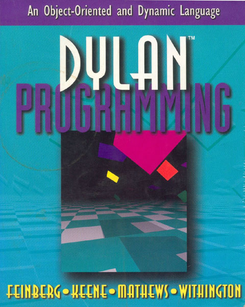

.. epigraph::

    This book will be useful to anyone learning dynamic, object-oriented
    programming, whether it be in Dylan, Java, Smalltalk, or Lisp.

    -- Andrew Shalit, author of The Dylan Reference Manual.

Contents
========

.. toctree::
   :maxdepth: 2
   :titlesonly:

   front-matter
   preface
   part1
   part2
   part3
   part4
   source-code
   environ
   c-comparisons
   glossary

.. only:: html

   * :ref:`genindex`
   * :ref:`search`

