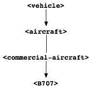
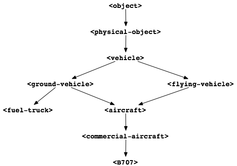
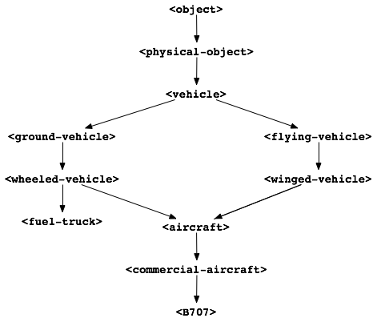

Multiple Inheritance
====================

In the class relationships that we have defined so far, each class has
only one direct superclass. When a class has a single direct superclass,
the way in which that class inherits from its superclass is called
*single inheritance*. In Dylan, a class can have more than one direct
superclass. When a class has multiple direct superclasses, it inherits
via *multiple inheritance*.

Why would we want to use multiple inheritance? Objects in the real world
can have complicated behavior. As we make our software models more
realistic, we often find that the behavior of the objects becomes more
complicated as well. Multiple inheritance is useful when we can break
down complicated behavior into sets of characteristics that do not
interfere with one another. We might be able to define a class to
represent each set of these characteristics. We can then define
subclasses that combine sets of characteristics by inheriting from more
than one of our superclasses. We give examples in this chapter.

Multiple inheritance does not change any of the rules of slot
inheritance or method dispatch that we have learned so far. But it does
require extensions to those rules. In this chapter, we explain how slot
inheritance and method dispatch work in Dylan in the presence of
multiple inheritance.

Example of multiple inheritance
-------------------------------

In our airport example, we defined a ``<vehicle>`` class, and used it as a
superclass for classes of aircraft. :ref:`hierarchy-of-vehicle-classes`
shows the hierarchy of vehicle classes that we defined.

So far, the only type of vehicle that we have defined is aircraft. Of
course, there are many other kinds of vehicle: automobiles, ships, and
spacecraft, to name a few. We have not needed these kinds of vehicles in
the airport example so far, but we can easily see how we would need more
vehicle classes if we made the example more realistic.

For example, aircraft need fuel before they can take off. An aircraft is
typically fueled by a truck at the gate. If fuel is unavailable or
fueling is delayed, the aircraft’s departure from the gate is delayed as
well. If we want to model the takeoff process more accurately, we should
take account of the need for fuel, and specifically the need to get fuel
trucks to aircraft preparing for takeoff.

We are not going to handle the fuel-supply problem in this book.
However, in this section, we are going to modify the vehicle class
hierarchy as a first step toward handling fuel trucks and other kinds of
ground vehicles. In the process, we will develop an opportunity for
using multiple inheritance in aircraft classes.

Modeling of ground vehicles
~~~~~~~~~~~~~~~~~~~~~~~~~~~

An obvious early step in modeling the behavior of fuel trucks would be
to define a ``<fuel-truck>`` class. Presumably, we would want that class
to inherit from

.. _hierarchy-of-vehicle-classes:

   Hierarchy of vehicle classes.

``<vehicle>``. Let’s look at our current definitions of both the
``<vehicle>`` class and its only direct subclass, ``<aircraft>``:

.. code-block:: dylan

    // The class that represents all self-propelled devices
    define abstract class <vehicle> (<physical-object>)
      // Every vehicle has a unique identification code
      slot vehicle-id :: <string>, required-init-keyword: id:;
      // The normal operating speed of this class of vehicle in miles per hour
      each-subclass slot cruising-speed :: <positive-integer>;
      // Allow individual differences in the size of particular aircraft, while
      // providing a suitable default for each class of aircraft
      each-subclass slot standard-size :: <size>;
    end class <vehicle>;

    // This class represents vehicles that normally fly for a portion of
    // their trip
    define abstract class <aircraft> (<vehicle>)
      slot altitude :: <integer>, init-keyword: altitude:;
      // Direction here is either #”inbound” or #”outbound”.
      slot direction :: <symbol>;
      // The next transition that this aircraft might be able to make.
      slot next-transition :: <aircraft-transition>,
        required-init-keyword: transition:, setter: #f;
    end class <aircraft>;

As a start, we can define a ``<fuel-truck>`` class as a subclass of
``<vehicle>``. To operate on instances of this class, we will no doubt
need to know how much aircraft fuel they contain. We define one initial
slot, ``aircraft-fuel-remaining``. We also need to provide initial values
for the inherited slots ``cruising-speed`` and ``standard-size``.

.. code-block:: dylan

    define class <fuel-truck> (<vehicle>)
      // Amount of aircraft fuel remaining in the tank
      slot aircraft-fuel-remaining :: <integer>,
      init-keyword: aircraft-fuel-remaining:, init-value: 0;
      inherited slot cruising-speed, init-value: 25;
      inherited slot standard-size,
      init-value: make(<size>, length: 30, width: 10, height: 10);
    end class <fuel-truck>;

This definition serves our immediate purpose, but the class hierarchy is
not as modular as it might be. Suppose that we want to take account of
other vehicles on the ground, such as baggage carriers or fire trucks?
We can anticipate that all ground vehicles might have common features,
and we do not want each new class to be a direct subclass of ``<vehicle>``
. As a refinement, we define two intermediary classes,
``<ground-vehicle>`` and ``<flying-vehicle>``:

.. code-block:: dylan

    define abstract class <ground-vehicle> (<vehicle>)
    end class <ground-vehicle>;

    define abstract class <flying-vehicle> (<vehicle>)
    end class <flying-vehicle>;

    define class <fuel-truck> (<ground-vehicle>)
      // How much aircraft fuel is left in the tank
      slot aircraft-fuel-remaining :: <integer>,
        init-keyword: aircraft-fuel-remaining:, init-value: 0;
      inherited slot cruising-speed, init-value: 25;
      inherited slot standard-size,
        init-value: make(<size>, length: 30, width: 10, height: 10);
    end class <fuel-truck>;

    define abstract class <aircraft> (<flying-vehicle>)
      slot altitude :: <integer>, init-keyword: altitude:;
      slot direction :: <symbol>;
      slot next-transition :: <aircraft-transition>,
        required-init-keyword: transition:, setter: #f;
    end class <aircraft>;

At this point, we are going to leave the fuel-truck simulation. We do
not model the fuel-supply problem further in this book. We do want to
explore opportunities that our new class hierarchy presents for
restructuring the aircraft classes.

Aircraft classes and multiple inheritance
~~~~~~~~~~~~~~~~~~~~~~~~~~~~~~~~~~~~~~~~~

It is obvious that an aircraft is a flying vehicle. In our airport
model, however, we have to take account of an aircraft’s behavior on
taxiways and runways and at gates. In these situations, the aircraft is
acting as a ground vehicle. Perhaps it makes sense to define our
aircraft classes as subclasses of both ``<flying-vehicle>`` and
``<ground-vehicle>``.

What could we gain by doing so? Consider cruising speed. When an
aircraft is in the air, we need to take into account its flying cruising
speed when estimating its time of arrival at its destination. When the
aircraft is on the ground, we need to take into account the ground
cruising speed when estimating how much time the aircraft will spend on
a taxiway or runway. It makes sense to have both flying and ground
cruising speeds. It also makes sense for flying cruising speed to be a
property of flying vehicles — more specifically, aircraft — and for
ground cruising speed to be a property of ground vehicles. After all,
the notion of cruising speed can be useful in estimating how long a fuel
truck will take to arrive at a given gate.

We now restructure our vehicle classes again, this time to make the
aircraft classes be subclasses of both ``<flying-vehicle>`` and
``<ground-vehicle>``. We need to remove the ``cruising-speed`` slot from
the ``<vehicle>`` class, and to replace it by two slots:
``ground-cruising-speed`` for the ``<ground-vehicle>`` class and
``flying-cruising-speed`` for the ``<flying-vehicle>`` class. We can also
take this opportunity to move the ``altitude`` slot from the ``<aircraft>``
class to the ``<flying-vehicle>`` class, because any flying vehicle is
likely to need to keep track of its altitude. Finally, we introduce
multiple inheritance by redefining the ``<aircraft>`` class to be a direct
subclass of both ``<flying-vehicle>`` and ``<ground-vehicle>``.

.. code-block:: dylan

    define abstract class <vehicle> (<physical-object>)
      // Every vehicle has a unique identification code
      slot vehicle-id :: <string>, required-init-keyword: id:;
      // The standard size of this class of vehicle
      each-subclass slot standard-size :: <size>;
    end class <vehicle>;

    define abstract class <ground-vehicle> (<vehicle>)
      // The normal operating speed of this class of vehicle
      each-subclass slot ground-cruising-speed :: <positive-integer>;
    end class <ground-vehicle>;

    define abstract class <flying-vehicle> (<vehicle>)
      // The normal operating speed of this class of vehicle
      each-subclass slot flying-cruising-speed :: <positive-integer>;
      slot altitude :: <integer>, init-keyword: altitude:;
    end class <flying-vehicle>;

    define abstract class <aircraft> (<flying-vehicle>, <ground-vehicle>)
      slot direction :: <symbol>;
      slot next-transition :: <aircraft-transition>,
        required-init-keyword: transition:, setter: #f;
    end class <aircraft>;

Now, all aircraft classes have two slots for cruising speed:
``ground-cruising-speed``, inherited from the ``<ground-vehicle>`` class,
and ``flying-cruising-speed``, inherited from the ``<flying-vehicle>``
class. We have to modify our ``<B707>`` class to provide default initial
values for these slots.

.. code-block:: dylan

    define class <B707> (<commercial-aircraft>)
      inherited slot flying-cruising-speed, init-value: 368;
      inherited slot ground-cruising-speed, init-value: 45;
      inherited slot standard-size,
        init-value: make(<size>, length: 153, width: 146, height: 42);
    end class <B707>;

Finally, to complete the example, we would change our ``<fuel-truck>``
class definition to provide a default initial value for
``ground-cruising-speed``, instead of ``cruising-speed``.

Multiple inheritance and slots
------------------------------

For the most part, using multiple inheritance does not present special
problems in using slots. Recall that a class inherits all the slots of
its superclasses. A subclass can also add slots of its own, but it
cannot remove or replace any slots defined by its superclasses. A slot
can appear only once in a class and in all that class’s superclasses.
Thus, a class’s slots are the union of its slots and those of all its
superclasses, and duplicate slot definitions are not permitted. This
rule holds, regardless of whether a class has one direct superclass or
more than one.

.. topic:: Comparison with C++:

   In C++, a data member of the same name can appear in both a base class
   and a derived class. The name in the scope of the derived class hides
   the same name in the base class, but the base class slot can be accessed
   by qualifying its name.

   All access to Dylan class slots is through getter and setter methods,
   which are similar to C++ virtual functions. In Dylan, you can override
   access to an inherited slot by defining a getter or setter method
   specialized on the subclass (derived class).

   For more information on inheritance in C++, see
   :ref:`c-comparisons-concept-of-classes`.

There are ways, however, in which subclasses and superclasses can have
distinct effects on the same slot. One way is by providing default
values for the slot. Even though duplicate slots are not permitted, a
class can provide its own default value for a slot that it inherits from
a superclass. The subclass can provide this default by supplying in its
class definition an ``inherited slot`` option that includes an
``init-value:`` or ``init-function:`` specification, or an init expression.

Suppose that more than one class defines a default value for the same
slot. Which default takes precedence? When each class has only one
direct superclass, the answer is easy: the default value provided by the
*most specific* class takes precedence. A default value for a subclass
overrides a default value for a superclass.

But what if a class has more than one direct superclass, and each
superclass provides a different default value for the same slot?
Imagine, for example, that our ``<vehicle>`` class had a slot named
``fuel-remaining``, and our ``<ground-vehicle>`` and ``<flying-vehicle>``
classes each had a different default value for the ``fuel-remaining``
slot, which they inherit from the common superclass ``<vehicle>``:

.. code-block:: dylan

    define abstract class <vehicle> (<physical-object>)
      slot fuel-remaining :: <integer>;
      ...
    end class <vehicle>;

    define abstract class <ground-vehicle> (<vehicle>)
      inherited-slot fuel-remaining, init-value: 30;
      ...
    end class <ground-vehicle>;

    define abstract class <flying-vehicle> (<vehicle>)
      inherited-slot fuel-remaining, init-value: 3000;
      ...
    end class <flying-vehicle>;

    define abstract class <aircraft> (<flying-vehicle>, <ground-vehicle>)
      ...
    end class <aircraft>;

Now neither the class ``<ground-vehicle>`` nor the class
``<flying-vehicle>`` is more specific than the other with respect to
``<aircraft>``. So when we create an instance of ``<aircraft>`` that has
both ``<ground-vehicle>`` and ``<flying-vehicle>`` as direct superclasses,
what is the default initial value for the ``fuel-remaining`` slot: ``30`` or
``3000``?

To answer this question, Dylan needs an additional way of ordering
classes, called a *class precedence list*. In `The class precedence
list`_, we describe how Dylan constructs the class precedence list.
The short answer to our question about default initial slot values
is that Dylan uses the default value provided by the class that
appears earlier in the class precedence list.

We shall see that the class precedence list is also important for method
dispatch in the presence of multiple inheritance. Suppose, for example,
that we had defined two getter or two setter methods for the
``fuel-remaining`` slot: one specialized on the ``<flying-vehicle>`` class,
and the other specialized on the ``<ground-vehicle>`` class. Which method
would be selected to get or set the slot value of an instance of
``<aircraft>`` ? We return to the issue of method dispatch after we see
how Dylan constructs the class precedence list.

The class precedence list
-------------------------

When each class has only one direct superclass, the relations among
superclasses and subclasses form a *tree*. For every subclass in the
tree, there is a well-defined ordering in terms of *specificity* for
that class and all its superclasses. A subclass is always more specific
than are any of its superclasses. When each class has only one
superclass, we can order unambiguously any given class and all its
superclasses, from *most specific* to *least specific*. 
:ref:`hierarchy-of-vehicle-classes` illustrates part of such an
ordering for our original, single-inheritance definitions of ``<vehicle>``
and ``<vehicle>`` ’s subclasses.

With multiple inheritance, the relations among superclasses and
subclasses can form a *graph*, which may not be a tree. We cannot
always order a class and all its superclasses in terms of specificity.
It is still true that a subclass is more specific than are any of its
superclasses. But we cannot always order its superclasses in terms of
specificity.

:ref:`graph-of-vehicle-classes` illustrates our current definitions
of ``<vehicle>`` and of ``<vehicle>`` ’s subclasses.

.. _graph-of-vehicle-classes:

   Graph of vehicle classes that use multiple inheritance.

Consider ``<B707>`` and its superclasses. We can order ``<B707>``,
``<commercial-aircraft>``, and ``<aircraft>`` from more specific to less
specific. But we cannot say that either ``<ground-vehicle>`` or
``<flying-vehicle>`` is more specific than the other, because neither
class is a subclass of the other. We could order ``<B707>`` and its
superclasses in two ways, from more specific to less specific::

    <B707>, <commercial-aircraft>, <aircraft>,
    <flying-vehicle>, <ground-vehicle>, <vehicle>, <physical-object>,
    <object>

    <B707>, <commercial-aircraft>, <aircraft>,
    <ground-vehicle>, <flying-vehicle>, <vehicle>, <physical-object>,
    <object>

Dylan needs a way to determine which of these orderings to use. It
solves the problem by constructing a *class precedence list* for
``<B707>`` and its superclasses.

Construction of the class precedence list
~~~~~~~~~~~~~~~~~~~~~~~~~~~~~~~~~~~~~~~~~

To understand how Dylan determines the class precedence list, recall
that the ``define class`` form for a class includes a list of
superclasses. Remember that we defined ``<aircraft>`` as follows:

.. code-block:: dylan

    define abstract class <aircraft> (<flying-vehicle>, <ground-vehicle>)
      ...
    end class <aircraft>;

Here, we have listed the superclasses as ``<flying-vehicle>`` and
``<ground-vehicle>``, in that order.

In creating the class precedence list for a class, Dylan uses the
ordering of the list of direct superclasses in the ``define class`` form
for that class. Dylan relies on the following rules:

#. The class being defined takes precedence over all its direct
   superclasses.
#. Each direct superclass in the list takes precedence over all direct
   superclasses that appear later in the list.

These rules establish an ordering of a class and its direct
superclasses, called the *local precedence order*.

We listed ``<flying-vehicle>`` before ``<ground-vehicle>`` in the list of
superclasses of ``<aircraft>``, so, when we apply these rules, we see
that, for the ``<aircraft>`` class, ``<flying-vehicle>`` must have
precedence higher than that of ``<ground-vehicle>``. The local precedence
order for ``<aircraft>`` is as follows:

<aircraft>, <flying-vehicle>, <ground-vehicle>

The local precedence order for a class establishes an ordering of a
class and its *direct* superclasses. But our goal is to produce an
overall class precedence list, which establishes an ordering of the
class and *all* its superclasses, direct and indirect. In constructing
the class precedence list for a class, Dylan follows two steps:

#. Construct the local precedence order for the class and its direct
   superclasses, based on the order in which the direct superclasses
   appear in the ``define class`` form for the class.
#. Construct the overall class precedence list for the class by merging
   the class’s local precedence order with the class precedence lists of
   the class’s direct superclasses.

Notice that this procedure is recursive! But it is guaranteed to
terminate, because no class can be its own superclass.

The resulting class precedence list must be consistent with the local
precedence order of the class, and with the class precedence list of
each direct superclass. If class ``<a>`` precedes class ``<b>`` in the class
precedence list, then ``<b>`` cannot precede ``<a>`` in either the local
precedence order or the class precedence list for any direct superclass.
Because of the recursive procedure for constructing it, the class
precedence list must be consistent with the local precedence orders and
class precedence lists of *all* the class’s superclasses, rather than
just with those of the direct superclasses.

We can now see how Dylan computes the class precedence list for the
``<B707>`` class:

#. Construct the local precedence order for ``<B707>`` and its only direct
   superclass, ``<commercial-aircraft>``. The result is as follows:
   ``<B707>``, ``<commercial-aircraft>``.
#. Merge the local precedence order with the class precedence list of
   the only direct superclass, ``<commercial-aircraft>``.

Dylan must now use these rules, recursively, to compute the class
precedence list of ``<commercial-aircraft>``. In doing so, Dylan must
compute recursively the class precedence list of the only direct
superclass of ``<commercial-aircraft>``: ``<aircraft>``. This process
continues until Dylan has recursively computed the class precedence
lists for all superclasses of ``<B707>``. Finally, Dylan finishes
constructing the class precedence list for ``<B707>`` itself.
`class-precedence-lists-for-b707`_ shows the results.

One implication of this procedure is that, if a class inherits a
superclass via two different paths, the superclass in common must have
precedence lower than that of any of its subclasses. For example, the
``<object>`` class is a superclass of

.. _class-precedence-lists-for-b707:

.. table:: Class precedence lists for ``<B707>`` and its superclasses.

   +-----------------------+-------------------------------+------------------------------------------------------------------------+
   | Class                 | Local precedence order        | Class precedence list                                                  |
   +=======================+===============================+========================================================================+
   | <object>              | <object>                      | <object>                                                               |
   +-----------------------+-------------------------------+------------------------------------------------------------------------+
   | <physical-object>     | <physical-object>, <object>   | <physical-object>, <object>                                            |
   +-----------------------+-------------------------------+------------------------------------------------------------------------+
   | <vehicle>             | <vehicle>, <physical-object>  | <vehicle>, <physical-object>, <object>                                 |
   +-----------------------+-------------------------------+------------------------------------------------------------------------+
   | <ground-vehicle>      | <ground-vehicle>, <vehicle>   | <ground-vehicle>, <vehicle>, <physical-object>, <object>               |
   +-----------------------+-------------------------------+------------------------------------------------------------------------+
   | <flying-vehicle>      | <flying-vehicle>, <vehicle>   | <flying-vehicle>, <vehicle>, <physical-object>, <object>               |
   +-----------------------+-------------------------------+------------------------------------------------------------------------+
   | <aircraft>            | <aircraft>, <flying-vehicle>, | <aircraft>, <flying-vehicle>, <ground-vehicle>, <vehicle>,             |
   |                       | <ground-vehicle>              | <physical-object>, <object>                                            |
   +-----------------------+-------------------------------+------------------------------------------------------------------------+
   | <commercial-aircraft> | <commercial-aircraft>,        | <commercial-aircraft>, <aircraft>, <flying-vehicle>, <ground-vehicle>, |
   |                       | <aircraft>                    | <vehicle>, <physical-object>, <object>                                 |
   +-----------------------+-------------------------------+------------------------------------------------------------------------+
   | <B707>                | <B707>, <commercial-aircraft> | <B707>, <commercial-aircraft>, <aircraft>, <flying-vehicle>,           |
   |                       |                               | <ground-vehicle>, <vehicle>, <physical-object>, <object>               |
   +-----------------------+-------------------------------+------------------------------------------------------------------------+

every class (except itself). This class must have lower precedence than
any of its subclasses, so it appears last in every class precedence
list. The class precedence list is consistent with the rule that a
subclass is more specific than are any of its superclasses.

More complicated class precedence lists
~~~~~~~~~~~~~~~~~~~~~~~~~~~~~~~~~~~~~~~

Sometimes, more than one class precedence list is consistent with the
procedure that we have outlined so far. Suppose, for example, that we
had defined two additional classes, ``<wheeled-vehicle>`` and
``<winged-vehicle>``, with the class relations illustrated in
:ref:`expanded-graph-of-vehicle-classes`.

.. _expanded-graph-of-vehicle-classes:

   Expanded graph of vehicle classes that use multiple inheritance.

Let’s assume that the ``define class`` form for ``<aircraft>`` lists
``<winged-vehicle>`` before ``<wheeled-vehicle>`` in its list of direct
superclasses. Now, three class precedence lists for ``<B707>`` are
consistent with the procedures that we have discussed so far::

    <B707>, <commercial-aircraft>, <aircraft>, <winged-vehicle>,
    <flying-vehicle>, <wheeled-vehicle>, <ground-vehicle>, <vehicle>,
    <physical-object>, <object>

    <B707>, <commercial-aircraft>, <aircraft>, <winged-vehicle>,
    <wheeled-vehicle>, <flying-vehicle>, <ground-vehicle>, <vehicle>,
    <physical-object>, <object>

    <B707>, <commercial-aircraft>, <aircraft>, <winged-vehicle>,
    <wheeled-vehicle>, <ground-vehicle>, <flying-vehicle>, <vehicle>,
    <physical-object>, <object>

In this case, Dylan uses an algorithm that tends to keep together, in
the class precedence list, nonoverlapping superclass-to-subclass chains.

Look at this situation another way: The algorithm Dylan uses to
construct the class precedence list in effect builds the list one class
at a time, from highest to lowest precedence. The class precedence list
under construction for ``<B707>`` is unambiguous from ``<B707>`` through
``<winged-vehicle>``. At that point, Dylan could insert either
``<flying-vehicle>`` or ``<wheeled-vehicle>`` into the list. It chooses the
class that has a *direct subclass rightmost* in the partial class
precedence list that it has already constructed. In this case,
``<flying-vehicle>`` has a direct subclass ``<winged-vehicle>``, and
``<wheeled-vehicle>`` has a direct subclass ``<aircraft>``. Because
``<winged-vehicle>`` is rightmost in the partial list already constructed,
Dylan chooses ``<flying-vehicle>`` as the next entry in the list. Once
that decision has been made, the resulting class precedence list must be
the first of the three possible orderings that we listed::

    <B707>, <commercial-aircraft>, <aircraft>, <winged-vehicle>,
    <flying-vehicle>, <wheeled-vehicle>, <ground-vehicle>, <vehicle>,
    <physical-object>, <object>

Note that it is not always possible to compute a class precedence list.
Consider the three classes defined as follows:

.. code-block:: dylan

    define class <a> (<object>)
      ...
    end class <a>;

    define class <b> (<a>)
      ...
    end class <b>;

    define class <c> (<a>, <b>)
      ...
    end class <c>;

No class precedence list is possible for class ``<c>`` in this example,
because the ordering of classes ``<a>`` and ``<b>`` conflicts in the local
precedence lists for classes ``<b>`` and ``<c>``. Dylan signals an error
when it tries to compute a class precedence list and finds that it
cannot do so.

To examine the class precedence list for a class, we use the
``all-superclasses`` function, which returns the class and its
superclasses in the same order as they appear in the class precedence
list:

.. code-block:: dylan-console

    ? all-superclasses (<B707>)
    => #[{class <B707>}, {class <commercial-aircraft>}, {class <aircraft>},
    =>   {class <winged-vehicle>}, {class <flying-vehicle>},
    =>   {class <wheeled-vehicle>},{class <ground-vehicle>}, {class <vehicle>},
    =>   {class <physical-object>}, {class <object>}]

The details of the algorithm that Dylan uses to construct class
precedence lists are complicated, and are beyond the scope of this book.
For most uncomplicated uses of simple inheritance, the most important
points to remember about the class precedence list are that the list of
direct superclasses in a ``define class`` form is ordered, and each direct
superclass in the list takes precedence over all direct superclasses
that appear later in the list. In general, if more than one superclass
defines a behavior, the subclass behaves most like the first superclass
in its class precedence list that defines that behavior.

.. _inherit-mi-and-md:

Multiple inheritance and method dispatch
----------------------------------------

Now that we have seen how Dylan constructs the class precedence list, we
return to the issue of how multiple inheritance affects method dispatch.
Recall that, when a generic function is called, Dylan chooses the *most
specific applicable method* to call. For simplicity, let’s consider a
generic function that has one specialized parameter. As we have seen,
Dylan chooses which method to dispatch by comparing the type of the
required *argument* to the generic function with the type of the
corresponding specialized *parameter* for each method, using the
following procedure:

#. Find all the applicable methods. A method is applicable if the
   required argument is an instance of the type of the specialized
   parameter.
#. Sort the applicable methods in order of specificity. A method is more
   specific than another if the type of its specialized parameter is a
   proper subtype of the type of the other method’s specialized
   parameter.
#. Call the most specific method.

In the presence of multiple inheritance, it is possible to have two or
more methods that are applicable, but that cannot be sorted by
specificity because neither parameter type is a subtype of the other. By
following only the rules that we have seen so far, Dylan cannot choose
either method to call.

Class precedence and method dispatch
~~~~~~~~~~~~~~~~~~~~~~~~~~~~~~~~~~~~

To see how this problem for method dispatch can arise, we return to our
airport example. Recall that we now have two slots representing vehicle
cruising speed: ``ground-cruising-speed`` for ``<ground-vehicle>`` and
``flying-cruising-speed`` for ``<flying-vehicle>``. Let’s define a generic
function, ``say-cruising-speed``, to report the applicable cruising speed
for each class:

.. code-block:: dylan

    define generic say-cruising-speed (vehicle :: <vehicle>);

    // Method 1
    define method say-cruising-speed (vehicle :: <flying-vehicle>)
      format-out("Flying cruising speed: %d\n",
                 vehicle.flying-cruising-speed);
    end method say-cruising-speed;

    // Method 2
    define method say-cruising-speed (vehicle :: <ground-vehicle>)
      format-out("Ground cruising speed: %d\n",
                 vehicle.ground-cruising-speed);
    end method say-cruising-speed;

    // Method 3
    define method say-cruising-speed (vehicle :: <vehicle>)
      format-out("No cruising speed defined for type <vehicle>\n");
    end method say-cruising-speed;

Now, suppose that we call ``say-cruising-speed`` on an instance of
``<B707>``. Which method does Dylan call? All three methods are
applicable. Both method 1 and method 2 are more specific than is method
3. But Dylan cannot order methods 1 and 2 by specificity.

In this case, Dylan consults the class precedence list for the class of
the argument. In our example, the class of the argument is ``<B707>``.
The ``<flying-vehicle>`` class takes precedence over the
``<ground-vehicle>`` class, because ``<flying-vehicle>`` precedes
``<ground-vehicle>`` in the list of direct superclasses for ``<aircraft>``.
Dylan calls method 1, which produces the following output::

    Flying cruising speed: 368

Note that, if we had happened to list ``<ground-vehicle>`` before
``<flying-vehicle>`` in the list of direct superclasses for ``<aircraft>``,
Dylan would have called method 2, and we would have seen the following
output::

    Ground cruising speed: 45

In defining classes of aircraft, we did not intend for
``<flying-vehicle>`` characteristics to override ``<ground-vehicle>``
characteristics. But for method dispatch to work in the presence of
multiple inheritance, Dylan must order subclasses and superclasses
whenever it can.

How can we change our example to make ``<flying-vehicle>`` behavior add
to, rather than override, ``<ground-vehicle>`` behavior? By using
``next-method`` in our ``say-cruising-speed`` methods for ``<flying-vehicle>``
and ``<ground-vehicle>``, we can report all applicable kinds of cruising
speed for any combination of either or both of those classes. To make
this behavior work, we also change the ``say-cruising-speed`` method for
``<vehicle>``, which will always be called last, to have no effect:

.. code-block:: dylan

    // Method 1
    define method say-cruising-speed (vehicle :: <flying-vehicle>)
      format-out("Flying cruising speed: %d\n",
                 vehicle.flying-cruising-speed);
      next-method();
    end method say-cruising-speed;

    // Method 2
    define method say-cruising-speed (vehicle :: <ground-vehicle>)
      format-out("Ground cruising speed: %d\n",
                 vehicle.ground-cruising-speed);
      next-method();
    end method say-cruising-speed;

    // Method 3
    define method say-cruising-speed (vehicle :: <vehicle>)
    end method say-cruising-speed;

Recall that, when Dylan decides which method to call, the result is a
list of methods, sorted by specificity. When ``say-cruising-speed`` is
called on an instance of ``<B707>``, the list of methods is sorted in the
following order: method 1, method 2, method 3. Dylan calls method 1.
Then, as a result of the call to ``next-method`` in method 1, Dylan calls
method 2. Finally, as a result of the call to ``next-method`` in method 1,
Dylan calls method 3. The output we see is as follows::

    Flying cruising speed: 368
    Ground cruising speed: 45

Note that, if we called ``say-cruising-speed`` on an instance of
``<fuel-truck>``, we would see the following output::

    Ground cruising speed: 25

Refined rules for method dispatch
~~~~~~~~~~~~~~~~~~~~~~~~~~~~~~~~~

In summary, the effect of multiple inheritance on method dispatch is to
refine the rule for sorting methods according to specificity:

A method is *more specific* than another if the type of its specialized
parameter is a proper subtype of the type of the other method’s
specialized parameter. (For definitions of proper subtype, see
:ref:`classes-method-dispatch-nonclass-types`.) If one type is not a
proper subtype of the other, a method is more specific if the class of its
specialized parameter precedes the class of the other method’s specialized
parameter in the class precedence list of the argument to the generic
function.  Otherwise, the methods are *unordered* for that parameter.

If the generic function has more than one required argument, Dylan uses
this augmented rule for determining specificity in the usual way for
sorting applicable methods with more than one argument. In essence,
Dylan orders the applicable methods separately for each required
argument, and then constructs an overall ordering by comparing the
separate sorted lists. In the overall method ordering, a method is more
specific than another if it satisfies two constraints:

#. The method is *no less specific* than the other method for *all*
   required parameters. (The two methods might have the same types for
   some parameters.)
#. The method is *more specific* than the other method for *some*
   required parameter.

Note that one method might be more specific than another for one
parameter, but less specific for another parameter. These two methods
are *ambiguous* in specificity and cannot be ordered. If the
method-dispatch procedure cannot find any method that is more specific
than all other methods, Dylan signals an error.

.. topic:: Comparison with C++:

   Multiple inheritance in C++ is different from multiple inheritance
   in Dylan. In C++, unless a base class is virtual, it is inherited
   multiple times if there is more than one path to the base class
   as a result of multiple inheritance. In Dylan, all base classes
   are effectively virtual.

   C++ has nothing like Dylan’s class precedence list for determining the
   precedence of two superclasses, neither of which is derived from the
   other. There is no implicit ordering of virtual members defined for such
   classes. C++ also has nothing like Dylan’s ``next-method`` for invoking
   the next most specific virtual function. A C++ programmer must often
   explicitly provide the sort of method dispatch and combination that
   Dylan implements automatically.

   For examples of similar Dylan and C++ programs that use multiple
   inheritance, see :ref:`c-comparisons-concept-of-classes`.

.. topic:: Comparison with Java:

   Java formalizes the concept of a *protocol* with its *interfaces*.
   An interface is like an abstract class and a set of required generic
   functions. A class that *implements* an interface must define methods
   for each of the generic functions specified by that interface. In a
   sense, an interface is like a specification for multiple inheritance,
   without the implementation. A class that implements an interface is
   considered to be of the interface type, but it must implement all the
   behaviors directly, rather than inheriting them from the interface —
   which may mean that code has to be duplicated, rather than shared and
   reused.

Use of multiple inheritance
---------------------------

Multiple inheritance is likely to be most useful when you can separate
the characteristics of objects into *orthogonal* sets, in which the
characteristics of one set do not depend on the characteristics of other
sets. If you can define a class to represent each set of
characteristics, you can use multiple inheritance to build complex
classes with different combinations of characteristics. We gave a
glimpse of how to create such a design by starting to segregate
characteristics of flying and ground vehicles, and then noting that
certain vehicles, like such as aircraft, can combine both sets of
characteristics.

Another approach that can be useful for various applications is to
create one or more *base* superclasses, which define common
characteristics of subclasses, and a number of *mix-in* classes, each of
which adds a set of orthogonal characteristics. A mix-in class is like
an addition, such as chocolate chips or nuts, that might be mixed into
an ice-cream base. Another way to think about this approach is to
imagine the base class as a noun and the mix-in classes as adjectives
that modify or specialize the noun. You can then construct concrete
subclasses by using multiple inheritance. For each concrete subclass,
one or more mix-in classes typically precede a single base class in the
list of superclasses.

Use of a mix-in class
~~~~~~~~~~~~~~~~~~~~~

In our airport example, four classes now define slots that serve as
names or strings that represent identifiers for objects:

.. code-block:: dylan

    define abstract class <vehicle-storage> (<physical-object>)
      slot identifier :: <string>, required-init-keyword: id:;
      ...
    end class <vehicle-storage>;

    define abstract class <vehicle> (<physical-object>)
      slot vehicle-id :: <string>, required-init-keyword: id:;
      ...
    end class <vehicle>;

    define class <airport> (<physical-object>)
      slot name :: <string>, init-keyword: name:;
      ...
    end class <airport>;

    define class <airline> (<object>)
      slot name :: <string>, required-init-keyword: name:;
      ...
    end class <airline>;

Our example would be more unified and maintainable if we had a single
representation for these identifiers.

There are several ways that we could improve the example using single
inheritance. One way to do that in principle would be to define a ``name``
slot in a common superclass. In this case, we cannot use this solution,
because the only common superclass is the built-in class ``<object>``.
This approach would work if all named classes inherited from
``<physical-object>`` — we could add a ``name`` slot to ``<physical-object>``
. But then all subclasses of ``<physical-object>`` would inherit the
``name`` slot, whether or not those subclasses need names. Some objects
might be inappropriately named, and those instances would be larger than
they need to be.

Another approach would be to define two new subclasses to contain the
``name`` slot: a ``<named-object>`` subclass of ``<object>``, and a
``<named-physical-object>`` subclass of ``<physical-object>``. We would
then use ``<named-physical-object>`` as the superclass for
``<vehicle-storage>``, ``<vehicle>``, and ``<airport>``, and we would use
``<named-object>`` as the superclass for ``<airline>``. That would work,
too, although the ``name`` slot would be defined in two classes, rather
than in one.

Suppose, however, that we later find that some, but not all, subclasses
need another attribute, such as a unique identifier. Perhaps
``<airport>``, ``<vehicle>``, and ``<airline>`` need unique identifiers, but
``<vehicle-storage>`` does not. Extending this model, we might have to
define new classes ``<unique-object>``, ``<unique-named-object>``,
``<unique-physical-object>``, and ``<unique-named-physical-object>``. We
now have eight base classes to represent the possible combinations of
name and unique identifier. If we add a third attribute, we end up with
many more classes. We soon have an unmanageable proliferation of base
classes.

Multiple inheritance provides a solution to these problems. We can
define a mix-in class, ``name-mix-in``, whose only purpose is to contain
the ``name`` slot:

.. code-block:: dylan

    define abstract class <name-mix-in> (<object>)
      slot name :: <string>, init-keyword: name:;
    end class <name-mix-in>;

Now, we redefine our ``<vehicle-storage>``, ``<vehicle>``, ``<airport>``,
and ``<airline>`` classes to have two direct superclasses: ``<name-mix-in>``,
and either ``<object>`` or ``<physical-object>``:

.. code-block:: dylan

    define abstract class <vehicle-storage> (<name-mix-in>,
                                             <physical-object>)
      // identifier slot removed
      required keyword name:;
      ...
    end class <vehicle-storage>;

    define abstract class <vehicle> (<name-mix-in>, <physical-object>)
      // vehicle-id slot removed
      required keyword name:;
      ...
    end class <vehicle>;

    define class <airport> (<name-mix-in>, <physical-object>)
      // name slot removed
      keyword name:, init-value: "Anonymous Airport";
      ...
    end class <airport>;

    define class <airline> (<name-mix-in>, <object>)
      // name slot removed
      required keyword name:;
      ...
    end class <airline>;

We use the ``required keyword`` option to make the ``name:`` keyword
required when we create an instance of ``<vehicle-storage>``, ``<vehicle>``,
or ``<airline>``. If we provided an ``init-value:`` or ``init-function:``
for the ``name`` slot in the definition of ``<name-mix-in>``, Dylan would
ignore that option when we created an instance of any of these
subclasses.

We also use the ``keyword`` option with an ``init-value:`` to provide a
default initial value for the ``name:`` initialization argument and for
the ``name`` slot for instances of ``<airport>``.

Of course, we also have to change other code in our example to use the
name ``name`` and the init keyword ``name:`` when referring to the slot.

Multiple inheritance provides several advantages in solving the name
problem:

#. We localize in a single class the characteristic of having a name.
#. Subclasses can still customize aspects of the name attribute, such as
   what that attribute’s initial value is, and whether or not it is
   required.
#. We can give a subclass a name attribute without redefining any of its
   superclasses.
#. The only subclasses that have a name attribute are those for which
   that is appropriate.

Pros and cons of multiple inheritance
~~~~~~~~~~~~~~~~~~~~~~~~~~~~~~~~~~~~~

There is debate about the value of using multiple inheritance in
object-oriented programs. Some people think that multiple inheritance in
appropriate applications can improve modularity and can make it easier
to reuse code. Other people think that the complications and pitfalls of
multiple inheritance make program maintenance difficult, and thus
outweigh the possible advantages.

We have presented examples of multiple inheritance that show that it can
have advantages when you can separate object characteristics into
non-overlapping sets. Multiple inheritance then lets you create complex
classes using only the characteristics that you need, without a
proliferation of base classes.

Multiple inheritance does complicate method dispatch and impose
additional requirements on an application. It is essential to be aware
of dependencies on subclass–superclass ordering, particularly in method
selection and slot initialization. In general, classes that are intended
to be multiple direct superclasses of the same subclass should depend on
one another as little as possible. Protocols involving multiple
inheritance may need more documentation than do those involving single
inheritance.

Summary
-------

In this chapter, we covered the following:

- We introduced the concept of multiple inheritance: inheritance from
  more than one direct superclass.
- We discussed the implications of multiple inheritance for slot
  initialization.
- We described how Dylan constructs the class precedence list for a
  class. The class precedence list is an ordering of a class and all
  its superclasses.
- We showed how Dylan uses class precedence lists in sorting methods by
  specificity when a generic function is called.
- We developed extensions of the airport example using multiple
  inheritance.
- We discussed advantages and disadvantages of using multiple
  inheritance.

