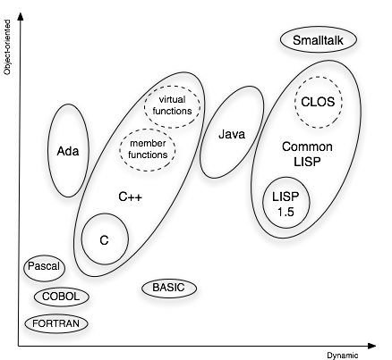
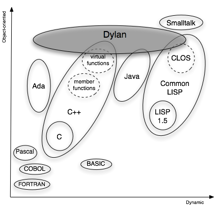

Introduction
============

How many days did you spend in the past year tracking down elusive
memory leaks and references to unallocated or freed memory?

How much time did you spend documenting which of the arguments to your
functions are *input* and which are *output* arguments — and making sure
all the callers of those functions agree?

Do you have trouble following your own programs’ control flow because so
much of it is devoted to checking and returning error codes?

How many conditional statements in your programs are there because you
need to perform the same general operation in a different way for
different kinds of data? How much time do you spend updating them to
handle new types of data?

How often have you wished that you could leave the types of certain data
unspecified while you develop an application — but later add the type
information to improve error checking and performance?

How much time do you spend recompiling and relinking your application
just to test a minor modification to the code?

Software development has progressed, but software productivity has
failed to keep up with advances in hardware. Despite a proliferation of
development tools and environments, programmers expend too much effort
on tasks that the programming language and environment should make
unnecessary.

Comparison of Dylan and other programming languages
---------------------------------------------------

Each language in wide use for applications has advantages and
disadvantages. One way to compare languages is to imagine them arrayed
along two axes. One axis ranges from *procedural* to *object-oriented*
languages. The other axis ranges from *static* to *dynamic* languages.
:ref:`Object-oriented and dynamic extents of programming languages.
<figure-1.1>` shows the comparison of several popular computer-programming
languages on a graph.

- A program in a *procedural* language consists of *functions*
  operating on *data*. The programming task is to choose the best
  available representation for data, and the best algorithms for
  manipulating the data. Languages near the procedural end of the axis
  include C, FORTRAN, and COBOL.
- A program in an *object-oriented* language consists of *objects*,
  categorized by *class*, that combine data and behavior. The
  programming task is to define the best class relations to represent
  objects, and the best set of operations that objects of related
  classes support. Languages near the object-oriented end of the axis
  include C++, Java, Smalltalk, and the Common LISP Object System
  (CLOS).
- A *static* language requires most program structure — such as the
  types of variables and function arguments — to be determined at
  compile time. The compiler can detect errors and optimize performance
  at the cost of run-time flexibility. Languages near the static end of
  the axis include C, C++, and FORTRAN.
- A *dynamic* language allows you to make more run-time changes to
  program structure, such as passing arguments of different types to
  the same function and, in some languages, defining new types or
  classes. A dynamic environment might allow run-time definition and
  linking. Languages near the dynamic end of the axis include Common
  LISP and Smalltalk.

In reality, few languages in commercial use are purely procedural or
object oriented, purely static or dynamic. In fact, the trend has been
to add missing elements from one pole to languages that are close to the
opposite pole. C++ adds object-oriented features to C; dynamic linking
is becoming more common; LISP and Smalltalk vendors have made
applications smaller and more efficient. This work, however, is hampered
by the need to maintain compatibility with features of the language that
were not designed with objects, dynamism, or performance in mind.

.. _figure-1.1:

   Object-oriented and dynamic extents of programming languages.

Dylan, in contrast, is a new language that integrates the best ideas
from object-oriented, procedural, dynamic, and static languages,
while avoiding many of the drawbacks.  :ref:`Object-oriented and
dynamic extents of Dylan and other languages. <figure-1.2>` shows
where Dylan fits on the graph.

.. _figure-1.2:

   Object-oriented and dynamic extents of Dylan and other languages.

Dylan’s goals are simple:

- Promote modular, reusable, component-oriented programs.
- Support powerful and familiar procedural programming.
- Encourage rapid and productive development of programs.
- Permit delivery of safe, efficient, compact applications.

Let’s take a brief look at features of Dylan that support these goals.

Modular, reusable, component-oriented programs
----------------------------------------------

Dylan is an object-oriented language. Programs create and use objects,
and they use classes to categorize and abstract attributes of objects.
Classes play a number of key roles:

- They are data types, embodying subtype–supertype relationships
  between objects.
- They are the vehicle for abstraction of common attributes of objects.
- They organize sharing of attributes: Subclasses *inherit* the
  attributes of superclasses.
- They are the principal basis for specializing behavior of objects.

Objects contain *data* in *slots*, which are like structure members or
fields in other languages. But the *behavior* of objects resides in
generic functions and methods. A *generic function* is a function that
embodies an operation common to different classes of the objects that
are its arguments. A *method* is a function that acts as a specific
implementation of a generic operation for objects of a particular class.
A program calls a generic function, and Dylan determines the most
appropriate method to invoke based on the arguments to the generic
function. A program controls method selection, or *dispatch*, by means
of class relationships, rather than via explicit conditional statements.

Abstraction of common attributes and methods in superclasses lets you
reuse code, rather then reimplement it, for subclasses. By defining a
subclass, you can add specialized data or behavior while having the
subclass inherit attributes of superclasses, which may be defined in
another component or library, or in Dylan itself.

Generic functions constitute abstract interfaces for specific
operations. You can usually change the implementation of an operation or
a data representation without changing the interface to the operation.
In this way, you can change an implementation without changing the
functions or objects that use the implementation. These functions or
objects may be defined in another component or library.

Dylan provides large-scale variable namespaces, called *modules*. A
module can include or use other modules, but only the variables
explicitly exported from those modules are visible to it. Modules
provide public and private global variables. Because functions and
classes, as well as data, are variable values, modules define external
interfaces for collections of classes and generic functions.

Powerful and familiar procedural programming
--------------------------------------------

Dylan is not just an object-oriented language. It includes and extends
the language features that you expect to find in a more purely
procedural language. Dylan’s syntax encourages clear and structured
programming. It includes familiar, economical notation for infix
operators and slot and array references. Dylan offers a choice of
concise or expanded equivalents for many syntactic constructs to
accommodate a range of programming styles, from terse to descriptive.

- You do not have to write a lot of intrusive code to support Dylan’s
  object orientation. For example, the most common language expressions
  for defining a method automatically define a generic function if
  necessary. A method-defining expression looks much like a
  function-defining expression in other languages.
- You can define a function to take a variable number of arguments. You
  can also define a function to take arguments in the form of
  name–value pairs, thus supporting self-documenting function
  invocation.
- Functions can return more than one value. In fact, you can use a
  single expression to initialize multiple variables to the values
  returned by a single function call. You do not have to use a
  potentially confusing mechanism, such as output parameters, to obtain
  multiple values.
- Dylan has a rich set of variable-sized aggregate data types, called
  *collections*. Collection classes include strings, arrays, sets,
  queues, lists, stacks, and tables. Dylan has flexible iteration
  constructs and permits applications to extend them so that they
  operate on application-defined collection subclasses. In this way, a
  module that uses specialized collection classes can cooperate with
  another module that defines general collection operations.
- Dylan has a built-in exception-signaling and exception-handling
  system that permits both error handling and recovery. Exceptions are
  based on a class and object model that fits smoothly with the rest of
  the language and can be extended by the program. You do not have to
  return and check error codes from functions — an error-prone process
  in itself — to ensure that no exception has occurred.

Rapid and productive development of programs
--------------------------------------------

Dylan promotes rapid development and incremental refinement of prototype
programs. The language encourages you to spend time early in the
programming cycle writing and experimenting with substantive, working
code, and not worrying about distracting issues such as memory
management and exact type
specifications.

- Dylan allows flexible typing of variables, parameters, and return
  values. You can permit variables, parameters, and return values to be
  of a general type, so that their values can be objects of any subtype
  of the general type. Later in the development cycle, when the program
  specification is refined, you can add more specific type constraints.
- You can choose to allow run-time definition of new classes and
  methods. Even if you do not so choose, most Dylan development
  environments allow you to add or change definitions at run time
  without recompiling or relinking the program, while the program is
  under development.
- Like those of Java, Dylan implementations provide automatic storage
  management. You can create and use objects freely, even in complex
  algorithms, where control flow may make it difficult to tell when an
  object is no longer needed. You do not explicitly allocate or
  deallocate memory, and you do not have to worry about failing to free
  unused memory or referring to memory that has already been freed.
- Dylan includes a powerful *macro* language, based on pattern matching
  and replacement. Macros let you extend the base language by creating
  syntactic structures that more concisely match a particular problem
  domain. Macros can serve as shorthand for common idioms, and can
  create more abstract or problem-specific constructs that the compiler
  translates into Dylan.

Delivery of safe, efficient, compact applications
-------------------------------------------------

Languages that provide run-time flexibility have usually paid a price in
decreased performance and large application size. Dylan’s solution is to
separate the development environment from the delivered run-time
application. Dylan provides maximum flexibility during program
development, but also lets you trade flexibility for performance in a
delivered application. A Dylan compiler can often optimize such
potentially expensive operations as slot access and method dispatch.

- You can declare type constraints for variables, parameters, return
  values, and slots. The more specific your type declarations, the
  better the compiler can detect type mismatches and optimize
  performance.
- By default, classes and generic functions are closed off, or *sealed*.
  No other library or application can define subclasses for a sealed
  class or define methods for a sealed generic function. Sealing can
  help a compiler to optimize slot access and method dispatch.
- Dylan’s core language is small. Extended components of the language,
  such as input–output and advanced mathematical operations, are
  provided by libraries. You can keep an application small by using
  only the libraries that the application needs. You can also create
  libraries of your own, and deliver them in compiled form.
- You can selectively open or *unseal* classes and generic functions to
  allow users of your application or library to specialize the
  interfaces that you provide. An open interface in Dylan includes
  link- and run-time information, so that an application that
  specializes the interface does not have to be recompiled to use a new
  version of the library.
- Most Dylan implementations provide support for operating in a
  multilanguage environment. A Dylan program can operate with code
  written in another language, and a program written in another
  language can operate with Dylan code. You can use a Dylan program as
  a component of a software system that includes code written in other
  languages.

Dylan’s overall aim is to meet two needs that have often been in
conflict:

#. To give programmers the freedom and power to develop applications
   rapidly
#. To deliver components and applications that can run efficiently on a
   wide range of machines and operating systems

This book introduces you to the features of Dylan that make those goals
attainable. We think you will find Dylan to be a language that makes
your programming time both productive and enjoyable.
