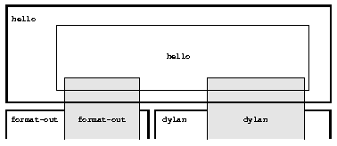
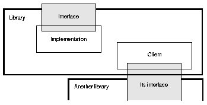
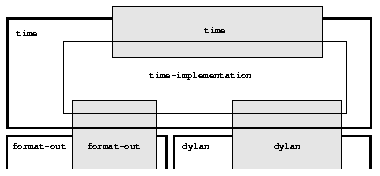
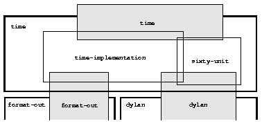
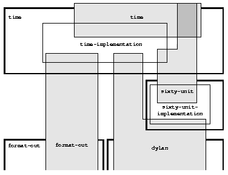

Libraries and Modules
=====================

As you create a program, you will often discover subsets of your code
that are candidates for sharing, reuse, or resale. Alternatively, you
may be working on a large program that has been divided into pieces that
can be implemented separately, either to allow parallel development, or
to make the programming task more manageable. For either of these
reasons, you can package your code into a *reusable software component*
so that

- Other programmers can easily add your component to their programs
  (which are called *client programs* of your component).
- You can develop your component independently from any clients.
- Clients can use your code without knowing or depending on the
  internal implementation of your component.
- You can sell your component to clients without revealing your source
  code.

Two important principles of software engineering apply here: information
hiding and protocols. The principle of *information hiding* says that
you should try to minimize the information that is passed between
components in a system, thus minimizing the interdependencies of
components. A *protocol* is the interface definition of a software
component. The purpose of establishing protocols is to define a uniform
interface that clients can use, even if the implementation of a
component is enhanced or modified. Dylan supports software components,
information hiding, and protocols in terms of *libraries* and *modules*.

Many Dylan environments support simple or exploratory programming with a
``dylan-user`` module that includes both the standard Dylan language
facilities and a common subset of Dylan libraries. Because all but the
simplest programs usually grow into projects or are reused in new
projects, it is good practice to create a unique library and module for
each program or component. If you are writing a simple, stand-alone
program or a simple component, you can use the simple library and module
structure illustrated in :ref:`start-complete-program`. You may want
to skim this chapter, however, so you have an idea of the options available
for more complex situations.

In this chapter, we start by describing the basic concepts of libraries
(`Libraries`_), modules and namespaces ( `Modules`_), and programs and
source records (`Source code, modules, and libraries`_). In the
remainder of the chapter, we illustrate the concepts of libraries and
modules by considering the classes and methods for times that we defined
in :doc:`time-code`, and showing how they might be packaged
into a reusable software component or library. We also show how the
``sixty-unit`` classes and methods could be a component substrate that the
``time`` library uses and shares with an ``angle`` library. Finally, we
illustrate how to implement a ``say`` protocol that works with either or
both of the ``time`` and ``angle`` libraries by creating a separate library
that defines the shared protocol.

Libraries
---------

A Dylan library defines a software component — a separately compilable
unit that can be either a stand-alone program or a component (library)
of some larger program. The elements of the core Dylan language are in a
library called ``dylan``. The simplest Dylan program consists of at least
two libraries: the original program source in the program library, and
the ``dylan`` library, which supplies the predefined Dylan language
elements used by the program library. A simple Dylan component may
consist of only a single library — the component library. The component
library will be used by other libraries. The component library will use
definitions from the ``dylan`` library (and possibly other components).
Hence, when combined with other components into a complete program, the
program will consist of several libraries.

In each Dylan implementation, a library is associated with
implementation-specific export information that is automatically
maintained by the compiler. The library export information completely
describes whatever implementation-specific information is needed for
other software components to use the library. Thus, you can use
libraries to deliver components in compiled form, keeping the
implementation of the library confidential.

.. topic:: Comparison with C++ and Modula:

   Dylan libraries are similar to C++ libraries in that they both
   are potentially shared components of many programs. Unlike C++
   libraries, Dylan libraries include all the information needed
   to be used by another Dylan library — there is no companion
   header file that must be kept up to date.

   Dylan libraries are analogous to Modula packages — all the information
   necessary to use a library is contained in the library.

.. _libraries-modules:

Modules
-------

A library is made up of modules, which hold the definitions of the
library. Each module specifies an independent *namespace* for Dylan
constants and variables. Each module can use definitions from other
modules in the same library or in other libraries, and each module can
provide definitions to other modules in the same or in other libraries.
Each module controls the visibility of the names within a module from
outside the module. You can use modules both to do information hiding
and to prevent name clashes between constants and variables.

Namespaces
~~~~~~~~~~

We mentioned in :ref:`start-variables-constants`, that Dylan has module
variables and module constants. Every module contains its own set of module
variables and constants. Two independent modules ``a`` and ``b`` might both
have variables named ``*x*``. These are two different variables with
possibly different values. Within module ``a``, a reference to module
variable ``*x*`` is a reference to ``a`` ’s variable ``*x*``. Within
module ``b``, a reference to module variable ``*x*`` is a reference to
``b`` ’s variable ``*x*``. In this sense, a module defines its own
namespace.

Definitions
~~~~~~~~~~~

A module variable or module constant is declared and initialized by a
*definition*. We have already seen that ``define variable`` is a
definition that establishes a module variable, and ``define constant`` is
a definition that establishes a module constant. Dylan also uses module
constants to refer to classes, generic functions, and macros. The
definition for a class, ``define class``, establishes a module constant
whose name is the class name and whose value is the class object.
Similarly, the definitions for a generic function and a macro establish
module constants. When we say that a module contains definitions, we
mean that the classes, generic functions, macros, and other objects
defined in that module are the values of variables and constants in that
module.

Export and import of names by modules
~~~~~~~~~~~~~~~~~~~~~~~~~~~~~~~~~~~~~

Within each module, every name refers either to a definition owned by
that module, or possibly to a definition owned by another module.
Modules make the names of their definitions available to other modules
by *exporting* those names. A module can refer to the names of another
module by *using* the other module. Note that no module can access a
definition in another module that is not exported; hence, modules
provide a form of access control.

When a module exports its names and a second module uses the first
module, importing the names of the first module, then the definitions of
the second module can use the names of the first module, just as they
can use any other name in their own module.

When one module uses a second module, it can use all the names exported
from the second module, or it can specify a subset of those exports to
*import*. In addition, imported names can be *renamed* — they can be
given different names when imported. You can use renaming to document
which definitions are from another module, by giving them all a uniform
prefix; you can use renaming to resolve name conflicts; or you can use
renaming to give nicknames or shorthand names for imported names.

.. topic:: Comparison with C:

   Exported variables in Dylan are like external variables and functions
   in C. (By *external*, we do not mean the ``extern`` storage declaration,
   but rather the concept of an external variable — one that is available
   for linking to.)

   Unexported variables in Dylan are like *static* variables and functions
   in C.

.. topic:: Comparison with C++:

   Dylan modules are similar to C++ namespaces in that they eliminate the
   problem of global namespace pollution or clashes between names used in
   individual libraries. Unlike C++ namespaces, Dylan modules also define
   a level of access control: Each module decides what names are externally
   visible, and no module can create or access names in another module,
   unless that other module explicitly exports those names. In contrast,
   the C++ *using* declaration allows the client of a namespace to access
   any name in that namespace.

Export and import of modules by libraries
~~~~~~~~~~~~~~~~~~~~~~~~~~~~~~~~~~~~~~~~~

Just as a module specifies a namespace for definitions, each library
specifies an independent namespace of modules and controls the
visibility of its modules. Within each library, every module refers
either to a module owned by that library, or to a module owned by
another library. Libraries make their modules available to other
libraries by *exporting* those modules. A library can refer to the
modules of another library by *using* the other library. No library can
refer to the modules of another library that are not exported.

When a library exports a module and a second library uses the first
library, importing its modules, then the modules of the second library
can use the modules of the first library, just as they can use any other
modules in their own library.

When one library uses another library, it can use all the modules
exported from the second library, or it can specify a subset of those
exports to *import*. Imported modules can be *renamed* as they are
imported, just as imported module names can be removed.

You can see that libraries and modules together provide a two-level
structure of naming, information hiding, and access control. The
designers of Dylan believed that only a single level would not give
sufficient flexibility, but that more than two levels was unnecessary.
In essence, modules give a fine level of control that lets you organize
within a single component, and libraries give a higher level of control
that lets you organize components into a program. Also, libraries are
the Dylan *compilation unit* — they are the level at which components
can be exchanged without source code being exchanged. A software
publisher would typically sell its wares as Dylan libraries.

Simple example of libraries and modules
~~~~~~~~~~~~~~~~~~~~~~~~~~~~~~~~~~~~~~~

To illustrate these concepts, we repeat the definition of the
``library.dylan`` file, first shown in :doc:`start`. Here, we
have used a more verbose, but also more precise, format.

The library file: ``library.dylan``.

.. code-block:: dylan

    module: dylan-user

    define library hello
      use dylan, import: { dylan };
      use format-out, import: { format-out };
    end library hello;

    define module hello
      use dylan, import: all;
      use format-out, import: all;
    end module hello;

The first line of ``library.dylan`` states that the expressions and
definitions in this file are in the ``dylan-user`` module. In this
predefined module, you define the modules and library that make up your
component or program. Every library has a unique ``dylan-user`` module. In
the file ``library.dylan``, we define a library named ``hello`` and a
module named ``hello``.

The module definition names the other modules whose names the ``hello``
module will use. In this case, the ``hello`` module uses the ``dylan`` and
``format-out`` modules. Here, we have explicitly stated that we are
importing all the names from the modules that we use — using the
``import: all`` clause is not strictly necessary, because it is the
default that is used if we do not specify what to import. By using
another module, we import the names exported from that module, making
them available in our namespace. For example, ``format-out`` is exported
from the ``format-out`` module, so the ``use format-out`` clause enables our
program to call the ``format-out`` function. The ``use dylan`` clause in the
module definition makes available all the built-in Dylan language
elements exported from the ``dylan`` module. When we define a module, it
must *use* all the modules that export the definitions used by the
definitions in our module.

The library definition tells the compiler which other libraries our
program uses. Here, we have explicitly stated that we are interested in
only the ``dylan`` and ``format-out`` modules from these other libraries.
This clause is not strictly necessary, since the module definition tells
the compiler which modules it uses; but it is good practice to document
our intent. For example, the ``format-out`` module is in the ``format-out``
library. Therefore, our ``hello`` library must use the ``format-out``
library, and must import the ``format-out`` module for the ``hello`` module
to use the ``format-out`` module. Similarly, the ``dylan`` module is in the
``dylan`` library, and therefore our ``hello`` library must use the ``dylan``
library and import the ``dylan`` module in order for the ``hello`` module to
use the ``dylan`` module. When we define a library, it must *use* all the
libraries that export the modules used by the modules in our library.

The module definition also specifies which variables and constants are
exported from the module for use by other modules. The library
definition specifies which modules are exported from the library for use
by other libraries. In our simple example, the ``hello`` module exports no
variables or constants, and the ``hello`` library exports no modules.

:ref:`Libraries and modules <libraries-and-modules>` illustrates the
relationships between libraries and modules in our example program. In
:ref:`Libraries and modules <libraries-and-modules>`,
and in the other figures in this chapter, we draw libraries as heavy
bold boxes and modules as light boxes. We have tried to illustrate how
libraries and modules build on one another through their “use”
relationships. A library that uses another library is shown above the
library that it uses, so we show the ``hello`` library above the
``format-out`` and ``dylan`` libraries. An exported module is illustrated as
being on top of (overlapping) the library that

.. _libraries-and-modules:

   Libraries (heavy boxes) and modules (light boxes) in “Hello, world”.

exports it (we have also shaded them, to illustrate this overlap). And a
module that uses another module is illustrated as being on top of
(overlapping) the used module. Try to envision the modules as
semitransparent overlays, layered up from the surface of the paper.
Thus, the ``hello`` module overlays the ``format-out`` and ``dylan`` modules
that it uses.

Note that we intentionally do not show all the modules in the
``format-out`` and ``dylan`` libraries in
:ref:`Libraries and modules <libraries-and-modules>`,. The
``format-out`` and ``dylan`` libraries might well have other modules, but
either those modules are not exported or our program does not use them.

Source code, modules, and libraries
-----------------------------------

How is Dylan source code associated with modules and libraries? In Sections
`Libraries`_ and `Modules`_, we looked at a Dylan program from the top
down: A program contains libraries; a library contains modules; and a
module contains variables and their definitions. We now look at a
program from the bottom up, to see how source code is organized into
modules, modules into libraries, and libraries into
programs.

Source records and modules
~~~~~~~~~~~~~~~~~~~~~~~~~~

All the Dylan source code for a program is organized into units called
*source records*. How source records are stored is dependent on the
implementation. Some implementations may store source records in a
database, others may simply use *interchange format* files (see
`Interchange files`_). No matter how they are stored, each source record
is in a module; therefore,

- All the module’s variables and constants, including those imported by
  using other modules, are visible to, and can be used by, the code in
  the source record.
- The module controls which definitions in the source record are
  exported, and therefore are visible, to other modules.
- Variables and constants in other modules that are not exported, or
  ones that are exported but are not imported by the source record’s
  module, are not visible to the source record.

Dylan implementations can associate a source record with a module in
different ways. The interchange format has a *header* at the front that
specifies the module for its source records.

Modules and libraries
~~~~~~~~~~~~~~~~~~~~~

Every module is in a library; therefore,

- All the library’s modules, including those imported by using other
  libraries, are visible to, and can be used by, the module.
- The library controls whether the module is exported, and therefore is
  visible, to other libraries.
- Modules in other libraries that are not exported, or ones that are
  exported but are not imported by the module’s library, are not
  visible to the module.

Dylan implementations can associate a module with a library in different
ways. The *library-interchange definition* (*LID)* format lists the
interchange files that make up a library. The module definitions in
those interchange files are thus in that library.

Libraries and programs
~~~~~~~~~~~~~~~~~~~~~~

Every library is in a set of libraries that can be combined into a
program; therefore,

- The library can import the exported modules of any other available
  library.
- The library’s exported modules are visible to, and can be imported
  by, other available libraries.

The Dylan implementation determines what libraries are available; how
they are combined into a program; and how they are compiled, linked, and
run. Consult your implementation documentation for further information.

We have presented a simple hierarchical model: All Dylan code resides in
source records; every source record resides in a module; every module
resides in a library. Every module must be completely defined within its
library, because the library is the Dylan unit of compilation. So that
this restriction is enforced, every source record in a library must be
in a module that is defined in the library; no source record can be in a
module that is imported by the library. Within a library, it is possible
for a name to be owned by one module and for that name’s
definition to be provided by another module. This flexibility helps us
to structure code, as we shall see in `Module definition`_.

Module definition
-----------------

Enough theory. Let’s see how modules and libraries can be used in
practice by considering the classes and methods for representing and
manipulating times that we defined in :doc:`time-code`, and
showing how they might be packaged into a reusable software component.

First, let’s examine what the external protocol of our time library
might be. We have defined two kinds of time that can be created:
``<time-of-day>`` and ``<time-offset>``. We have a generic function for
printing times, ``say``, and one, perhaps not so obvious, utility
function for creating new times, ``encode-total-seconds``.

We define a method, ``\+``, for adding times, but a method is not a
protocol. The protocol for the generic function ``\+`` is defined by the
Dylan library, which already exports it, for any Dylan program. When we
define our method for adding times, we are extending that protocol; we
are not creating a new one.

The ``decode-total-seconds`` function, the ``<sixty-unit>`` class, and
several other functions are used internally only, so they are not part
of the external protocol.

Although ``<time>`` is used internally only within our library, it is good
practice to make abstract superclasses such as ``<time>`` part of a
library interface. When we do so, a client of the library that does not
care which specific kind of time is being manipulated can simply use
``<time>``.

Thus, five items (``<time>``, ``<time-of-day>``, ``<time-offset>``, ``say``,
and ``encode-total-seconds``) define the external protocol of the time
library.

.. _libraries-roles-of-modules:

Roles of modules
~~~~~~~~~~~~~~~~

In our experience, we have found it useful to consider modules as having
roles: interface, implementation, or client. These roles lead to a
simple, low-maintenance structure. An *interface module* creates names
that are to be visible to other modules and at a library interface. An
*implementation module* contains the definitions that make up the
library (including those visible through an interface module). A *client
module* is a module that depends on other modules’ definitions.

It is possible for a module to play more than one role — for example, a
client module may also implement a higher-level interface. We recommend
thinking of modules as having these roles, and in this chapter we use
that design convention.

When illustrating the roles of modules, we use the conventions shown in
:ref:`role-of-modules`. In :ref:`role-of-modules`, we show a library with
three modules: an interface module (with its interface sticking out of
the top of the library), an implementation module (overlapping the
interface, because it implements the interface by giving definitions to
the names the interface exports), and a client module overlapping
another library’s interface module (using its exported interface module
to import definitions from another library). As we noted, the
implementation and client are often the same module, and the interface
of one library is used by the clients of other libraries. Dylan modules
and libraries are not allowed to have mutual dependencies, so we can use
the convention of drawing at the top the interfaces that a library
exports, and of drawing at the bottom the interfaces that a library
uses. It is difficult simultaneously to illustrate the module “use”
relationships in only two dimensions — the overlapping of one module by
another is intended to depict usage.

.. _role-of-modules:

   The roles of modules: interface, implementation, and client.

The interface module
~~~~~~~~~~~~~~~~~~~~

We can now write a first draft of the interface module for our library:

.. code-block:: dylan

    define module time
      // Classes
      create <time>, <time-of-day>, <time-offset>;
      // Generics
      create say, encode-total-seconds;
    end module time;

In the preceding definition, the ``time`` interface module creates and
exports (makes visible) three classes and two functions. We use the
``create`` clause, because we do not intend to define any implementations
in the time-library interface module itself — that will be done in an
implementation module, which will use the time-library module as its
interface. The ``create`` clause causes the names to be reserved in the
``time`` interface module, with the requisite that definitions be provided
by some other module in the same library.

.. topic:: Comparison with C:

   The Dylan ``create`` clause is roughly analogous to the C ``extern``
   declaration.

The implementation module
~~~~~~~~~~~~~~~~~~~~~~~~~

Our ``time`` interface module specifies the names that are visible to
clients of our library. It also serves to specify the names that must be
defined in our implementation. To prepare to define those names, we
create a separate implementation module:

.. code-block:: dylan

    define module time-implementation
      // Interface module
      use time;
      // Substrate modules
      use format-out;
      use dylan;
    end module time-implementation;

In the preceding definition, the implementation module uses the ``time``
interface module so that it can give definitions to the names that the
interface created. The implementation module is also a client module: It
is a client of the ``dylan`` module, because its definitions use
definitions such as ``define class``, ``<integer>``, and ``*`` (which are
defined by the ``dylan`` module of the ``dylan`` library); it is also a
client of the ``format-out`` module, because the ``say`` methods are
implemented using the ``format-out`` function (which is defined in the
``format-out`` module of the ``format-out`` library).

We can start to envision the ``time`` library as shown in
:ref:`initial-time-library`. In a library more complicated than the time
library, we might decompose the construction of the library into several
implementation modules. For example, we might want to assign the
implementation of the ``<sixty-unit>`` substrate to another programmer,
and to create an interface between that substrate and the rest of the
implementation so that work on either side of the interface can proceed
in parallel. In that case, we might use the following module definitions: 

.. code-block:: dylan

    define module sixty-unit
      // External interface
      use time;
      // Internal interface
      export <sixty-unit>, total-seconds, decode-total-seconds;
      // Substrate module
      use dylan;
    end module sixty-unit;

.. _initial-time-library:

   Initial ``time`` library.

.. code-block:: dylan

    define module time-implementation
      // External interface
      use time;
      // Substrate modules
      use sixty-unit;
      use format-out;
      use dylan;
    end module time-implementation;

Here, because the ``sixty-unit`` module is an internal interface, we forgot
the formality of creating a separate implementation module; we simply
*export* the definitions that we expect to be used by other modules
within the library. This approach is perhaps a short-sighted one. If
later we want the ``sixty-unit`` functionality to be available to another
library, we will be faced with reorganizing its module definitions (as
we shall see in `Component library`_). Even within a library, it is good
practice to organize modules as interface and implementation.

Notice the distinction between the way that we handled the external
``time`` interface, and the shortcut we took with ``sixty-unit``. Although
the ``sixty-unit`` module will *define* ``encode-total-seconds``, which is
part of the ``time`` interface, it does not *export*
``encode-total-seconds``; rather, it *uses* the ``time`` interface module,
which *created* ``encode-total-seconds`` (without defining that function).
Because ``sixty-unit`` uses ``time``, the name ``encode-total-seconds`` is
the same object in both modules. Effectively, ``encode-total-seconds`` is
owned by the ``time`` module, although it is defined by the ``sixty-unit``
module.

This organization of the external interface may appear odd at first, but
it reduces duplication that would otherwise have to occur: If
``sixty-unit`` exported ``encode-total-seconds``, then, for it to be
visible at the interface of the library, either the ``sixty-unit`` module
would have to be exported from the library as an interface (which export
is undesirable, because the ``sixty-unit`` module has other exports that
are not intended to be visible outside the library), or the ``time``
interface module would have to use ``sixty-unit`` and to re-export
``encode-total-seconds``. The *create* clause provides the cleaner
solution of allowing a name to be exported from only the one interface
module, defined in a separate implementation module (without exposing
the implementation module), and used by many client modules.

Dylan requires that all the variables exported via the *create* clause
be defined by some module in the same library; however, they can be
defined in any module, and the interface definitions can be spread over
several implementation modules. The compiler will verify that the
interface is implemented completely, even if its implementation is
spread over several modules, by checking when the library is compiled
that each created name has a definition.

The ``sixty-unit`` module exports the class ``<sixty-unit>``, because
``time-implementation`` will subclass that class. The ``sixty-unit`` module
also exports the generic functions ``total-seconds``, and
``decode-total-seconds``. The export of ``total-seconds`` might seem
surprising at first, because, in many object-oriented languages, access
to a class includes access to all the slots of a class. In Dylan, slots
are simply methods on generic functions and names in the module
namespace; hence, the functions must be exported if slot access from
outside the module is to be allowed. Note that exporting ``total-seconds``
allows other modules only to get the current value of the
``total-seconds`` slot. To allow other modules also to set the slot value,
we would have to export ``total-seconds-setter``. It is not necessary to
export the init keyword ``total-seconds:``, which allows the initial
value of the slot to be set when objects are created. Keywords, or
symbols, all exist in a single global namespace that is separate from
module variables.

.. topic:: Comparison with C++:

   Dylan modules provide access control similar to that provided by the
   ``private:`` and ``public:`` keywords in C++ classes, but Dylan access
   control is done at the module, rather than at the class, level. Dylan
   has no equivalent to ``protected:`` access control, in that a class
   that subclasses a class from another module does *not* have access
   to slots or other generic functions on its superclass from the other
   module, unless they are explicitly exported from that module.

   Dylan does support multiple interfaces, however; different levels of
   access can be provided by having more than one interface module, each
   supplying the access needed for the particular interface.

   One way to think of Dylan access control in C++ terms is that all
   definitions in a module are *friend*'s of all classes in the module, and
   the exported definitions of the module are *public*.

Breaking out the ``sixty-unit`` substrate to a separate module creates a
slightly more complicated structure to our diagram, as shown in
:ref:`internal-modules-of-time-library`.

.. _internal-modules-of-time-library:

   Internal modules of ``time`` library.

In :ref:`internal-modules-of-time-library`, we show the definitions
of ``sixty-unit`` in a separate module. The ``sixty-unit`` module is
a client of ``dylan``, an interface and implementation of definitions
used by ``time-implementation`` (that is, ``time-implementation`` is a
client of ``sixty-unit``), and an implementation of part of the interface
created by ``time``.

Library definition
------------------

We can now give the definition of the library:

.. code-block:: dylan

    define library time
      // Interface module
      export time;
      // Substrate libraries
      use format-out;
      use dylan;
    end library time;

In the preceding definition, we declare that the interface to our
library is defined by the ``time`` interface module. By exporting that
module, we make all the exported names from that module accessible to
clients of this library. We also declare that the ``time`` library relies
on the ``format-out`` and ``dylan`` libraries (that is, that those libraries
have interface modules of which our modules will be clients). Notice
that no mention is made of the ``time-implementation``, or ``sixty-unit``
modules, because they are completely internal to our library and are not
visible to any clients of our library.

Recall that constant and variable names, module names, and library names
are distinct, so it is possible to have a library, module, and constant
all of the same name. A common convention in a library with only one
interface module is to give them the same name, as we have done here.

To build our library, we would need to define the library, define all
the modules, specify where and how the definitions or source records
that implement our library are to be found, specify where the object
code that results from compiling the source records are to be stored,
and provide any particular instructions to the compiler regarding how to
build the library. The details of how to provide this information vary
from one Dylan implementation to the next.

To use our library, we would need to specify where to find the object
code and the implementation-dependent export information that allows
another library to use our library without access to our source records.
The details of this information also depend on the Dylan implementation
that we are using.

.. topic:: Comparison with C++:

   The library definition, which names the modules exported and
   libraries used by a library, is similar to C++ header files
   and includes. The main difference is that the Dylan development
   environment extracts the information that it needs about
   exported and imported variables directly, rather than requiring
   exports to be duplicated in a set of header files, and requiring
   those header files to be included in every source file that uses the
   imports.

Interchange files
-----------------

Source records in Dylan do not have to be stored in files. Certain
environments use a database for storing source records, and a
hypertextlike mechanism for exploring them. Dylan does, however, specify
a portable interchange format, based on files, for exchanging Dylan
source records among Dylan implementations.

A file in *interchange format* has a header and a body. The header
consists of consecutive lines of keywords and values. The body consists
of Dylan source records, and is separated from the header by at least
one blank line. The only required keyword is one to specify to what
module the source records in the file belong. Each file contains source
records of a single module, although the source records of each module
can be stored in any number of files. Standard keywords are also defined
for author, copyright, and version, although an implementation may
ignore them, or may define additional keywords.

So, for instance, if we wanted to publish our library source records, we
might create the files shown in the following sections.

The ``time-library`` file
-------------------------

The ``time-library`` file: ``time-library.dylan``.

.. code-block:: dylan

    Module: dylan-user

    // Library definition
    define library time
      // Interface module
      export time;
      // Substrate libraries
      use format-out;
      use dylan;
    end library time;

    // Interface module
    define module time
      // Classes
      create <time>, <time-of-day>, <time-offset>;
      // Generics
      create say, encode-total-seconds;
    end module time;

    // Internal substrate module
    define module sixty-unit
      // External interface
      use time;
      // Internal interface
      export <sixty-unit>, total-seconds, decode-total-seconds;
      // Substrate module
      use dylan;
    end module sixty-unit;

    // Implementation module
    define module time-implementation
      // External interface
      use time;
      // Substrate modules
      use sixty-unit;
      use format-out;
      use dylan;
    end module time-implementation;

Because every file has to name the module to which its source records
belong, you might wonder where to start. Every library implicitly
defines a ``dylan-user`` module for this purpose. The ``dylan-user`` module
imports all of the ``dylan`` module, so any Dylan definition can be used.
You can think of ``dylan-user`` as being a scratch version of ``dylan``.
Each library has a private copy of ``dylan-user``, so there is no concern
that definitions in one library’s ``dylan-user`` could be confused with
those of another.

The purposes of the library file are to communicate to the Dylan
compiler the structure of the module namespaces, to state which other
libraries to search for the modules that are used in the implementation
of this library, and to determine which modules implemented by this
library are visible to other libraries (and programs) that use this
library. The details of how these tasks are done depend on the
implementation, but each environment will provide a mechanism for
reading library and module definitions, either directly from an
interchange file, or after conversion of the interchange file to an
implementation-dependent format.

The ``sixty-unit`` implementation file
~~~~~~~~~~~~~~~~~~~~~~~~~~~~~~~~~~~~~~

The ``sixty-unit`` implementation file: ``sixty-unit.dylan``.

.. code-block:: dylan

    Module: sixty-unit

    define abstract class <sixty-unit> (<object>)
      slot total-seconds :: <integer>,
        required-init-keyword: total-seconds:;
    end class <sixty-unit>;

    define method encode-total-seconds
        (max-unit :: <integer>, minutes :: <integer>, seconds :: <integer>)
     => (total-seconds :: <integer>)
      ((max-unit * 60) + minutes) * 60 + seconds;
    end method encode-total-seconds;

    define method decode-total-seconds
        (sixty-unit :: <sixty-unit>)
     => (max-unit :: <integer>, minutes :: <integer>, seconds :: <integer>)
      decode-total-seconds(sixty-unit.total-seconds);
    end method decode-total-seconds;

    define method decode-total-seconds
        (total-seconds :: <integer>)
     => (hours :: <integer>, minutes :: <integer>, seconds :: <integer>)
      let (total-minutes, seconds) = truncate/(abs(total-seconds), 60);
      let (hours, minutes) = truncate/(total-minutes, 60);
      values(hours, minutes, seconds);
    end method decode-total-seconds;

The preceding implementation file is the first file in which we use one
of our own modules. The header statement ``Module: sixty-unit`` tells the
Dylan compiler where to look to resolve the names that we are using — it
tells Dylan that, when we say ``define class`` or ``<integer>`` or ``*``, we
mean the Dylan definitions of ``define class``, ``<integer>``, and ``*``,
because ``sixty-unit`` uses the ``dylan`` module. When we define
``encode-total-seconds``, we mean the ``encode-total-seconds`` created by
the ``time`` module, because ``sixty-unit`` uses that module.

The ``time`` implementation file
~~~~~~~~~~~~~~~~~~~~~~~~~~~~~~~~

The ``time`` implementation file: ``time.dylan``.

.. code-block:: dylan

    Module: time-implementation

    // Define nonnegative integers as integers that are >= zero
    define constant <nonnegative-integer> = limited(<integer>, min: 0);

    define abstract class <time> (<sixty-unit>)
    end class <time>;

    define method say (time :: <time>) => ()
      let (hours, minutes) = decode-total-seconds(time);
      format-out("%d:%s%d",
                 hours, if (minutes < 10) "0" else " " end, minutes);
    end method say;

    // A specific time of day from 00:00 (midnight) to before 24:00 (tomorrow)
    define class <time-of-day> (<time>)
    end class <time-of-day>;

    define method total-seconds-setter
        (total-seconds :: <integer>, time :: <time-of-day>)
     => (total-seconds :: <nonnegative-integer>)
      if (total-seconds >= 0)
        next-method();
      else
        error("%d cannot be negative", total-seconds);
      end if;
    end method total-seconds-setter;

    define method initialize (time :: <time-of-day>, #key)
      next-method();
      if (time.total-seconds < 0)
        error("%d cannot be negative", time.total-seconds);
      end if;
    end method initialize;

    // A relative time between -24:00 and +24:00
    define class <time-offset> (<time>)
    end class <time-offset>;

    define method past? (time :: <time-offset>) => (past? :: <boolean>)
      time.total-seconds < 0;
    end method past?;

    define method say (time :: <time-offset>) => ()
      format-out("%s ", if (time.past?) "minus" else "plus" end);
      next-method();
    end method say;

    define method \+
        (offset1 :: <time-offset>, offset2 :: <time-offset>)
     => (sum :: <time-offset>)
      let sum = offset1.total-seconds + offset2.total-seconds;
      make(<time-offset>, total-seconds: sum);
    end method \+;

    define method \+
        (offset :: <time-offset>, time-of-day :: <time-of-day>)
     => (sum :: <time-of-day>)
      make(<time-of-day>,
           total-seconds: offset.total-seconds + time-of-day.total-seconds);
    end method \+;

    define method \+ (time-of-day :: <time-of-day>,
                      offset :: <time-offset>)
     => (sum :: <time-of-day>)
      offset + time-of-day;
    end method \+;

    define method \< (time1 :: <time-of-day>, time2 :: <time-of-day>)
      time1.total-seconds < time2.total-seconds;
    end method \<;

    define method \< (time1 :: <time-offset>, time2 :: <time-offset>)
      time1.total-seconds < time2.total-seconds;
    end method \<;

    define method \= (time1 :: <time-of-day>, time2 :: <time-of-day>)
      time1.total-seconds = time2.total-seconds;
    end method \=;

    define method \= (time1 :: <time-offset>, time2 :: <time-offset>)
      time1.total-seconds = time2.total-seconds;
    end method \=;

    // Two useful time constants
    define constant $midnight
      = make(<time-of-day>, total-seconds: encode-total-seconds(0, 0, 0));

    define constant $tomorrow
      = make(<time-of-day>,
             total-seconds: encode-total-seconds(24, 0, 0));

In the preceding implementation file, it is the ``time-implementation``
module that specifies what we mean when we write Dylan expressions, and
in which module namespace our definitions will appear.

The library-interchange definition (LID)
~~~~~~~~~~~~~~~~~~~~~~~~~~~~~~~~~~~~~~~~

As described in :ref:`start-files-of-dylan-program`, most Dylan
implementations also accept a LID file that enumerates the files of a
library and the order in which those files will be initialized, if
there are any top-level forms. The LID file for our ``time`` library
would be as follows.

The LID file: ``time.lid``.

.. code-block:: dylan

    library: time
    files: library
           sixty-unit
           time

In a LID file, only the base file name is given. Information about the
folder or directory where the files are stored, and about the file
extension (*.dylan* in our examples), is implementation dependent and
must be supplied by the individual implementation.

Component library
-----------------

In previous examples, we have shown how the ``<angle>`` class can use the
``<sixty-unit>`` class as a base class. We could have simply included the
``<angle>`` class in our time library (presumably calling it a
time-and-angle library), but it seems plausible that clients might not
want both classes all the time. Another organization would be to make an
angle library that uses the time library, which would be burdensome only
to clients who want angles without time. Clearly, the right solution is
to make a separate ``sixty-unit`` library that is shared by the time and
angle libraries.

Because we had already broken out ``sixty-unit`` into a separate module
and file, we can create this new organization by

- Moving the ``sixty-unit`` module to its own library file
- Updating the ``time`` library file
- Opening the ``<sixty-unit>`` class

Note that no changes are required to the ``time`` implementation file, so
we do not present it again.

The ``sixty-unit-library`` file
~~~~~~~~~~~~~~~~~~~~~~~~~~~~~~~

The ``sixty-unit`` library file: ``sixty-unit-library.dylan``.

.. code-block:: dylan

    Module: dylan-user

    // Library definition
    define library sixty-unit
      // Interface module
      export sixty-unit;
      // Substrate library
      use dylan;
    end library sixty-unit;

    // Interface module
    define module sixty-unit
      // External interface
      create <sixty-unit>;
      create total-seconds, encode-total-seconds, decode-total-seconds;
    end module sixty-unit;

    // Implementation module
    define module sixty-unit-implementation
      // External interface
      use sixty-unit;
      // Substrate module
      use dylan;
    end module sixty-unit-implementation;

Notice that we have taken this opportunity to reorganize the
``sixty-unit`` module into a separate interface and implementation. We
also have to create ``encode-total-seconds`` in the ``sixty-unit`` module,
rather than to create it in the ``time`` interface and to define it in
``sixty-unit``. Recall that all created names must be defined in the
library in which they are created; we cannot use the create–define
structure across libraries. We still want ``encode-total-seconds`` to be
part of the interface of the ``time`` library, so we will have to change
the ``time`` interface module to import it and to re-export it from the
time library, as shown in :ref:`updated-time-library-file`.

If we had followed our own recommendations in
`The implementation module`_, we would probably have discovered that
``encode-total-seconds`` belonged in the ``sixty-unit`` interface, and we
would have avoided most of this reorganization.

.. _updated-time-library-file:

The updated ``time-library`` file
~~~~~~~~~~~~~~~~~~~~~~~~~~~~~~~~~

The ``time-library`` file: ``time-library.dylan``.

.. code-block:: dylan

    Module: dylan-user

    // Library definition
    define library time
      // Interface module
      export time;
      // Substrate libraries
      use sixty-unit;
      use format-out;
      use dylan;
    end library time;

    // Interface module
    define module time
      // Classes
      create <time>, <time-of-day>, <time-offset>;
      // Generics
      create say;
      // Shared protocol
      use sixty-unit, import: { encode-total-seconds }, export: all;
    end module time;

    // Implementation module
    define module time-implementation
      // External interface
      use time;
      // Substrate modules
      use sixty-unit;
      use format-out;
      use dylan;
    end module time-implementation;

Note that the ``time`` interface module imports only
``encode-total-seconds`` from ``sixty-unit``. It then re-exports all the
names that it has imported — in this case, just ``encode-total-seconds``.
In this way, the ``time`` interface is acting as a filter and is passing
on only a subset of the ``sixty-unit`` interface to its clients.

At this point, we need to *open* the ``<sixty-unit>`` class. Because it is
now in a separate library, it must be defined to be open to allow other
libraries, such as ``time`` or ``angle``, to subclass it. Opening a class
simply amounts to changing the ``define class`` to ``define open class``.
The exact implications of this declaration are discussed in
:doc:`perform`.

The updated ``sixty-unit`` implementation file
~~~~~~~~~~~~~~~~~~~~~~~~~~~~~~~~~~~~~~~~~~~~~~

The ``sixty-unit`` implementation file: ``sixty-unit.dylan``.

.. code-block:: dylan

    Module: sixty-unit-implementation

    define open abstract class <sixty-unit> (<object>)
      slot total-seconds :: <integer>,
        required-init-keyword: total-seconds:;
    end class <sixty-unit>;

    define method encode-total-seconds
        (max-unit :: <integer>, minutes :: <integer>, seconds :: <integer>)
     => (total-seconds :: <integer>)
      ((max-unit * 60) + minutes) * 60 + seconds;
    end method encode-total-seconds;

    define method decode-total-seconds
        (sixty-unit :: <sixty-unit>)
     => (max-unit :: <integer>, minutes :: <integer>, seconds :: <integer>)
      decode-total-seconds(sixty-unit.total-seconds);
    end method decode-total-seconds;

    define method decode-total-seconds
        (total-seconds :: <integer>)
     => (hours :: <integer>, minutes :: <integer>, seconds :: <integer>)
      let (total-minutes, seconds) = truncate/(abs(total-seconds), 60);
      let (hours, minutes) = truncate/(total-minutes, 60);
      values(hours, minutes, seconds);
    end method decode-total-seconds;

:ref:`sixty-unit-as-separate-library` shows the relationships among our
libraries and modules at this point. Note that ``sixty-unit`` is now a
separate library. It uses the ``dylan`` library and is used by the ``time``
library. We illustrate the ``time`` module importing and re-exporting part
of the ``sixty-unit`` interface module (the method ``encode-total-seconds``)
by the darker grey area.

.. _sixty-unit-as-separate-library:

   ``sixty-unit`` as a separate library.

Two LID files
~~~~~~~~~~~~~

Here, we show the LID files for each library.

The LID file: ``sixty-unit.lid``.

.. code-block:: dylan

    library: sixty-unit
    files: sixty-unit-library
           sixty-unit

The LID file: ``time.lid``.

.. code-block:: dylan

    library: time
    files: time-library
           time

.. _libraries-protocol-design:

Protocol design
---------------

We can now define the ``angle`` library as another client of the
``sixty-unit`` library. The interface of the ``angle`` library consists of
the classes ``<angle>`` and ``<directed-angle>``, and the ``say`` method.
Uh-oh! We want that ``say`` method to be another method on the ``say``
generic function defined by the ``time`` library, so that a client of the
``time`` *and* ``angle`` libraries sees a single generic function, ``say``,
that applies to either times or angles. This situation illustrates the
value of putting a lot of thought into designing our protocols before we
get too deep into an implementation. The ``say`` generic function is a
separate protocol that could apply to many classes in our system. To
permit separate libraries to add methods to a Dylan generic function,
the module defining the protocol (that is, the module defining the
generic function) needs to be defined first, in a separate, common
library. Other libraries then use this component library to define their
particular implementation of the protocol.

To create the ``say`` protocol, we define a library and implementation
file as shown in Sections `The say-library file`_
through `The angle library`_.

The ``say-library`` file
~~~~~~~~~~~~~~~~~~~~~~~~

The ``say-library`` file: ``say-library.dylan``.

.. code-block:: dylan

    Module: dylan-user

    // Library definition
    define library say
      // Interface modules
      export say, say-implementor;
      // Substrate libraries
      use format-out;
      use dylan;
    end library say;

    // Protocol interface
    define module say
      create say;
    end module say;

    // Implementor interface
    define module say-implementor
      use say, export: all;
      use format-out, export: all;
    end module say-implementor;

    // Implementation module
    define module say-implementation
      use say;
      use dylan;
    end module say-implementation;

The ``say`` implementation file
~~~~~~~~~~~~~~~~~~~~~~~~~~~~~~~

The ``say`` implementation file: ``say.dylan``.

.. code-block:: dylan

    Module: say-implementation

    define open generic say (object :: <object>) => ();

Here, we have created the recommended interface and implementation
structure, having learned our lesson with the ``sixty-unit`` module. Even
though it looks like overkill to have a separate implementation module
for a single generic function definition, we have planned for future
expansion.

The ``say`` protocol library is an example of the multiple-interface
capability of Dylan libraries. The ``say`` library has two interfaces that
it makes available: ``say`` defines the ``say`` protocol, and
``say-implementor`` provides the substrate for protocol implementors. This
interface is cleaner than the one that we used for ``sixty-unit``, where
``encode-total-seconds`` played more of an interface role, and
``<sixty-unit>`` and ``decode-total-seconds`` played more of a substrate
role. The result is seen in the clients of the ``sixty-unit`` library, who
must split out these roles for themselves.

Note that the ``say-implementor`` module is both a client and an interface
module. It is the interface of the ``say`` protocol for clients who will
implement ``say`` methods, and it is a client of the ``format-out`` module.
Because most ``say`` methods use ``format-out`` in their implementations, it
makes sense to re-export all of the ``format-out`` module for
``say-implementor`` clients.

The explicit definition of the ``say`` generic function is good protocol
documentation. It is also required: All module variables must have a
definition for a library to be complete. (An alternative would have been
to define a default method for ``say``, which would also create an
implicit generic-function definition. However, implicit generic-function
definitions are *sealed*, and, for a protocol, we need an *open*
generic function, because we intend clients to add methods to it. The
exact implications of this declaration are discussed in :doc:`perform`.)
The designer of the ``say`` protocol still has to choose whether to require
each type to define its own ``say`` method, or to provide a universal default.
In this case, we choose not to provide a default, so that an error will be
signaled if ``say`` is called on a type that does not either provide or
inherit a ``say`` method.

.. topic:: Comparison with C++:

   Dylan modules enforce a structured design of protocols. To create a
   shared protocol, to which methods can be added from independent
   libraries, we must ensure that the module defining the protocol
   (the module defining the generic function) is defined first, in
   a separate, common library. The common library defines the
   protocol in one place, easing documentation and maintenance.

   In C++ however, a *using* directive can create a local alias to overload
   a function in any other library, even if it is in another namespace.

   The library-use relationships of Dylan modules form a directed graph,
   centralizing shared functionality, whereas C++ namespaces can be
   interconnected arbitrarily, making documentation and maintenance of
   shared protocols difficult.

To complete our restructuring, we must reorganize the ``time`` library and
module files to use the ``say`` protocol, so that the ``say`` protocol is
shared with the ``angle`` library that we intend to build.

The updated ``time-library`` file
~~~~~~~~~~~~~~~~~~~~~~~~~~~~~~~~~

The ``time-library`` file: ``time-library.dylan``.

.. code-block:: dylan

    Module: dylan-user

    // Library definition
    define library time
      // Interface module
      export time;
      // Substrate libraries
      use sixty-unit;
      use say;
      use dylan;
    end library time;

    // Interface module
    define module time
      // Classes
      create <time>, <time-of-day>, <time-offset>;
      // Shared protocol
      use say, export: all;
      use sixty-unit, import: { encode-total-seconds }, export: all;
    end module time;

    // Implementation module
    define module time-implementation
      // External interface
      use time;
      // Substrate modules
      use sixty-unit;
      use say-implementor;
      use dylan;
    end module time-implementation;

The ``time`` module is modified to use ``say``, which it exports to its
clients. The implementation module is modified to use ``say-implementor``,
which includes ``format-out``, so it would be superfluous to continue to
include ``format-out`` in ``time-implementation``. Similarly, the ``time``
library definition replaces its use of the ``format-out`` library with the
``say`` library.

Note that the compiler recursively finds all the libraries necessary for
compilation. In this case, the ``format-out`` library will be included in
the compilation of the ``time`` library, even though it is not directly
named.

The ``angle`` library
~~~~~~~~~~~~~~~~~~~~~

At this point, we are ready to define the ``angle`` library, which will
share the ``sixty-unit`` and ``say`` libraries with the ``time`` library. In
:doc:`time-mod`, we present the consolidated changes to the
``sixty-unit``, ``say``, and ``time`` libraries that we have developed in
this chapter, followed by the complete definition of the ``angle``
library.

Summary
-------

In this chapter, we covered the following:

- We illustrated Dylan modules and libraries.
- We showed how to design modules using three roles: interface modules,
  implementation modules, and client modules.
- We described how a library might appear in Dylan interchange format.
- We showed how to create a component library.
- We illustrated the complexity of component and protocol design.
- We discussed how to create a protocol that can be extended by multiple
  client libraries.
- We discussed namespaces in Dylan, and their applicable scope; see
  :ref:`namespace-scopes`.
- We described the roles of modules and the definition clauses that
  modules use; see :ref:`module-roles`.

.. _namespace-scopes:

.. table:: Namespace scopes.

   +----------------------+-------------+
   | Namespace            | Scope       |
   +======================+=============+
   | library              | global      |
   +----------------------+-------------+
   | module               | per library |
   +----------------------+-------------+
   | constant or variable | per module  |
   +----------------------+-------------+
   | symbol or keyword    | global      |
   +----------------------+-------------+

.. _module-roles:

.. table:: Module roles.

   +----------------+----------------------------+
   | Role           | Example clause             |
   +================+============================+
   | interface      | .. code-block:: dylan      |
   |                |                            |
   |                |   // Interface class       |
   |                |   create <time>;           |
   |                |   // Re-exported interface |
   |                |   use say, export: all;    |
   +----------------+----------------------------+
   | client         | .. code-block:: dylan      |
   |                |                            |
   |                |   // Substrate module      |
   |                |   use dylan;               |
   +----------------+----------------------------+
   | implementation | .. code-block:: dylan      |
   |                |                            |
   |                |   // Interface module      |
   |                |   use time;                |
   +----------------+----------------------------+
   | implementation | .. code-block:: dylan      |
   | and interface  |                            |
   |                |   // Interface protocol    |
   |                |   export say;              |
   +----------------+----------------------------+
