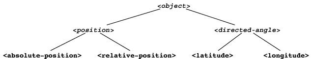
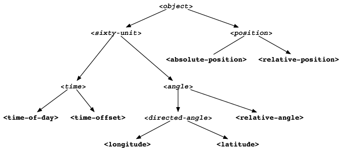
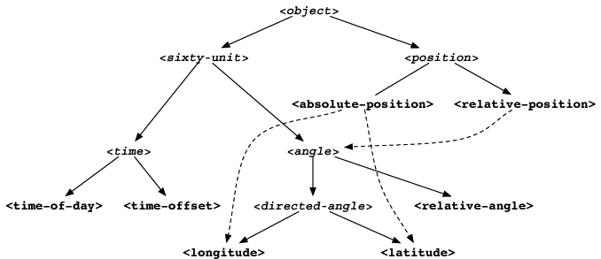

Modularity
==========

Object-oriented programming can lead to modular code. When you are
experienced with an object-oriented programming style, you might be able
to define classes and methods with the right modularity from the start.
Novices, however — and even experienced object-oriented programmers who
are attacking large problems — may find that they discover opportunities
for sharing as they begin to implement classes and methods. The dynamic
aspects of Dylan support an evolutionary approach to programming, so it
is easy to continue to refine your implementation and to design as you
go.

In this chapter, we show an evolutionary approach to programming, as we
define classes that represent different kinds of positions. We start out
with one approach, and gradually refine it to achieve greater
modularity. We illustrate one new Dylan feature: abstract classes.

Starting in this chapter, and continuing throughout the rest of the
book, we take the approach of editing and compiling source code. Now and
then, we use a listener to call a function and show the function’s
output. Whenever we use a listener, we show the ``?`` prompt.

Requirements of the position classes
------------------------------------

To predict when an aircraft will arrive at the airport, we need to know
the speed of the aircraft relative to the ground, and the distance the
aircraft is from the airport. Thus, we need to represent the positions
of objects, such as airports and aircraft, to compute distances.

We shall use two ways to express the position of an object. First, we
use latitude and longitude to indicate the *absolute position* of the
object. Second, we describe the position of the object relative to a
second object. For example, a particular aircraft might be 200 miles
west of a given airport. This kind of description is a *relative
position*.

We shall define the classes ``<absolute-position>`` and
``<relative-position>``. The slots of ``<absolute-position>`` will
store information about the latitude or longitude of that position.
The slots of ``<relative-position>`` will include a distance (such
as 200 miles), and a direction (such as south).

We need to provide ``say`` methods for absolute and relative positions.
The following sample calls show the output that we want to achieve:

.. code-block:: dylan-console

    ? say(*my-absolute-position*);
    => 42 degrees 19 minutes 34 seconds North latitude
    => 70 degrees 56 minutes 26 seconds West longitude

    ? say(*her-relative-position*);
    => 30 miles away at heading 90 degrees

Initial class definitions
-------------------------

We start with these simple, initial class definitions:

.. code-block:: dylan

    // Superclass of all position classes
    define class <position> (<object>)
    end class <position>;

    define class <absolute-position> (<position>)
      slot latitude;
      slot longitude;
    end class <absolute-position>;

    define class <relative-position> (<position>)
      slot distance;
      slot angle;
    end class <relative-position>;

These initial definitions show the inheritance relationships among the
classes, and the names of the slots show the information that the
classes must provide. At this point, we omit the type declarations of
the slots, which is equivalent to specifying the type ``<object>``. We
will fill in the implementation later, by deciding on the types of the
slots, and providing the ``say`` methods.

Our requirements mention only ``<absolute-position>`` and
``<relative-position>``, but we choose to define a superclass of both of
them, named ``<position>``.

.. topic:: Modularity note:

   The benefits of defining the ``<position>`` class are
   these:

   - The ``<position>`` class creates an explicit relationship between the
     other position classes, which are related conceptually.
   - We can use the ``<position>`` class as the type of a slot or other
     object, in cases where either an absolute or relative position is
     appropriate.

Abstract classes
----------------

We intend that the ``<position>`` class will not have direct instances.
Any position objects should be direct instances of ``<absolute-position>``
and ``<relative-position>``. In Dylan, a class that is intended to be a
superclass and not to have direct instances is an *abstract* class. A
class that is intended to have direct instances is a *concrete* class.

By default, a user-defined class is concrete. To define an abstract
class, you declare it to be abstract in the ``define class`` form. For
example:

.. code-block:: dylan

    // Superclass of all position classes
    define abstract class <position> (<object>)
    end class <position>;

The ``<time>`` class is another one that we intend to have no direct
instances, so we redefine it to be abstract:

.. code-block:: dylan

    define abstract class <time> (<object>)
      slot total-seconds :: <integer>, init-keyword: total-seconds:;
    end class <time>;

If we tried to make an instance of ``<position>`` or ``<time>`` now, ``make``
would signal an error. For more information about abstract classes, see
`Abstract, concrete, and instantiable classes`_.

Absolute position
-----------------

The ``<absolute-position>`` class represents latitude and longitude. One
way to represent latitude and longitude is with degrees, minutes,
seconds, and a direction. We can use the approach of combining degrees,
minutes, and seconds into a total-seconds slot as we did for ``<time>``.
We can also define a class that represents total seconds and a
direction, and call it ``<directed-angle>``:

.. code-block:: dylan

    define abstract class <directed-angle> (<object>)
      slot total-seconds :: <integer>, init-keyword: total-seconds:;
      slot direction :: <string>, init-keyword: direction:;
    end class <directed-angle>;

We use the ``<directed-angle>`` class in the definition of
``<absolute-position>``:

.. code-block:: dylan

    define class <absolute-position> (<position>)
      slot latitude :: <directed-angle>, init-keyword: latitude:;
      slot longitude :: <directed-angle>, init-keyword: longitude:;
    end class <absolute-position>;

.. topic:: Modularity note:

   The ``<directed-angle>`` class represents the characteristics
   that latitude and longitude have in common.

.. topic:: Comparison to C:

   If you are familiar with a language that uses explicit pointers,
   such as C, you may be confused by Dylan’s object model. Although
   there is no pointer-to operation in Dylan, there are pointers in
   the implementation. If you are trying to imagine how Dylan
   objects are implemented, think in terms of always manipulating a pointer
   to the object — a Dylan variable (or slot) stores a pointer to an
   object, rather than a copy of the object’s slots. Similarly, assignment,
   argument passing, and identity comparison are in terms of pointers to
   objects. See :doc:`c-comparisons`.

.. topic:: Comparison to Java:

   Java recognizes that pointers make it extremely difficult to enforce
   safety and for a compiler to reason about a program for optimization.
   Java supports an object model similar to that of Dylan, where pointers
   are used in the implementation of objects, but are not visible to
   Java programs.

We could define the ``say`` method as follows:

.. code-block:: dylan

    define method say (position :: <absolute-position>) => ()
      format-out("%d degrees %d minutes %d seconds %s latitude\n",
                 decode-total-seconds(position.latitude));
      format-out("%d degrees %d minutes %d seconds %s longitude\n",
                 decode-total-seconds(position.longitude));
    end method say;

The preceding method depends on ``decode-total-seconds`` having a method
that is applicable to ``<directed-angle>`` (the type of the objects
returned by ``position.latitude`` and ``position.longtude``). We define
such a method in `Meeting of angles and times`_.

.. topic:: Modularity note:

   The preceding ``say`` method does not take advantage of
   the similarity between latitude and longitude. One clue that there is a
   modularity problem is that the two calls to ``format-out`` are nearly
   identical.

The ``say`` method on ``<absolute-position>`` should not call
``format-out`` directly on the two instances of ``<directed-angle>``
stored in the latitude and longitude slots. Instead, we can define
a ``say`` method on ``<directed-angle>``, and can call it in the
method on ``<absolute-position>``:

.. _say-directed-angle:

.. code-block:: dylan

    define method say (angle :: <directed-angle>) => ()
      let (degrees, minutes, seconds) = decode-total-seconds(angle);
      format-out("%d degrees %d minutes %d seconds %s",
                 degrees, minutes, seconds, angle.direction);
    end method say;

    define method say (position :: <absolute-position>) => ()
      say(position.latitude);
      format-out(" latitude\n");
      say(position.longitude);
      format-out(" longitude\n");
    end method say;

.. topic:: Modularity note:

   Our modularity is improved, now that the ``<directed-angle>`` class
   is responsible for describing its instances.  This division of labor
   reduces duplication of code.

   There is still a problem with this approach, because the ``say`` method on
   ``<absolute-position>`` must print “latitude” and “longitude” after
   calling ``say`` on the directed angles stored in its two slots. The
   modularity is still flawed, because the method on ``<absolute-position>``
   acts on the knowledge that the method on ``<directed-angle>`` does not
   print “latitude” or “longitude.”

We defined the ``<directed-angle>`` class to represent what latitude and
longitude have in common. It is useful to recognize that latitude and
longitude have differences as well as similarities. We represented
latitude and longitude by the names of slots in ``<absolute-position>``,
and their implementations as instances of ``<directed-angle>``. We can
elevate the visibility of latitude and longitude by providing classes
that represent each of them:

.. code-block:: dylan

    define class <latitude> (<directed-angle>)
    end class <latitude>;

    define class <longitude> (<directed-angle>)
    end class <longitude>;

We redefine ``<absolute-position>`` to use ``<latitude>`` and ``<longitude>``:

.. code-block:: dylan

    define class <absolute-position> (<position>)
      slot latitude :: <latitude>, init-keyword: latitude:;
      slot longitude :: <longitude>, init-keyword: longitude:;
    end class <absolute-position>;

.. _position-angle-relationships:

   Inheritance relationships among the position and angle classes. Abstract
   classes are shown in *oblique* *typewriter* *font*.

:ref:`Inheritance relationships among the position and angle classes
<position-angle-relationships>` shows the inheritance relationships
among the position and angle classes.

We define these new ``say`` methods:

.. code-block:: dylan

    define method say (latitude :: <latitude>) => ()
      next-method();
      format-out(" latitude\n");
    end method say;

    define method say (longitude :: <longitude>) => ()
      next-method();
      format-out(" longitude\n");
    end method say;

The calls to ``next-method`` in the methods on ``<latitude>`` and
``<longitude>`` will call the method on ``<directed-angle>``, shown
:ref:`previously <say-directed-angle>`.

We redefine the ``say`` method on ``<absolute-position>``:

.. code-block:: dylan

    define method say (position :: <absolute-position>) => ()
      say(position.latitude);
      say(position.longitude);
    end method say;

.. topic:: Modularity note:

   The approach of defining the classes ``<latitude>`` and ``<longitude>``
   provides the following benefits:

   - Each class is responsible for describing its instances. Each method
     depends on ``say`` working for all the classes. No method on one class
     must understand the details of a method on another class.
   - We guard against any attempt to store a latitude in a slot designated
     for a longitude, and vice versa. This type checking will be useful
     when we introduce more differences between the classes. For example,
     the direction of a latitude is north or south, and the direction of a
     longitude is west or east. We can provide methods that ensure that
     the directions stored in a ``<latitude>`` instance are appropriate for
     latitude — and we can do the same for longitude. We show two
     techniques for implementing that type checking: See
     :ref:`slots-virtual-slots`, and :ref:`perform-enumerations`.
   - You can ask an object what its class is by using the ``object-class``
     function. In this case, you can find out that an object is a latitude
     or longitude, rather than just a directed angle. The data does not
     stand alone; it is an instance that carries with it its type, its
     identity, and the methods appropriate to it.

Relative position
-----------------

We define the ``<relative-position>`` class as follows:

.. code-block:: dylan

    define class <relative-position> (<position>)
      // distance is in miles
      slot distance :: <single-float>, init-keyword: distance:;
      slot angle :: <relative-angle>, init-keyword: angle:;
    end class <relative-position>;

The ``distance`` slot stores the distance to the other object, and the
``angle`` slot stores the direction to the other object. Unfortunately,
the angle needed here is different from the ``<directed-angle>`` class,
because the ``<directed-angle>`` class has a direction, such as south,
which is not needed for the angle of ``<relative-position>``.

We need to provide a class of angle without direction, which we can use
for the ``angle`` slot of the ``<relative-position>`` class). Therefore, we
define two new classes, and redefine ``<directed-angle>``:

.. code-block:: dylan

    // Superclass of all angle classes
    define abstract class <angle> (<object>)
      slot total-seconds :: <integer>, init-keyword: total-seconds:;
    end class <angle>;

    define class <relative-angle> (<angle>)
    end class <relative-angle>;

    define abstract class <directed-angle> (<angle>)
      slot direction :: <string>, init-keyword: direction:;
    end class <directed-angle>;

.. topic:: Modularity note:

   Why provide both the classes ``<angle>`` and ``<relative-angle>``,
   when the ``<relative-angle>`` class has no additional slots? We need
   a class that has only the ``total-seconds`` slot, and no others. We
   need to use such a class as the type of the ``angle`` slot of
   ``<relative-angle>``. We might consider making the ``<angle>`` class
   concrete, and using that class, which has only the ``total-seconds`` slot.
   However, that approach would not prevent someone from storing a
   ``<directed-angle>`` instance in the ``angle`` slot of ``<relative-angle>``,
   because ``<directed-angle>`` instances are also instances of ``<angle>``.

   In Dylan, by defining classes as specifically as possible, you enhance
   the reliability of your program, because the compiler (or run-time
   system) can verify that only correct values are used. In contrast, you
   could write a program in Dylan or C in which you represented everything
   as an integer — in that style of program, someone could far too easily
   introduce a programming error in which a time was stored where a
   latitude was needed.

The ``<angle>`` class looks remarkably similar to the ``<time>`` class
defined earlier:

.. code-block:: dylan

    // Superclass of all angle classes
    define abstract class <angle> (<object>)
      slot total-seconds :: <integer>, init-keyword: total-seconds:;
    end class <angle>;

    // Superclass of all time classes
    define abstract class <time> (<object>)
      slot total-seconds :: <integer>, init-keyword: total-seconds:;
    end class <time>;

We would like to call ``decode-total-seconds`` on instances of ``<angle>``,
but currently the method is defined to work on ``<time>``. The next step
is to take advantage of the similarity between ``<angle>`` and ``<time>``.

Meeting of angles and times
---------------------------

We can create a new superclass to combine times and angles. Sometimes,
the trickiest part of defining superclasses that model characteristics
shared by other classes is thinking of the right name for the
superclass. Here, we use ``<sixty-unit>`` to name the class that has
``total-seconds`` that can be converted to either hours, minutes, and
seconds, or to degrees, minutes, and seconds. In the methods for
decoding and encoding total seconds, we use the name ``max-unit`` to refer
to the unit that is hours for time, and degrees for positions.

.. code-block:: dylan

    define abstract class <sixty-unit> (<object>)
      slot total-seconds :: <integer>, init-keyword: total-seconds:;
    end class <sixty-unit>;

    define method decode-total-seconds
        (sixty-unit :: <sixty-unit>)
     => (max-unit :: <integer>, minutes :: <integer>, seconds :: <integer>)
      decode-total-seconds(abs(sixty-unit.total-seconds));
    end method decode-total-seconds;

    define method encode-total-seconds
        (max-unit :: <integer>, minutes :: <integer>, seconds :: <integer>)
     => (total-seconds :: <integer>)
      ((max-unit * 60) + minutes) * 60 + seconds;
    end method encode-total-seconds;

We redefine the time and angle classes and methods to take advantage of
the new ``<sixty-unit>`` class:

.. code-block:: dylan

    define abstract class <time> (<sixty-unit>)
    end class <time>;

    define abstract class <angle> (<sixty-unit>)
    end class <angle>;

    define method say (angle :: <angle>) => ()
      let (degrees, minutes, seconds) = decode-total-seconds(angle);
      format-out("%d degrees %d minutes %d seconds",
                 degrees, minutes, seconds);
    end method say;

    // definition unchanged, repeated for completeness
    define abstract class <directed-angle> (<angle>)
      slot direction :: <string>, init-keyword: direction:;
    end class <directed-angle>;

    define method say (angle :: <directed-angle>) => ()
      next-method();
      format-out(" %s", angle.direction);
    end method say;

    // definition unchanged, repeated for completeness
    define class <relative-angle> (<angle>)
    end class <relative-angle>;

    // we need to show degrees for <relative-angle>, but do not need to show
    // minutes and seconds,so we override the method on <angle>
    define method say (angle :: <relative-angle>) => ()
      format-out("%d degrees", decode-total-seconds(angle));
    end method say;

    define method say (position :: <relative-position>) => ()
      format-out("%d miles away at heading ", position.distance);
      say(position.angle);
    end method say;

To see the complete library, and the test code that creates position
instances and calls ``say`` on them, see :doc:`time-code`.

:ref:`Is-a relationships (inheritance) among classes <is-a-relationships>`
shows the inheritance relationships of the classes. When one class
inherits from another, the relationship is sometimes called the *is-a
relationship*. For example, a direct instance of ``<time-offset>`` *is a*
``<time>`` as well, and it *is a* ``<sixty-unit>``.

.. _is-a-relationships:

   Is-a relationships (inheritance) among classes, shown by arrows.
   Abstract classes are shown in *oblique* *typewriter* *font*.

The classes have another kind of relationship as well — one class can
use another class as the type of a slot, in what is called the *has-a
relationship*. :ref:`Has-a relationships among classes <has-a-relationships>`
shows both the inheritance relationships, and the relationships of one
class using another class as the type of a slot.

.. _has-a-relationships:

   Has-a relationships among classes, shown by dashed arrows.

Abstract, concrete, and instantiable classes
--------------------------------------------

A class is either abstract or concrete. Abstract classes are intended to
be superclasses. There are never any direct instances of an abstract
class. All superclasses of an abstract class must also be abstract.
Concrete classes are intended to have direct instances.

When you define a class with ``define class``, the result is a concrete
class. When you define a class with ``define abstract class``, the result
is an abstract class.

Instantiable classes
~~~~~~~~~~~~~~~~~~~~

A class that can be used as the first argument to ``make`` is an
*instantiable* class. All concrete classes are instantiable. When you
define an abstract class, Dylan does not provide a method for ``make``
that enables you to create direct instances of that class. Thus, if you
call ``make`` on an abstract class, you get an error.

Even though an abstract class does not have direct instances, it is
sometimes possible to use an abstract class as the first argument to
``make``. In this case, the ``make`` function creates and returns a direct
instance of a concrete subclass of the abstract class. In other words,
``make`` can return either a direct or an indirect instance of its first
argument.

To make it possible for an abstract class to be provided as the first
argument to ``make``, you define the abstract class, and define one or
more concrete subclasses of it. You then define a method for ``make`` that
specializes its first parameter on the abstract class, and that returns
an instance of one of its concrete subclasses. To define ``make`` methods,
you need to use the ``singleton`` function to create a type whose only
instance is the class itself; see :doc:`classes`. Definition of
``make`` methods is an advanced topic that we do not cover in this book.

What is the reason for enabling users to call ``make`` on an abstract
class? This flexibility allows a program that needs a general kind of
object, represented by a superclass, to ask for an instance of the
superclass without specifying the direct class of the instance. For
example, a program might need to store data in a vector, but might not
be concerned about the specific implementation of the vector that it
uses. Such a program can create a vector by calling ``make`` with the
argument ``<vector>``, and ``make`` will create an instance of a concrete subclass.
The built-in ``<vector>`` class is abstract, but is instantiable.

Design considerations for abstract classes
~~~~~~~~~~~~~~~~~~~~~~~~~~~~~~~~~~~~~~~~~~

The built-in Dylan classes follow a design principle in which concrete
classes do not inherit from other concrete classes, but rather inherit
from abstract classes only. In other words, the branches of the tree are
abstract classes, and the leaves of the tree are concrete classes. We
follow that design principle in this book as well. :ref:`Is-a
relationships (inheritance) among classes <is-a-relationships>` shows
our classes graphically; the branches of the tree (abstract classes)
appear in *oblique* *typewriter* *font*, and the leaves (concrete
classes) appear in *bold typewriter font*.

Abstract classes can fill two roles. First, they act as an interface.
For example, the ``<sixty-unit>`` class is an interface. If an object is
of the ``<sixty-unit>`` type, you can expect certain behaviors from that
object. Those behaviors are the generic functions that are specialized
on ``<sixty-unit>``, including ``decode-total-seconds``, and
``total-seconds``.

Abstract classes can also act as a partial implementation, if they
define slots. The slots in an abstract class are useful for the classes
that inherit from that class. For example, the ``<sixty-unit>`` class
defines the ``total-seconds`` slot, which is useful for ``<time>`` and
``<position>``.

Summary
-------

In this chapter, we covered the following:

- A class can represent characteristics and behavior in common across
  other classes. For example, the ``<directed-angle>`` class represents
  the degrees-minutes-seconds aspects that are common to latitude and
  longitude. Also, the ``<sixty-unit>`` class represents the
  ``total-seconds`` that are common to ``<time>`` and ``<angle>``.
- Classes can be used to represent differences between two similar
  kinds of objects. For example, the ``<latitude>`` and ``<longitude>``
  classes are similar in that both classes inherit from
  ``<directed-angle>``, and neither class defines additional slots.
  However, by providing the two classes,
  ``<latitude>`` and ``<longitude>``, we make it possible to identify
  objects as being of type ``<latitude>`` or ``<longitude>``, and we make
  it possible to customize the behavior of operations on ``<latitude>``
  and ``<longitude>`` as needed.
- In many object-oriented libraries and programs, certain classes are
  not intended to have direct instances. You can define those classes
  as abstract classes to document their purpose.
- When you have two related classes and both will have direct
  instances, it is good practice to define a third class to be the
  superclass of the two other classes. The superclass is abstract, and
  the other two classes are concrete. We used this style in the time
  classes, the angle classes, and the position classes. People can use
  the abstract superclasses, such as ``<position>``, as the type of
  objects that can be any kind of position.
- In proper modularity, a method on a particular class should not
  depend on information that is private to second class. If someone
  changes the representation of the second class, the method could
  break. We showed an example of breaking this rule when one version
  of the ``say`` method on ``<absolute-position>`` printed “latitude”
  and “longitude” after calling ``say`` on the directed angles stored
  in its two slots. The method on ``<absolute-position>`` acted on the
  knowledge that the method on ``<directed-angle>`` does not print
  “latitude” or “longitude.”

One of the challenges of modular design is for you to decide which
attributes to generalize (by moving them up to higher, or more general,
classes in the inheritance graph), and which attributes to specialize
(by moving them down the inheritance graph into more specific classes).
Another challenge is deciding when to split a class into multiple
behaviors, and when to introduce more abstract classes to hold shared
behavior. No computer language can make these decisions for you, but
dynamic languages typically allow more freedom to explore these
relationships. Generic functions and multimethods allow more freedom in
defining behavior than does attaching a method to a single class.
