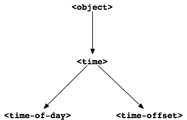

Class Inheritance
=================

In this chapter, we continue to develop the time library by defining
another kind of time to represent time offsets, such as 2 hours ago, and
30 minutes from now. We find an opportunity to use inheritance to good
advantage, so we redefine some classes and a method to take advantage of
inheritance. We also show how to define a generic function explicitly.

The ``<time-offset>`` class and methods
---------------------------------------

In this section, we define a class to represent time offsets, and a
method that describes a time offset. We start by defining the
``<time-offset>`` class:

.. code-block:: dylan

    // A relative time between -24:00 and +24:00
    define class <time-offset> (<object>)
      slot total-seconds :: <integer>, init-keyword: total-seconds:;
    end class <time-offset>;

Reasons for defining two similar classes
~~~~~~~~~~~~~~~~~~~~~~~~~~~~~~~~~~~~~~~~

The ``<time-offset>`` class is similar to the ``<time-of-day>`` class. They
both define a ``total-seconds`` slot. Why do we need to have two classes
that are so similar?

- A ``<time-of-day>`` is conceptually different from a ``<time-offset>``.
  If the ``total-seconds`` slot of a ``<time-of-day>`` is ``180``, that
  means the time of day at 0:03 (that is, 3 minutes past midnight). If
  the ``total-seconds`` slot of a ``<time-offset>`` is ``180``, that means 3
  minutes in the future. If you ask what time it is, the answer is a
  ``<time-of-day>``. If you ask how long it takes to wash the dog, the
  answer is a ``<time-offset>``.
- A ``<time-offset>`` can represent time in the past by having a negative
  value of ``total-seconds``. A ``<time-of-day>``, in contrast, should
  not have a negative value of ``total-seconds``. Later in this book, we
  provide methods that guarantee that the ``total-seconds`` slot of
  ``<time-of-day>`` instances is not negative; see :ref:`slots-setter-methods`,
  and :ref:`slots-initialize-methods`.
- We need different methods for describing instances of ``<time-offset>``
  and instances of ``<time-of-day>``. The ``<time-of-day>`` method prints
  ``8:30``, and the ``<time-offset>`` method should print ``minus 8:30`` or
  ``plus 8:30``.
- Eventually, we will need to be able to add a ``<time-of-day>`` to a
  ``<time-offset>``. For example, we can add the ``<time-of-day>`` 9:03 to
  the ``<time-offset>`` 2:50 and get the ``<time-of-day>`` 11:53. We will
  also need to add two ``<time-offset>`` instances. For example, 2
  minutes plus 8 minutes is equal to 10 minutes. But we cannot add two
  ``<time-of-day>`` instances, because it does not make sense to add
  three o’clock to four o’clock.

Creation of instances of ``<time-offset>``
~~~~~~~~~~~~~~~~~~~~~~~~~~~~~~~~~~~~~~~~~~

We can create an instance of ``<time-offset>`` representing 15:20:10 in
the future:

.. code-block:: dylan-console

    ? define variable *my-time-offset* :: <time-offset>
     = make(<time-offset>, total-seconds: encode-total-seconds(15, 20, 10));

We can create an instance of ``<time-offset>`` representing 6:45:30 in the
past, by using the unary minus function, ``-``, which returns the
negative of the value that follows it:

.. code-block:: dylan-console

    ? define variable *your-time-offset* :: <time-offset>
       = make(<time-offset>, total-seconds: - encode-total-seconds(6, 45,
                                                                   30));

.. _offset-methods-on-time-offset:

Methods on ``<time-offset>``
~~~~~~~~~~~~~~~~~~~~~~~~~~~~

Because a ``<time-offset>`` can represent future time or past time, it
will be useful to provide a convenient way to determine whether a
``<time-offset>`` is in the past. We define a new predicate named ``past?``
as follows:

.. code-block:: dylan

    define method past? (time :: <time-offset>) => (past? :: <boolean>)
      time.total-seconds < 0;
    end method past?;

The ``past?`` method returns an instance of ``<boolean>``, which is
``#t`` if the time offset is in the past, and otherwise is ``#f``.
Here is an example:

.. code-block:: dylan-console

    ? past?(*my-time-offset*)
    => #f

    ? past?(*your-time-offset*)
    => #t

We need a method to describe instances of ``<time-offset>``. The output
should look like this:

.. code-block:: dylan-console

    ? say-time-offset(*my-time-offset*);
    => plus 15:20

    ? say-time-offset(*your-time-offset*);
    => minus 6:45

We might define the method in this way:

.. code-block:: dylan

    define method say-time-offset (time :: <time-offset>) => ()
      let (hours, minutes) = decode-total-seconds(time);
      format-out("%s %d:%s%d",
                 if (past?(time)) "minus" else "plus" end,
                 hours,
                 if (minutes < 10) "0" else "" end,
                 minutes);
    end method say-time-offset;

If we test this method in a listener, however, the result is different:

.. code-block:: dylan-console

    ? say-time-offset(*my-time-offset*);
    => ERROR: No applicable method for decode-total-seconds with argument
    =>   {instance <time-offset>}

“No applicable method” means that there is no method for this generic
function that is appropriate for the arguments. To understand this
error, we can look at the methods for ``decode-total-seconds`` in
:ref:`usr-class-second-method-decode-total-seconds`.  One method takes an
argument of the type ``<integer>``. Another method takes an argument of the
type ``<time-of-day>``. There is no method for instances of ``<time-offset>``,
so Dylan signals an error. There are three possible approaches to
solving this problem.

As a first approach, we could define the ``say-time-offset`` method to
call ``decode-total-seconds`` with an integer.

.. code-block:: dylan
   :linenos:

    // First approach: Call decode-total-seconds with an integer
    define method say-time-offset (time :: <time-offset>) => ()
      let (hours, minutes) = decode-total-seconds(abs(time.total-seconds));
      format-out("%s %d:%s%d",
                 if (past?(time)) "minus" else "plus" end,
                 hours,
                 if (minutes < 10) "0" else "" end,
                 minutes);
    end method say-time-offset;

We changed only the call to ``decode-total-seconds`` on line 3. Here, we
call it with the absolute value (returned by the ``abs`` function) of the
``total-seconds`` slot.

This approach works, but it is awkward because we need to remember what
kinds of arguments ``decode-total-seconds`` can take. The convenient
calling syntax that we introduced for calling ``decode-total-seconds``
with an instance of ``<time-of-day>`` is not available for other kinds of
time.

As a second approach, we could to define a third method for
``decode-total-seconds`` that takes as its argument an instance of
``<time-offset>``:

.. code-block:: dylan

    // Second approach: Define a method on <time-offset>
    define method decode-total-seconds (time :: <time-offset>) => ()
      decode-total-seconds(abs(time.total-seconds));
    end method decode-total-seconds;

The method for ``say-time-offset`` can then call ``decode-total-seconds``,
as we did in the first place:

.. code-block:: dylan

    define method say-time-offset (time :: <time-offset>) => ()
      let (hours, minutes) = decode-total-seconds(time);
      format-out("%s %d:%s%d",
                 if (past?(time)) "minus" else "plus" end,
                 hours,
                 if (minutes < 10) "0" else "" end,
                 minutes);
    end method say-time-offset;

This approach works, and it preserves the flexibility of calling
``decode-total-seconds`` on instances of ``<integer>``, ``<time-of-day>``,
and ``<time-offset>``. However, the body of the method on ``<time-offset>``
(defined in this section) is nearly identical to the body of the method
on ``<time-of-day>`` (defined in :ref:`usr-class-second-method-decode-total-seconds`).
The only difference is that we use ``abs`` in the method on ``<time-offset>``
but not in the method on ``<time-of-day>``. If we used it in the method on
``<time-of-day>``, it would be harmless. Duplication of code is ugly,
adds maintenance overhead, and is particularly undesirable when
programming in an object-oriented language, where it may indicate a flaw
in the overall design.

The best solution to the problem lies in a third approach — to rethink
the classes and methods in a more object-oriented style, using
inheritance. We show this solution in the next section.

Class inheritance
-----------------

We have defined two simple classes, ``<time-of-day>`` and ``<time-offset>``.
We repeat the definitions here:

.. code-block:: dylan

    // A specific time of day from 00:00 (midnight) to before 24:00 (tomorrow)
    define class <time-of-day> (<object>)
      slot total-seconds :: <integer>, init-keyword: total-seconds:;
    end class <time-of-day>;

    // A relative time between -24:00 and +24:00
    define class <time-offset> (<object>)
      slot total-seconds :: <integer>, init-keyword: total-seconds:;
    end class <time-offset>;

There is commonality between the two classes:

- Both classes represent a kind of time — they have a conceptual basis
  in common.
- Both classes have a ``total-seconds`` slot — they have structure in
  common.
- Both classes need a ``decode-total-seconds`` method to convert the
  ``total-seconds`` slot to hours, minutes, and seconds — they have
  behavior in common.

We can use inheritance to model the shared aspects of these two classes
directly. We need to define a new class, such as ``<time>``, and to
redefine the two classes to inherit from ``<time>``. The ``<time>`` class
will contain the slot ``total-seconds``, and the other two classes will
inherit that slot. We shall redefine the ``decode-total-seconds`` method
such that its parameter is of the ``<time>`` type, which means that it can
be called for instances of ``<time-of-day>`` and of ``<time-offset>``.

New definitions of the time classes
~~~~~~~~~~~~~~~~~~~~~~~~~~~~~~~~~~~

We define the new class ``<time>``:

.. code-block:: dylan

   define class <time> (<object>)
     slot total-seconds :: <integer>, init-keyword: total-seconds:;
   end class <time>;

We redefine ``<time-of-day>`` and ``<time-offset>`` to inherit from ``<time>``:

.. code-block:: dylan

    // A specific time of day from 00:00 (midnight) to before 24:00 (tomorrow)
    define class <time-of-day> (<time>)
    end class <time-of-day>;

    // A relative time between -24:00 and +24:00
    define class <time-offset> (<time>)
    end class <time-offset>;

.. topic:: Dynamic feature — no need to recompile:

   In C++, a complete recompile of the program would be necessary to change
   the superclass of a class. Most Dylan development environments support
   a mode that requires only that you compile the new class definitions.
   The difference between compiling only a few class definitions and
   compiling the whole program can be a time saver for complex
   applications.

Slot inheritance
~~~~~~~~~~~~~~~~

A class inherits the slots of its superclasses, and can define more
slots if they are needed. For example, the ``<time-of-day>`` and
``<time-offset>`` classes inherit the ``total-seconds`` slot from their
superclass, ``<time>``. A class inherits the slot options from its
superclasses as well. A class cannot remove or replace any slots defined
by its superclasses. It is an error for a class to define a slot with
the same name as a slot inherited from one of that class’s superclasses.

Existing instances of the classes
~~~~~~~~~~~~~~~~~~~~~~~~~~~~~~~~~

The variables ``*my-time-of-day*``, ``*your-time-of-day*``,
``*my-time-offset*``, and ``*your-time-offset*`` all contain instances
of classes that have now been redefined. Some environments might be able
to update instances of the old class definitions to conform to the new
class definitions, but we will be conservative and assume that our
environment does not update instances. Therefore, we create the
instances again:

.. code-block:: dylan-console

    ? *my-time-offset*
     := make(<time-offset>, total-seconds: encode-total-seconds(15, 20, 10));

    ? *your-time-offset*
     := make(<time-offset>, total-seconds: - encode-total-seconds(6, 45, 30));

    ? *my-time-of-day* := make(<time-of-day>, total-seconds: 120);

    ? *your-time-of-day*
     := make(<time-of-day>, total-seconds: encode-total-seconds(8, 30, 59));

Relationships of the time classes
~~~~~~~~~~~~~~~~~~~~~~~~~~~~~~~~~

It is helpful to look at the relationships among the time classes. We
show them in :ref:`inheritance-of-time-classes`.

Referring to :ref:`inheritance-of-time-classes`, we introduce terminology
by example:

- The ``<time-of-day>`` class is a *direct subclass* of the ``<time>``
  class.
- The ``<time-of-day>`` class is a *subclass* of the ``<object>`` class.
- The ``<time>`` class is a *direct superclass* of the ``<time-of-day>``
  class.
- The ``<object>`` class is a *superclass* of the ``<time-of-day>`` class.
- When you make an instance of the ``<time-of-day>`` class, the result is
  a *direct instance* of that class.

.. _inheritance-of-time-classes:

   Inheritance relationships of the time classes.

- A direct instance of ``<time-of-day>`` is an *indirect instance* of
  ``<time>`` and ``<object>``.
- An object is a *general instance* of a class if it is either a direct
  or an indirect instance of that class. The term *instance* is
  equivalent to general instance. A direct instance of ``<time-of-day>``
  is both a general instance and an instance of ``<time-of-day>``,
  ``<time>``, and ``<object>``.
- The ``<time-of-day>`` class is a *subtype* of the ``<time>`` and
  ``<object>`` classes. A class is also a subtype of itself. All classes
  are types.
- The ``<object>`` class is a *supertype* of all the other classes shown.
  All classes are subtypes of the ``<object>`` class. All objects are
  instances of the ``<object>`` class.

Methods for classes that use inheritance
----------------------------------------

`Existing methods for decode-total-seconds <existing-decode-total-seconds>`_
shows the methods that we now have defined for the
``decode-total-seconds`` generic function; `Desired methods for
decode-total-seconds <desired-decode-total-seconds>`_ shows the methods that we
want to have.

.. _existing-decode-total-seconds:

Existing methods for ``decode-total-seconds``:

.. code-block:: dylan

    // Method on <integer>
    define method decode-total-seconds
        (total-seconds :: <integer>)
     => (hours :: <integer>, minutes :: <integer>, seconds :: <integer>)
      let (total-minutes, seconds) = truncate/(total-seconds, 60);
      let (hours, minutes) = truncate/(total-minutes, 60);
      values(hours, minutes, seconds);
    end method decode-total-seconds;

    // Method on <time-of-day>
    define method decode-total-seconds
        (time :: <time-of-day>)
     => (hours :: <integer>, minutes :: <integer>, seconds :: <integer>)
      decode-total-seconds(time.total-seconds);
    end method decode-total-seconds;

.. _desired-total-seconds:

Desired methods for ``decode-total-seconds``:

.. code-block:: dylan

    // Method on <integer>
    define method decode-total-seconds
        (total-seconds :: <integer>)
     => (hours :: <integer>, minutes :: <integer>, seconds :: <integer>)
      let (total-minutes, seconds) = truncate/(total-seconds, 60);
      let (hours, minutes) = truncate/(total-minutes, 60);
      values(hours, minutes, seconds);
    end method decode-total-seconds;

    // Method on <time>
    define method decode-total-seconds
        (time :: <time>)
     => (hours :: <integer>, minutes :: <integer>, seconds :: <integer>)
      decode-total-seconds(abs(time.total-seconds));
    end method decode-total-seconds;

To take advantage of the redefined classes, we want to remove the method
on ``<time-of-day>``, and to add a method on ``<time>``. The method on
``<time>`` is appropriate for instances of both ``<time-of-day>`` and
``<time-offset>``.

There are two important points to cover. We first discuss how to remove
the method on ``<time-of-day>`` and how to add the method on ``<time>`` in
`Redefinition of a method`_. We then describe how the ``decode-total-seconds``
generic function works in `Method dispatch`_.

Redefinition of a method
------------------------

It is important to understand that when you define a method, Dylan will
do one of the following:

- Add that method to the generic function (without affecting existing
  methods), if the parameter list of the new method is different from
  the parameter lists of all the existing methods.
- Redefine an existing method of the generic function, if the parameter
  list of the new method is equivalent to the parameter list of one of
  the existing methods. (Although the concept of redefinition is not in
  the Dylan language, most Dylan development environments support
  redefinition.)

Two parameter lists are equivalent if the types of each required
parameter are the same. A parameter with no type is the same as a
parameter whose type is ``<object>``. For example, the following
parameter lists are equivalent:

.. code-block:: dylan

    (a :: <string>, b :: <integer>, c)
    (str :: <string>, num :: <integer>, any-old-thing :: <object>)

Assume that we are working in a listener, and already have defined the
methods shown in `Existing methods for decode-total-seconds
<existing-decode-total-seconds>`_. Consider what happens when we define
the method on ``<time>``. The parameter list of the new method is not
equivalent to the parameter list of any of the
existing methods, so the new method is added to the generic function. Thus,
``decode-total-seconds`` has three methods: a method on
``<integer>``, a method on ``<time-of-day>``, and a method on ``<time>``.
The environment may offer a way to remove a method from a generic
function. When we remove the definition of the method on ``<time-of-day>``
using the environment, the ``decode-total-seconds`` generic function
contains only the desired methods, as shown in `Desired methods for
decode-total-seconds <desired-decode-total-seconds>`_. A typical browser
will help you to find the methods to remove.

If, however, we are working in source files rather than in a listener,
we simply need to remove the method on ``<time-of-day>`` with the editor,
and to type in the method on ``<time>``. When we next compile the file,
the generic function will contain only the desired methods, as shown in
`Desired methods for decode-total-seconds <desired-decode-total-seconds>`_.

We can now call ``decode-total-seconds`` on instances of ``<time-of-day>``
and on instances of ``<time-offset>``:

.. code-block:: dylan-console

    ? decode-total-seconds(*your-time-of-day*);
    => 8
    => 30
    => 59

    ? decode-total-seconds(*your-time-offset*);
    => 6
    => 45
    => 30

The result is as expected — ``decode-total-seconds`` returns the hours,
minutes, and seconds. We now describe how this generic function works.

.. _offset-method-dispatch:

Method dispatch
---------------

When a generic function is called, it chooses the *most specific
applicable method* and calls that method. The process of choosing the
most specific method and calling it is *method dispatch*. This process
has three steps:

#. Find all the *applicable methods* for the argument to the generic function.
#. Sort the applicable methods by *specificity*.
#. Call the most specific method.

Dylan does the method dispatch automatically, but it is important that
you understand the semantics of the method dispatch. When you understand
how Dylan determines the applicability of methods and how it sorts them
by specificity, you can design classes and methods that work together
correctly. Method dispatch is at the heart of object-oriented
programming.

Step 1: Find the applicable methods
~~~~~~~~~~~~~~~~~~~~~~~~~~~~~~~~~~~

Start with the set of methods defined for the generic function that was
called. A method is *specialized* on a required parameter that has a
type constraints. The type constraint of the required parameter is
called the *parameter specializer* of the parameter. A method is
*applicable* if the argument to the generic function is an instance of
the parameter specializer of the method.

For example, consider the ``decode-total-seconds`` generic function.
:ref:`applicable-methods-for-decode-total-seconds` shows which method is
applicable for certain arguments.

.. _applicable-methods-for-decode-total-seconds:

.. table:: Applicable methods for arguments to ``decode-total-seconds``.

   +----------------------+-------------------+-------------------------+
   | Argument             | Argument’s type   | Applicable methods      |
   +======================+===================+=========================+
   | ``*my-time-of-day*`` | ``<time-of-day>`` | method on ``<time>``    |
   +----------------------+-------------------+-------------------------+
   | ``*my-time-offset*`` | ``<time-offset>`` | method on ``<time>``    |
   +----------------------+-------------------+-------------------------+
   | ``1000``             | ``<integer>``     | method on ``<integer>`` |
   +----------------------+-------------------+-------------------------+
   | ``"hello, world"``   | ``<string>``      | none                    |
   +----------------------+-------------------+-------------------------+

The first row of the table shows that, when the argument is a direct
instance of ``<time-of-day>``, the method on ``<time>`` is applicable,
because the argument is an instance of ``<time>`` (the method’s parameter
specializer). The final row of the table shows that, when the argument
is ``"hello, world"``, none of the defined methods are applicable, because
``"hello, world"`` is not an instance of ``<time>`` or ``<integer>``.

For ``decode-total-seconds``, there is either no or one applicable method
for any argument. If there is one applicable method, it is called. If
there is no applicable method, the “No applicable method” error is
signaled. There is no need to continue to step 2.

In other cases, there can be several applicable methods. Consider the
generic function ``say-greeting``, shown in `The say-greeting generic
function and its methods <say-greeting-gf-methods>`_.
:ref:`applicable-methods-for-say-greeting` shows that, for certain
arguments, one method is applicable, but that, for an integer argument,
two methods are applicable.

When the argument is ``7``, a direct instance of ``<integer>``, the method
on ``<object>`` is applicable, because ``7`` is an instance of ``<object>``
(the method’s parameter specializer); the method on ``<integer>`` also is
applicable, because ``7`` is an instance of ``<integer>`` (the method’s
parameter specializer).

.. _say-greeting-gf-methods:

The ``say-greeting`` generic function and its methods:

.. code-block:: dylan

    define method say-greeting (greeting :: <object>)
      format-out("%s\n", greeting);
    end;

    define method say-greeting (greeting :: <integer>)
      format-out("Your lucky number is %s.\n", greeting);
    end;

.. _applicable-methods-for-say-greeting:

.. table:: Applicable methods for different arguments to ``say-greeting``.

   +--------------------+----------------------------+
   | Argument           | Applicable method(s)       |
   +====================+============================+
   | ``7``              | #. method on ``<object>``  |
   |                    | #. method on ``<integer>`` |
   +--------------------+----------------------------+
   | ``$pi``            | method on ``<object>``     |
   +--------------------+----------------------------+
   | ``"hello, world"`` | method on ``<object>``     |
   +--------------------+----------------------------+

Step 2: Sort applicable methods by specificity
~~~~~~~~~~~~~~~~~~~~~~~~~~~~~~~~~~~~~~~~~~~~~~

Start with the set of applicable methods. Compare the parameter
specializers of the methods. If one type is a subtype of the other, the
method whose parameter is of the subtype is *more specific* than the
other method. Sort the list of applicable methods from most specific to
least specific.

Let’s continue with the example of calling ``say-greeting`` with an
argument of ``7``. The parameter specializers of the two methods are
``<object>`` and ``<integer>``. Because ``<integer>`` is a subtype of
``<object>``, the method on ``<integer>`` is more specific than the method
on ``<object>``.

Step 3: Call the most specific method
~~~~~~~~~~~~~~~~~~~~~~~~~~~~~~~~~~~~~

The generic function calls the most specific method.

Precedence in method dispatch
~~~~~~~~~~~~~~~~~~~~~~~~~~~~~

This conceptual description of how method dispatch works should help you
to understand how to design methods. The most important concept to
realize is that method dispatch should feel natural — it gives
precedence to the methods that are more closely related to the argument,
rather than to the methods that are more general. This precedence
ordering lets you adjust the behavior of a class with respect to that
class’s superclasses.

.. topic:: Performance note:

   The Dylan compiler and run-time system ensure that the method-dispatch
   rules are followed for every call to a generic function. Given accurate
   type declarations, however, a compiler can usually compute the result
   of the dispatch rules at compile time, so the executed code is just
   as efficient as a normal function call in a language without generic
   functions and methods. See :doc:`perform`.

Definition of a generic function
--------------------------------

We repeat the definitions of the methods for ``say-time-of-day`` and
``say-time-offset`` here:

.. code-block:: dylan

    define method say-time-of-day (time :: <time-of-day>) => ()
      let (hours, minutes) = decode-total-seconds(time);
      format-out
        ("%d:%s%d", hours, if (minutes < 10) "0" else "" end, minutes);
    end method say-time-of-day;

    define method say-time-offset (time :: <time-offset>) => ()
      let (hours, minutes) = decode-total-seconds(time);
      format-out("%s %d:%s%d",
                 if (past?(time)) "minus" else "plus" end,
                 hours,
                 if (minutes < 10) "0" else "" end,
                 minutes);
    end method say-time-offset;

Now that ``decode-total-seconds`` has an applicable method for instances
of ``<time-offset>`` and ``<time-of-day>``, both these methods work
correctly:

.. code-block:: dylan-console

    ? say-time-of-day(*my-time-of-day*);
    => 0:02

    ? say-time-of-day(*your-time-of-day*);
    => 8:30

    ? say-time-offset(*my-time-offset*);
    => plus 15:20

    ? say-time-offset(*your-time-offset*);
    => minus 6:45

We have defined two methods: ``say-time-offset`` and ``say-time-of-day``. A
method defined with ``define method`` cannot exist without a *generic
function*. When you define a method, and no generic function of that
name exists, Dylan automatically creates a generic function. When we
defined these two methods, there were no generic functions with those
names defined, so Dylan created module variables named ``say-time-of-day``
and ``say-time-offset``, created the generic functions, stored the
generic functions in the module variables, and added the methods to the
generic functions.

These two methods are logically related to each other, but have no
explicit relationship in the code, other than in the similarity of their
names. A cleaner approach is to abstract the concept of what these
methods are trying to do — that is, to describe an object. To introduce
this abstraction, we define a new generic function.

We use ``define generic`` to define the generic function explicitly:

.. code-block:: dylan

    // Given an object, print a description of the object
    define generic say (any-object :: <object>) => ();

This generic function has a name: ``say``. It receives one argument: the
object to describe. That argument must be of the type ``<object>``. All
objects are of the type ``<object>``, so this generic function does not
restrict the type of its argument.

Our definition for the generic function ``say`` is similar to that of the
generic function that Dylan would have created automatically if we had
defined a method for ``say`` before we defined the generic function ``say``
. (The only difference is that the automatically defined generic
function would have a more general value declaration.) However, defining
the generic function explicitly enables us to formalize its purpose, to
name the parameter, to specify a type constraint on the parameter, to
specify the return values and their types, and to give comments about
the generic function as a whole. The generic function defines the
*contract* that all methods for this generic function must obey. The
contract of the ``say`` generic function is as follows:

The ``say`` generic function receives one required argument, which must be
of the type ``<object>``. It prints a description of the object. The
``say`` generic function returns no values.

Dylan requires all the methods for a generic function to have congruent
parameter lists and values declarations. See :ref:`func-parameter-list-congruence`.

Now, we define two methods for ``say``. The method for ``say`` on
``<time-of-day>`` fulfills the same purpose (and has the same body) as the
``say-time-of-day`` method, which we remove from the library with an
editor or a gesture in the environment.

.. code-block:: dylan

    define method say (time :: <time-of-day>) => ()
      let (hours, minutes) = decode-total-seconds(time);
      format-out
        ("%d:%s%d", hours, if (minutes < 10) "0" else "" end, minutes);
    end method say;

Similarly, the method for ``say`` on ``<time-offset>`` is intended to
replace ``say-time-offset``, which we remove.

.. code-block:: dylan

    define method say (time :: <time-offset>) => ()
      let (hours, minutes) = decode-total-seconds(time);
      format-out("%s %d:%s%d",
                 if (past?(time)) "minus" else "plus" end,
                 hours,
                 if (minutes < 10) "0" else "" end,
                 minutes);
    end method say-time-offset;

.. _say-generic-function-methods:

The generic function ``say`` has two methods defined for it:

.. code-block:: dylan

    define method say (time :: <time-of-day>) => ()
      let (hours, minutes) = decode-total-seconds(time);
      format-out
        ("%d:%s%d", hours, if (minutes < 10) "0" else "" end, minutes);
    end say;

    define method say (time :: <time-offset>) => ()
      let (hours, minutes) = decode-total-seconds(time);
      format-out("%s %d:%s%d",
                 if (past?(time)) "minus" else "plus" end,
                 hours,
                 if (minutes < 10) "0" else "" end,
                 minutes);
    end say;

We can call ``say``:

.. code-block:: dylan-console

    ? say(*my-time-of-day*);
    => 0:02

In the preceding call, the argument is of the type ``<time-of-day>``, so
the method on ``<time-of-day>`` is the only applicable method. That method
is invoked.

.. code-block:: dylan-console

    ? say(*my-time-offset*);
    => plus 15:20

In the preceding call, the argument is of the type ``<time-offset>``, so
the method on ``<time-offset>`` is the only applicable method. That method
is invoked.

Use of ``next-method`` to call another method
---------------------------------------------

Notice that there is duplication of code in the two methods for ``say``,
as shown in `Methods for the say generic function
<say-generic-function-methods>`_ Both methods call
``decode-total-seconds`` to get the hours and minutes, and call
``format-out`` to print the hours and minutes. Both methods
print a leading zero for the minutes, if appropriate. These two tasks
are all that the method on ``<time-of-day>`` does. The method on
``<time-offset>`` does a bit more; it prints either *minus* or *plus*,
depending on the value of the ``past?`` slot.

We can eliminate this duplication by defining another method that does
the shared work. This method will be on the ``<time>`` class, so it will
be applicable to instances of ``<time-of-day>`` and ``<time-offset>``. The
method for ``<time-of-day>`` is no longer needed, because the new method
does the same work. However, a revised method for ``<time-offset>`` is
needed, to do the extra work of printing *minus* or *plus*, and to call
the method on ``<time>``, which is the next most specific method.

You can use the ``next-method`` function to call the next most specific
method. Recall that the result of Dylan’s method dispatch procedure is a
list of applicable methods, sorted by specificity. When one method calls
the ``next-method`` function, Dylan consults the list of sorted methods
and invokes the next most specific method on the list. (It is an error
to call ``next-method`` from the least specific method.)

We remove the definitions of the existing ``say`` methods, and define
these new methods:

.. code-block:: dylan

    define method say (time :: <time>) => ()
      let (hours, minutes) = decode-total-seconds(time);
      format-out
        ("%d:%s%d", hours, if (minutes < 10) "0" else "" end, minutes);
    end method say;

    define method say (time :: <time-offset>)
      format-out("%s ", if (past?(time)) "minus" else "plus" end);
      next-method();
    end method say;

We can call ``say``:

.. code-block:: dylan-console

    ? say(*my-time-of-day*);
    => 0:02

In the preceding call, the argument is of the type ``<time-of-day>``, so
the method on ``<time>`` is the only applicable method. That method is
invoked.

.. code-block:: dylan-console

    ? say(*my-time-offset*);
    => plus 15:20

In the preceding call, the argument is of the type ``<time-offset>``, so
two methods are applicable. The method on ``<time-offset>`` is more
specific than is the method on ``<time>``, so the method on
``<time-offset>`` is called. That method on ``<time-offset>`` prints *minus*
or *plus*, and calls ``next-method``. The ``next-method`` function calls
the method on ``<time>``, which prints the hours and minutes.

Using ``next-method`` is convenient in cases such as this, where a method
on a superclass can do most of the work, but a method on a subclass
needs to do additional work.

When ``next-method`` is called with no arguments, as it is in the method
on ``<time-offset>``, Dylan calls the next most specific method with the
same arguments provided to the method that calls ``next-method``.

You can provide arguments to ``next-method``. For example, you could
provide a keyword argument with a value that each method can manipulate
(such as adding a value to a number, or appending an element to a list).
If you provide arguments to ``next-method``, the arguments must be
compatible with the generic function, as described in
:ref:`func-parameter-list-congruence`. In addition, you cannot supply
required arguments that have classes different from those of the original
required arguments to the generic function, if doing so would have changed the
method dispatch in any way. Providing arguments to ``next-method`` is an
advanced technique; see :ref:`func-parameter-lists`, and
:ref:`nlanding-vehicle-containers`.

The time library (so far)
-------------------------

In the course of introducing methods, classes, and generic functions, we
have created elements of a library dealing with two kinds of time. Now,
we construct a simple library containing those elements (we will
continue to develop the time library throughout this book). We represent
the time library in four files: a LID file, a library file, a library
implementation file, and a test file. We could have expressed this
library in three files, by combining into a single file the library
implementation file and the test file, but we decided that it would be
clearer to separate the underlying implementation (the definitions of
classes, methods, and generic functions) from the test (where we create
instances and call ``say`` on them).

The LID file: ``time.lid``.

.. code-block:: dylan

    library: time

    files: library
           library-implementation
           test

The library file defines the ``time`` library and the ``time`` module.

The library file: ``library.dylan``.

.. code-block:: dylan

    module: dylan-user

    define library time
      use dylan;
      use format-out;
    end library time;

    define module time
      use dylan;
      use format-out;
    end module time;

The library implementation file defines the classes, methods, and
generic functions.

The implementation file: ``library-implementation.dylan``.

.. code-block:: dylan

    module: time

    // Class definitions

    define class <time> (<object>)
      slot total-seconds :: <integer>, init-keyword: total-seconds:;
    end class <time>;

    // A specific time of day from 00:00 (midnight) to before 24:00 (tomorrow)
    define class <time-of-day> (<time>)
    end class <time-of-day>;

    // A relative time between -24:00 and +24:00
    define class <time-offset> (<time>)
    end class <time-offset>;

    // Method for determining whether a time offset is in the past
    define method past? (time :: <time-offset>) => (past? :: <boolean>)
      time.total-seconds < 0;
    end method past?;

    // Methods for encoding and decoding total seconds

    define method encode-total-seconds
        (hours :: <integer>, minutes :: <integer>, seconds :: <integer>)
     => (total-seconds :: <integer>)
      ((hours * 60) + minutes) * 60 + seconds;
    end method encode-total-seconds;

    define method decode-total-seconds
        (time :: <time>)
     => (hours :: <integer>, minutes :: <integer>, seconds :: <integer>)
      decode-total-seconds(abs(time.total-seconds));
    end method decode-total-seconds;

    define method decode-total-seconds
        (total-seconds :: <integer>)
     => (hours :: <integer>, minutes :: <integer>, seconds :: <integer>)
      let (total-minutes, seconds) = truncate/(total-seconds, 60);
      let (hours, minutes) = truncate/(total-minutes, 60);
      values(hours, minutes, seconds);
    end method decode-total-seconds;

    // The say generic function and its methods

    // Given an object, print a description of the object
    define generic say (any-object :: <object>) => ();

    define method say (time :: <time>) => ()
      let (hours, minutes) = decode-total-seconds(time);
      format-out
        ("%d:%s%d", hours, if (minutes < 10) "0" else "" end, minutes);
    end method say;

    define method say (time :: <time-offset>)
      format-out("%s ", if (past?(time)) "minus" else "plus" end);
      next-method();
    end method say;

The test file creates instances and calls ``say`` on the instances. The
test file can access variables defined in the implementation file,
because both files are in the ``time`` module.

The test file: ``test.dylan``.

.. code-block:: dylan

    module: time

    define variable *my-time-offset* :: <time-offset>
      = make(<time-offset>, total-seconds: encode-total-seconds(15, 20, 10));

    define variable *your-time-offset* :: <time-offset>
      = make(<time-offset>, total-seconds: - encode-total-seconds(6, 45, 30));

    define variable *my-time-of-day*
      = make(<time-of-day>, total-seconds: encode-total-seconds(0, 2, 0));

    define variable *your-time-of-day*
      = make(<time-of-day>, total-seconds: encode-total-seconds(8, 30, 59));

    say(*my-time-offset*);

    say(*your-time-offset*);

    say(*my-time-of-day*);

    say(*your-time-of-day*);

When we run the ``test.dylan`` file, Dylan creates two instances of
``<time-offset>`` and two instances of ``<time-of-day>``. It calls ``say`` on
all four instances. The output of the test is

::

    plus 15:20
    minus 6:45
    0:02
    8:30

Summary
-------

In this chapter, we covered the following:

- We showed how to use class inheritance.
- We introduced the terminology of classes: direct subclass, subclass,
  direct superclass, superclass, direct instance, indirect instance,
  instance, subtype, and supertype.
- We showed how method dispatch works for a generic function with one
  argument, when there is more than one applicable method.
- We created a generic function explicitly (with ``define generic``).
- We used ``next-method`` to call the next most specific method.

