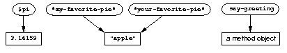

Methods, Classes, and Objects
=============================

In this chapter, we introduce the basic concepts of methods, classes,
and objects. We define simple methods, and show that each method is
intended for a certain class of argument. We discuss built-in classes in
Dylan, and show that they are related by class inheritance. Finally, we
discuss what it means to be an object.

Dylan’s model of objects and classes differs significantly from the C++
model. If you are familiar with C++, we recommend that you read
:doc:`c-comparisons`.

.. _oo-1-method-definitions:

Method definitions
------------------

In Dylan, we define methods — a *method* is a kind of function. We
define a simple method, ``say-hello``, as follows:

.. code-block:: dylan

    define method say-hello ()
      format-out("hello, world\n");
    end;

We call ``say-hello`` as follows:

.. code-block:: dylan-console

    ? say-hello();
    => hello, world

We use ``define method`` to define a method named ``say-hello``. Just after
the name ``say-hello``, we specify the method’s *parameter list*, ``()``.
The parameter list of this method is empty, meaning that this method
takes no arguments. The call to ``say-hello`` provides an empty argument
list, meaning that there are no arguments in the call.

The body of the ``say-hello`` method has one expression — a call to
``format-out``. A method returns whatever is returned by the expression
executed last in its body. In general, a method can return a single
value, multiple values, or no value at all. The ``say-hello`` method
returns what ``format-out`` returns — no value at all. In the call to
``say-hello``, we see the output of ``format-out`` in the listener;
we see output and not a returned value (because no value is returned).

.. topic:: Usage note:

   In this chapter, we define methods that call the ``format-out``
   function. Because ``format-out`` is in the ``format-out``
   module, we need to make that module available. There are two ways to do
   so. The first way is to work in files, as described in :ref:`start-complete-program`.
   The second way is to use a gesture or command in your Dylan environment to
   make the ``format-out`` module accessible. Then, you can simply enter the
   method definitions into the listener.

A method that takes an argument
~~~~~~~~~~~~~~~~~~~~~~~~~~~~~~~

We can define a method similar to ``say-hello``, called ``say-greeting``,
that takes an argument:

.. code-block:: dylan

    define method say-greeting (greeting :: <object>);
      format-out("%s\n", greeting);
    end;

The ``say-greeting`` method has one required parameter, named ``greeting``.
The type constraint of the required parameter indicates the type that
the argument must be. The ``greeting`` parameter has the type constraint
``<object>``, which is the most general class. All objects are of the
type ``<object>``, so using this class as the type constraint allows the
argument to be any object. You can omit the type constraint of a
required parameter; that omission has the same effect as specifying
``<object>`` as the type constraint.

We can call ``say-greeting`` on a string:

.. code-block:: dylan-console

     ? say-greeting("hi, there");
     => hi, there

We can call ``say-greeting`` on an integer, although the integer does not
give a particularly friendly greeting:

.. code-block:: dylan-console

    ? define variable *my-number* :: <integer> = 7;

    ? say-greeting(*my-number*);
    => 7

Two methods with the same name
~~~~~~~~~~~~~~~~~~~~~~~~~~~~~~

For fun, we can change ``say-greeting`` to take a different action for
integers, such as to print a message:

::

    Your lucky number is 7.

To make this change, we define another method, also called ``say-greeting``.
This method has one required parameter named ``greeting``, which has the type
constraint ``<integer>``.

.. code-block:: dylan

    define method say-greeting (greeting :: <integer>)
      format-out("Your lucky number is %s.\n", greeting);
    end;

.. code-block:: dylan-console

    ? say-greeting(*my-number*);
    => Your lucky number is 7.

A Dylan method is similar to a procedure or subroutine in other
languages, but there is an important difference. You can define more
than one method with the same name. Each one is a method for the same
:term:`generic function`. :ref:`The say-greeting generic function and its
methods <say-greeting-methods>` shows how you can picture a generic
function.

When a generic function is called, it chooses the most appropriate
method to call for the arguments. For example, when we call the
``say-greeting`` generic function with an integer, the method whose
parameter is of the type ``<integer>`` is called:

.. code-block:: dylan-console

    ? say-greeting(1000);
    => Your lucky number is 1000.

When we call the ``say-greeting`` generic function with an argument that
is not an integer, the method whose parameter is of the type ``<object>``
is called:

.. code-block:: dylan-console

    ? say-greeting("Buenos Dias");
    => Buenos Dias

.. _say-greeting-methods:

.. code-block:: dylan

    define method say-greeting (greeting :: <object>)
      format-out("%s\n", greeting);
    end;

    define method say-greeting (greeting :: <integer>)
      format-out("Your lucky number is %s.\n", greeting);
    end;

Classes
-------

We have already seen examples of classes in Dylan: ``<integer>``,
``<single-float>``, ``<string>``, and ``<object>``.

Individual values are called *objects*. Each object is a *direct
instance* of one particular class. You can use the ``object-class``
function to determine the direct class of an object. For example, in
certain implementations, *7*, *12*, and *1000* are direct instances of
the class ``<integer>``:

.. code-block:: dylan-console

    ? object-class(1000);
    => {class <integer>}

The value returned by ``object-class`` is the ``<integer>`` class itself.
The appearance of a class, method, or generic function in a listener
depends on the Dylan environment. We have chosen a simple appearance of
classes for this book.

All the classes that we have seen so far are built-in classes, provided
by Dylan. In :doc:`usr-class`, we show how to define new classes.

Class inheritance
~~~~~~~~~~~~~~~~~

One important aspect of classes is that they are related to one another
by *inheritance*. Inheritance enables classes that are logically related
to one another to share the behaviors and attributes that they have in
common. Each class inherits from one or more classes, called its
*superclasses*. If no other class is appropriate, then the class
inherits from the class ``<object>``. This class is the *root* of all
classes: All classes inherit from it, either directly or indirectly, and
it does not have any direct superclasses.

.. topic:: Comparison with C++:

   If you are familiar with the class concepts of C++, you might initially
   be confused by Dylan’s class model. In Dylan, all base classes are
   effectively virtual base classes with “virtual” data members. When a
   class inherits another class more than once (because of multiple
   inheritance), only a single copy of that base class is included. Each
   of the multiple-inheritance paths can contribute to the implementation
   of the derived class. The Dylan class model favors this mix-in
   style of programming. For more information, see
   :ref:`c-comparisons-concept-of-classes` in :doc:`c-comparisons`.

In Dylan, we distinguish between two terms: *direct instance* and
*general instance*. An object is a *direct instance* of exactly one
class: the class that ``object-class`` returns for that object. An object
is a *general instance* of its direct class, and of all classes from
which its direct class inherits. The term *instance* is equivalent to
*general instance*. You can use the ``instance?`` predicate to ask
whether an object is an instance of a given class:

.. code-block:: dylan-console

    ? instance?(1000, <integer>);
    => #t

    ? instance?("hello, world", <integer>);
    => #f

All objects are instances of the class ``<object>``:

.. code-block:: dylan-console

    ? instance?(1000, <object>);
    => #t

    ? instance?("hello, world", <object>);
    => #t

:ref:`classes-and-subclasses` shows the inheritance relationships among
several of the built-in classes. If class A is a superclass of class B,
then class B is a *subclass* of class A. For example, ``<object>`` is a
superclass of ``<string>``, and ``<string>`` is a subclass of ``<object>``.
For simplicity, :ref:`classes-and-subclasses` omits certain classes that
intervene between the classes shown.

.. _classes-and-subclasses:

   Classes and subclasses.

   Each arrow points from a class to a subclass.

A typical Dylan environment provides a browser to explore inheritance
relationships among classes; certain environments show the relationships
graphically.

The Dylan language includes functions that provide information about the
inheritance relationships among classes. We can use ``subtype?`` to ask
whether one class inherits from another class:

.. code-block:: dylan-console

    ? subtype?(<integer>, <number>);
    => #t

    ? subtype?(<integer>, <object>);
    => #t

    ? subtype?(<single-float>, <object>);
    => #t

    ? subtype?(<string>, <integer>);
    => #f

It may be confusing that we use a function called ``subtype?`` here, but
Dylan does not provide a function called ``subclass?``. Every class is a
*type*, but certain types are not classes (see
:ref:`classes-functions-create-nonclass-types`).  The ``subtype?``
function works for both classes and other types.

We can ask for all the superclasses of a given class:

.. code-block:: dylan-console

    ? all-superclasses(<string>);
    => #[{class <string>}, {class <mutable-sequence>}, {class <sequence>},
    =>   {class <mutable-collection>}, {class <collection>}, {class <object>}]

    ? all-superclasses(<integer>);
    => #[{class <integer>}, {class <rational>}, {class <real>},
    =>   {class <number>}, {class <object>}]

    ? all-superclasses(<single-float>);
    => #[{class <single-float>}, {class <float>}, {class <real>},
    =>   {class <number>}, {class <object>}]

The ``all-superclasses`` function returns a vector containing the class
itself and all that class’s superclasses. The ``#[...]`` syntax
represents a *vector*, which is a one-dimensional array. (For
information about vectors, see :doc:`collect`.)

Relationship between classes and methods
~~~~~~~~~~~~~~~~~~~~~~~~~~~~~~~~~~~~~~~~

The relationship between classes and methods in Dylan is different from
that in C++ and Smalltalk, among other languages.

.. topic:: Comparison to C++ and Smalltalk:

   In C++ and Smalltalk, a class contains the equivalent of methods. In
   Dylan, a class does not contain methods; instead, a method belongs to
   a generic function. This design decision enables these powerful
   features of Dylan:

   - You can define methods on built-in classes (because you do not
     have to modify the class definition to define a method intended for
     use on the class). For an example, see :ref:`multi-methods-for-plus-gf`.
     More generally, you can define a method for a class that you did not
     define.
   - You can write multimethods. In a *multimethod*, the method dispatch
     is based on the classes of more than one argument to a generic
     function. For an introduction to method dispatch, see
     :ref:`offset-method-dispatch`. For information about multimethods, see
     :doc:`multi`.
   - You can restrict generic functions to operate on specific classes of
     objects.

In Dylan, a method belongs to a generic function, as shown in :ref:`The
say-greeting generic function and its methods <say-greeting-methods>`.
Although methods are independent of classes, methods operate on
instances of classes. A method states the types of objects for which it
is applicable by the type constraint of each of its required parameters.
Consider the ``say-greeting`` method defined earlier:

.. code-block:: dylan

    define method say-greeting (greeting :: <integer>);
      format-out("Your lucky number is %s.\n", greeting);
    end;

This method operates on instances of the ``<integer>`` class. Notice how
easy and convenient it is to define a method intended for use on the
built-in class ``<integer>``.

Objects
-------

In Dylan, everything is an *object*. Characters, strings, numbers,
arrays, and vectors are all objects. The canonical true and false
values, ``#t``, and ``#f``, are objects. Methods, generic functions, and
classes are objects. What does it mean to be an object?

- Most important, an object has a unique identity. You can use the ``==``
  predicate to test whether two operands are the same object. See
  `Predicates for testing equality`_.
- An object is a direct instance of a particular class. You can use the
  ``object-class`` predicate to determine the direct class of an object.
- You can give an object a name. For example, if you define a variable
  or constant to contain an object, you have given that object a name.
  See `Bindings: Mappings between objects and names`_.
- You can pass an object as an argument or return value — because
  generic functions and methods are objects, you can manipulate them
  just as you can any other object. See :ref:`func-functions-as-objects`.

.. topic:: Comparison to C++ and Smalltalk:

   In Dylan and Smalltalk, everything is an object (an instance of a
   class); we say that Dylan and Smalltalk have “objects all the way
   down.” In contrast, in C++, some values are not objects; they have
   primitive types that are not classes. For example, in Dylan, 7 is
   an instance of ``<integer>``. In C++, 7 is not an instance;
   it has the type ``int``.  This design decision enables Dylan users to
   define methods on built-in classes in the same way that they define
   methods on user-defined classes — a technique that cannot be done in C++.

.. topic:: Comparison to Java:

   Java recognizes the need for object representation of all classes with
   the ``Number`` class and its subclasses. However, Java still requires
   the programmer to work with nonobjects when writing mathematical
   statements. The ``Number`` classes can be used to “wrap” an object
   cloak around the primitive ``integer``, ``float``, and other numeric
   types, to allow object-based programming. Dylan does not separate the
   mathematical manipulation of numbers from their other object properties.
   Programmers need only to think in terms of numerical objects, and can
   rely on the compiler to implement mathematical operations efficiently.
   Similarly, the ``Boolean`` class is used to encapsulate primitive
   ``boolean`` values as objects, and programmers must convert back and
   forth, depending on the context.

.. _oo-1-equality-predicates:

Predicates for testing equality
~~~~~~~~~~~~~~~~~~~~~~~~~~~~~~~

Dylan provides two predicates for testing equality: ``=`` and ``==``. The
``=`` predicate determines whether two objects are *similar*. Similarity
is defined differently for different kinds of objects. When you define
new classes, you can define how similarity is tested for those classes
by defining a method for ``=``.

The ``==`` predicate determines whether the operands are *identical* —
that is, whether the operands are the same object. The ``==`` predicate
(identity) is a stronger test: two values may be similar but not
identical, and two identical values are always similar.

If two numbers are mathematically equal, then they are similar:

.. code-block:: dylan-console

    ? 100 = 100;
    => #t

    ? 100 = 100.0;
    => #t

Two numbers that are similar, and have the same type, are the same
object:

.. code-block:: dylan-console

     ? 100 == 100;
     => #t

Two numbers that are similar, but have different types, are not the same
object:

.. code-block:: dylan-console

    ? 100 == 100.0;
    => #f

Characters are enclosed in single quotation marks. If two characters
look the same, they are similar and identical:

.. code-block:: dylan-console

    ? 'z' = 'z';
    => #t

    ? 'z' == 'z';
    => #t

Strings are enclosed in double quotation marks. Strings that have
identical elements are similar, but may or may not be identical. That
is, strings can have identical elements, but not be the same string. For
example, these strings are similar:

.. code-block:: dylan-console

    ? "apple" = "apple";
    => #t

Just by looking at two strings, you cannot know whether or not they are
the identical string. The only way to determine identity is to use the
``==`` predicate. The following expression could return ``#t`` or ``#f``:

.. code-block:: dylan-console

    ? "apple" == "apple";

A string is always identical to itself:

.. code-block:: dylan-console

    ? begin
       let yours = "apple";
       let mine = yours;
       mine == yours;
     end;
    => #t

Bindings: Mappings between objects and names
~~~~~~~~~~~~~~~~~~~~~~~~~~~~~~~~~~~~~~~~~~~~

A *binding* is a mapping between an object and a name. The name can be a
module variable, module constant, or local variable.

Here, we give the object ``3.14159`` the name ``$pi``, where ``$pi`` is a
module constant:

.. code-block:: dylan-console

    ? define constant $pi = 3.14159;

Here, we give the object ``"apple"`` the name ``*my-favorite-pie*``,
where ``*my-favorite-pie*`` is a module variable:

.. code-block:: dylan-console

    ? define variable *my-favorite-pie* = "apple";

More than one variable can contain a particular object, so, in effect,
an object can have many names. Here, we define a new variable that
contains the very same pie:

.. code-block:: dylan-console

    ? define variable *your-favorite-pie* = *my-favorite-pie*;

    ? *your-favorite-pie* == *my-favorite-pie*;
    => #t

When you define a method, ``define method`` creates a binding between a
name and a method object:

.. code-block:: dylan-console

    ? define method say-greeting (greeting :: <object>);
        format-out("%s\n", greeting);
      end;

All the bindings that we have created in this section so far are
accessible within a module. (For information about modules, see
:doc:`libraries`.) :ref:`Bindings as links <bindings-as-links>` shows how you
can picture each binding as a link between a name and another object.

Local variables are also bindings, but they are accessible only within a
certain body of code; for example,

.. code-block:: dylan-console

    ? begin
       let radius = 5.0;
       let circumference = 2.0 * $pi * radius;
       circumference;
     end;

Bindings can be constant or variable. You can use the assignment
operator to change a variable binding, but you cannot change a constant
binding. Module constants are constant bindings; module variables and
local variables are variable bindings.

.. _bindings-as-links:

   Bindings as links (shown as arrows) between names (enclosed in ovals)
   and objects (enclosed in rectangles) within a module.

Summary
-------

In this chapter, we covered the following:

- A generic function can contain more than one method, where each
  method has parameters of different types, and thus is intended for
  different arguments. The ``say-greeting`` generic function has two
  methods.
- Dylan provides built-in classes, including ``<integer>``,
  ``<single-float>``, ``<string>``, and ``<object>``. These classes are
  related by inheritance.
- In Dylan, almost everything is an object. Each object has a unique
  identity.
- The ``=`` predicate tests for similarity; the ``==`` predicate tests for
  identity.
- A binding is an association between an object and a name.

